# 这个是谁要关注的内容?

    高级内容,这个是运维要关注的,和我们敲java代码没有太大的关系了,所以要分清楚轻重.
    不要在上面花费太多的精力.

# K8s安装前准备

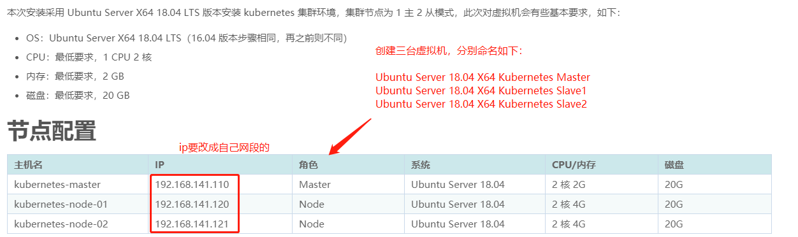
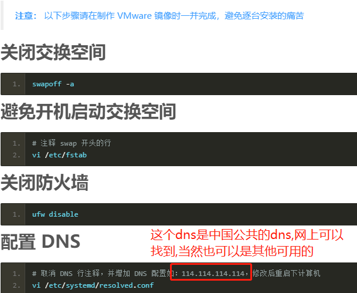
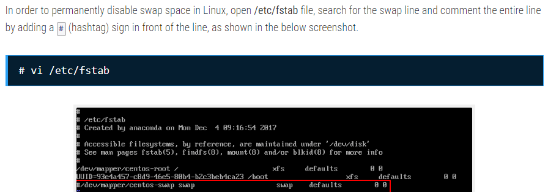
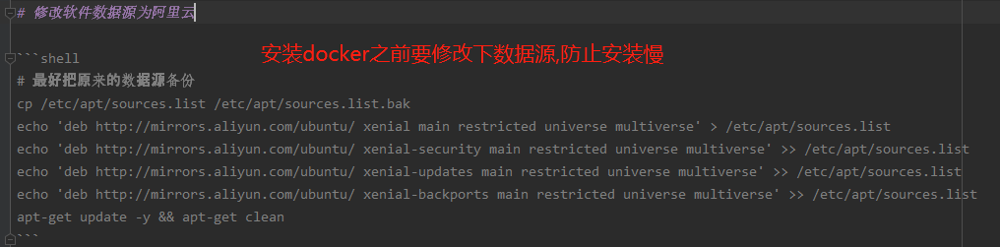

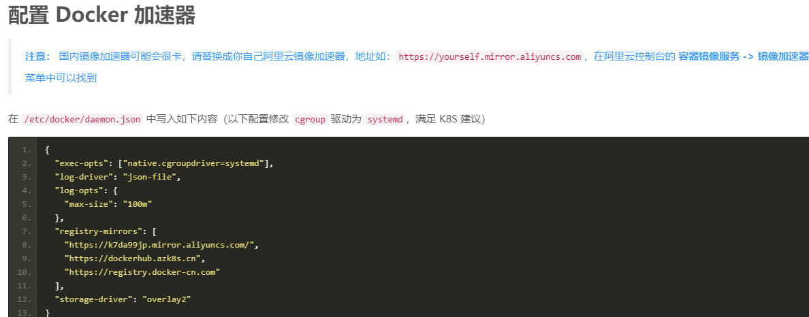

	安装了3个相关软件kubeadm,kubectl,kubelet.
	其中kubeadm 是 kubernetes 的集群安装工具.
	kubectl是命令行工具

    mkdir -p /usr/local/kubernetes
    
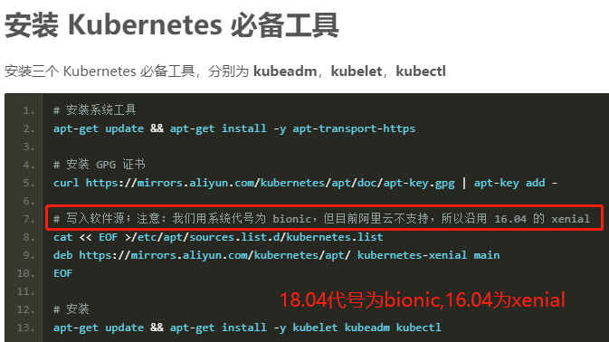
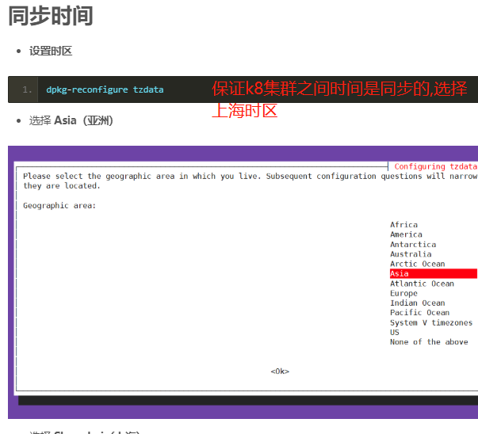
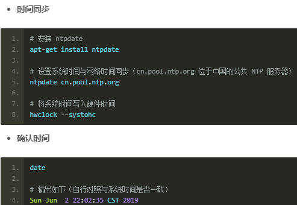
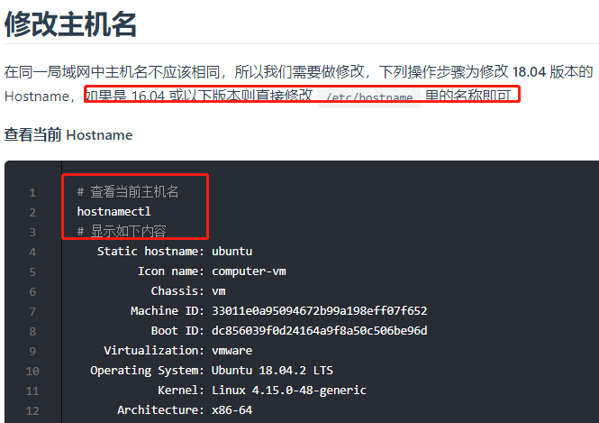
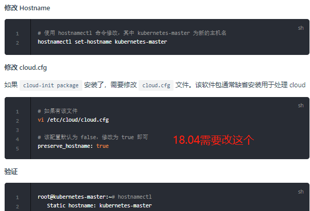
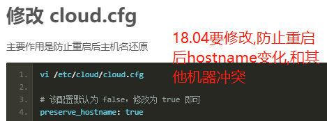
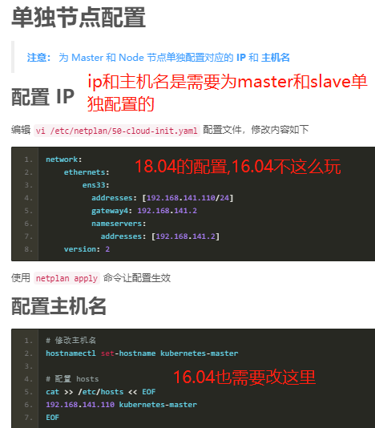