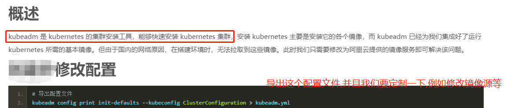
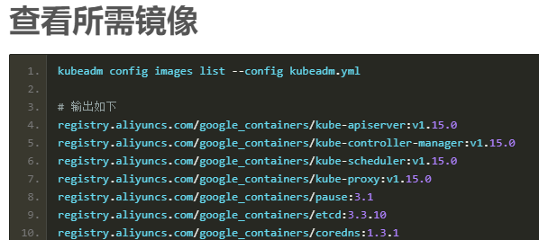
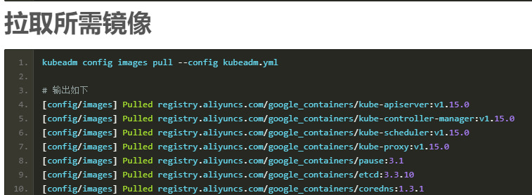
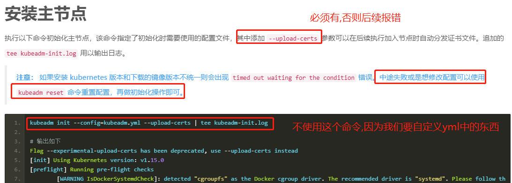
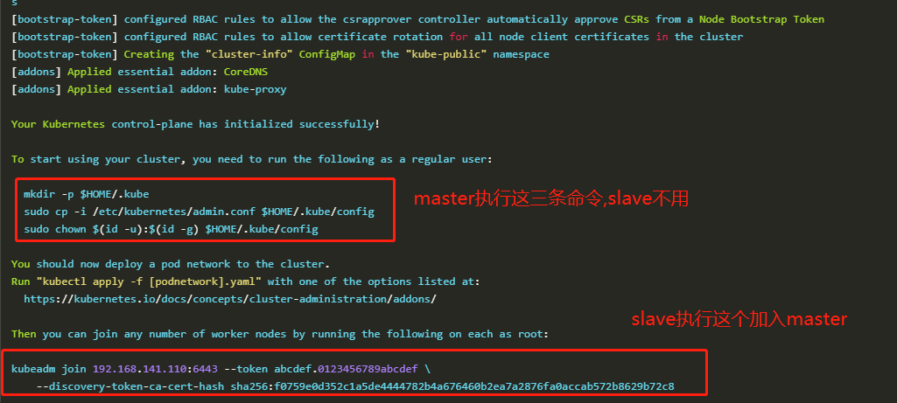
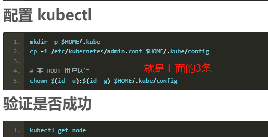
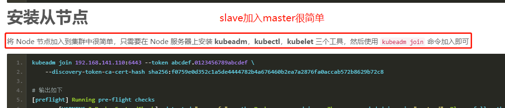
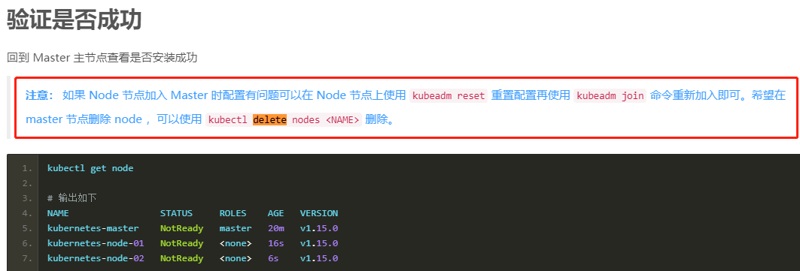

# Kubernetes 安装集群




    每个镜像的作用

```
kube-apiserver:v1.16.0: 用户和 kubernetes 集群交互的入口，封装了核心对象的增删改查操作，提供了 RESTFul 风格的 API 接口.类似于docker run/stop这些命令请求docker server的api接口,这里就是接受kubectl命令的api server.

kube-controller-manager:v1.16.0: 控制器管理,自动帮你重启pod,pod因为某种原因停调了,就会疯狂帮你重启.用于管理pod的生命周期的.主要是用于保证 replicationController 定义的复制数量和实际运行的 pod 数量一致，另外还保证了从 service 到 pod 的映射关系总是最新的.

kube-scheduler:v1.16.0: 调度,就是2台机器的配置不同,配置好的压力要分配大些,配置差的分配压力少些.再比如我想启动多个实例 ,要在哪台机器上启动呢?跟这个调度就有关系.负责集群资源的调度和管理，例如当有 pod 异常退出需要重新分配机器时，scheduler 通过一定的调度算法从而找到最合适的节点.再举例: 当你有数千个节点以后,我想启动3个nginx,5个tomcat,10个mysql,100个redis,具体在哪个节点上运行你不知道,scheduler来帮你分配,我们只需要在一台机器上操作,剩下几千个节点都不用你管了,这个就叫自动化 运维,

kube-proxy:v1.16.0: 整个k8s就是一个大型的内网,代理就是代表我怎么样从外网去到内网的每个节点上.这个是需要proxy的.

pause:3.1: pause就是暂停,和容器的启动运行有关系.

etcd:3.3.15-0: 服务注册与发现,因为内网中有那么多服务,用了k8s之后启动节点上千上万,就是很轻松的管理上千上万的节点,etcd就是一个标准的注册中兴,key-value键值存储数据库，用来存储kubernetes的信息的.

coredns:1.6.2: 域名解析服务器,我们在docker-compsoe的时候,我们请求服务是用的服务名,我们可以用服务名可以找到对应的机器,现在我是一个大型内网,可以理解为跨网段的,192.168.141.1, 192.168.142.1 ,这些网段内的机器如何通信呢?通过什么找到对方呢?所以就要这个dns服务来配合.

上面这些都是镜像,需要拉去,然后启动镜像对应的服务.

Kubernetes 集群中主要存在两种类型的节点，分别是 master 节点，以及 minion 节点。

master节点默认情况是不允许允许pod的,除非自己打开,但是一般我们不这么用.

Minion 节点是实际运行 Docker 容器的节点，负责和节点上运行的 Docker 进行交互，并且提供了代理功能。

Master 节点负责对外提供一系列管理集群的 API 接口，并且通过和 Minion 节点交互来实现对集群的操作管理

kubelet：运行在 minion 节点，负责和节点上的 Docker 交互，例如启停容器，监控运行状态等。

proxy：运行在 minion 节点，负责为 pod 提供代理功能，会定期从 etcd 获取 service 信息，并根据 service 信息通过修改 iptables 来实现流量转发（最初的版本是直接通过程序提供转发功能，效率较低。），将流量转发到要访问的 pod 所在的节点上去。

flannel：我们知道当我们启动 Docker 后会有一个用于和容器进行交互的 IP 地址，如果不去管理的话可能这个 IP 地址在各个机器上是一样的，并且仅限于在本机上进行通信，无法访问到其他机器上的 Docker 容器。Flannel 的目的就是为集群中的所有节点重新规划 IP 地址的使用规则，从而使得不同机器节点上的容器能够获得同属一个内网且不重复的 IP 地址，并让属于不同节点上的容器能够直接通过内网 IP 通信。	
```



```shell script
# 初始化的时候指定相关配置:
# 1. 我们现在的通信要保证安全的传输,节点之间的通信是通过gRPC,gRPC是实现了rpc协议的透明的远程过程调用.--upload-certs表示通信需要的证书,为了保证安全,意味着所有加入我节点的机器,k8s会自动分发证书
# 2. tee kubeadm-init.log是指定了安装的日志输出文件.
# 用这种方式,回去直接从aliyun镜像仓库中拉去上面那些image,所以上面的手动拉去镜像可以不用了.
kubeadm init \
  --apiserver-advertise-address=192.168.32.110 \
  --image-repository registry.aliyuncs.com/google_containers \
  --kubernetes-version v1.16.0 \
  --pod-network-cidr=10.244.0.0/16 \
  --upload-certs | tee kubeadm-init.log
```








# 常用命令

```shell script
kubeadm reset
watch kubectl get pods --all-namespaces

# (kube-system为NAMESPACE)
kubectl get pod -n kube-system

# 查看节点:
kubectl get node

# 注意： 如果 Node 节点加入 Master 时配置有问题可以在 Node 节点上使用 kubeadm reset 重置配置再
# 使用 kubeadm join 命令重新加入即可。希望在 master 节点删除 node ，可以使用 kubectl delete nodes <NAME> 删除。
```
