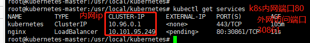

```shell script
# 检查组件运行状态
kubectl get cs

# 检查 Master 状态
kubectl cluster-info

# 检查 Nodes 状态
kubectl get nodes

# 运行第一个容器实例
# 使用 kubectl 命令创建两个监听 80 端口的 Nginx Pod（Kubernetes 运行容器的最小单元）
# --image=nginx: 从nginx镜像运行
# --replicas=2: 2个实例
# --port=80: 运行在k8s的80端口,k8s中那么多节点是一个整体,80如果被占用,也就是所有的节点都不可以使用80了,
# 我们要把那么多机器当成一台机器来看,这个就是资源共享.
# 注意这里的80只是把nginx部署到k8s的80端口,但它是一个局域网,是一个内网,外网不能访问,这样是为了安全
# 如果你想用,要自己expose出来.
kubectl run nginx --image=nginx --replicas=2 --port=80

# 查看全部 Pods 的状态
kubectl get pods

# 查看已部署的服务(我们部署的就是pod)
# 我们部署了一个名为nginx的deplooyment
kubectl get deployment

# 发布服务(把deployment发布为service)
# 使用负载均衡模式发布服务，让用户可以访问
# 暴露一个名叫nginx和deployment,和上面的对应,暴露80端口,类型是负载均衡,我们有2个nginx,也就是水平扩展了.
kubectl expose deployment nginx --port=80 --type=LoadBalancer

# 查看已发布的服务(已经暴漏到外网的服务)
# service就是已经暴漏出来的服务
kubectl get services

# 查看服务详情
kubectl describe service nginx

# 验证是否成功
# 通过浏览器访问 Node 服务器，此时 Kubernetes 会以负载均衡的方式访问部署的 Nginx 服务，能够正常看到 Nginx 的欢迎页即表示成功http://192.168.141.120:31406/

# 我们想停止服务必须停止deployment,容器运行在pod上,pod运行在deployment上.然后deployment通过expose来发布service
# 所以先delete deployment
kubectl delete deployment nginx

#删除已发布的服务
kubectl delete service nginx
```

