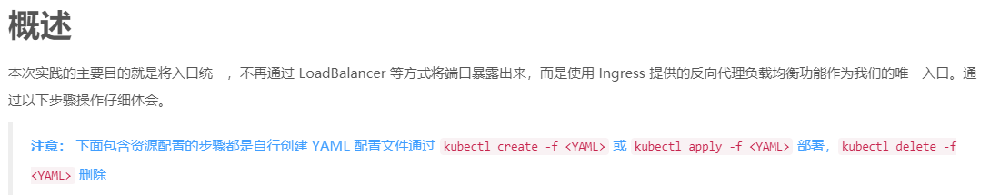
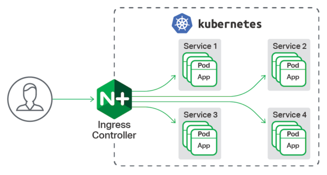

# 安装ingress-nginx-controller



- Ingress Controller 有许多种，我们选择最熟悉的 Nginx，其它的方式可以参考[官方文档](https://kubernetes.io/docs/concepts/services-networking/ingress-controllers/#using-multiple-ingress-controllers)

## [nginx官方的kubernetes-ingress-nginx-controller配置](https://www.nginx.com/products/nginx/kubernetes-ingress-controller)



- 下载 Nginx Ingress Controller 配置文件

```shell script
cd /usr/local/kubernetes/ingress

wget https://raw.githubusercontent.com/kubernetes/ingress-nginx/master/deploy/static/mandatory.yaml
```

修改`mandatory.yaml`，找到配置如下位置 (搜索 serviceAccountName) 在下面增加一句 `hostNetwork: true`

```yaml
apiVersion: apps/v1
kind: Deployment
metadata:
  name: nginx-ingress-controller
  namespace: ingress-nginx
  labels:
    app.kubernetes.io/name: ingress-nginx
    app.kubernetes.io/part-of: ingress-nginx
spec:
  # 可以部署多个实例
  replicas: 1
  selector:
    matchLabels:
      app.kubernetes.io/name: ingress-nginx
      app.kubernetes.io/part-of: ingress-nginx
  template:
    metadata:
      labels:
        app.kubernetes.io/name: ingress-nginx
        app.kubernetes.io/part-of: ingress-nginx
      annotations:
        prometheus.io/port: "10254"
        prometheus.io/scrape: "true"
    spec:
      serviceAccountName: nginx-ingress-serviceaccount
      # 增加 hostNetwork: true，意思是开启主机网络模式
      hostNetwork: true
      containers:
        - name: nginx-ingress-controller
          # 使用 Azure 中国镜像
          image: quay.azk8s.cn/kubernetes-ingress-controller/nginx-ingress-controller:0.24.1
          args:
            - /nginx-ingress-controller
            - --configmap=$(POD_NAMESPACE)/nginx-configuration
            - --tcp-services-configmap=$(POD_NAMESPACE)/tcp-services
            - --udp-services-configmap=$(POD_NAMESPACE)/udp-services
            - --publish-service=$(POD_NAMESPACE)/ingress-nginx
            - --annotations-prefix=nginx.ingress.kubernetes.io
          securityContext:
            allowPrivilegeEscalation: true
            capabilities:
              drop:
                - ALL
              add:
                - NET_BIND_SERVICE
            # www-data -> 33
            runAsUser: 33
          env:
            - name: POD_NAME
              valueFrom:
                fieldRef:
                  fieldPath: metadata.name
            - name: POD_NAMESPACE
              valueFrom:
                fieldRef:
                  fieldPath: metadata.namespace
          ports:
            - name: http
              # 暴露 Nginx 服务端口 80
              containerPort: 80
            - name: https
              containerPort: 443
          livenessProbe:
            failureThreshold: 3
// 以下代码省略...
```

- 通过命令 `kubectl apply -f mandatory.yaml` 部署
- 通过命令 `kubectl get pods -n ingress-nginx -o wide` 查看ingress-nginx的部署

# 部署 Ingress

>上面只是安装了Ingress-controller,这里是安装Ingress,Ingress会将请求路由到上面的controller.

    创建一个名为 /usr/local/kubernetes/ingress/ingress.yml 的资源配置文件

```yaml
apiVersion: networking.k8s.io/v1beta1
kind: Ingress
metadata:
  name: nginx-web
  annotations:
    # 指定 Ingress Controller 的类型,因为上面我们用了ingress-nginx-controller,所以这里是nginx
    # 下面的配置相当于都是给ingress-nginx-controller配置的
    kubernetes.io/ingress.class: "nginx"
    # 指定我们的 rules 的 path 可以使用正则表达式
    nginx.ingress.kubernetes.io/use-regex: "true"
    # 连接超时时间，默认为 5s
    nginx.ingress.kubernetes.io/proxy-connect-timeout: "600"
    # 后端服务器回转数据超时时间，默认为 60s
    nginx.ingress.kubernetes.io/proxy-send-timeout: "600"
    # 后端服务器响应超时时间，默认为 60s
    nginx.ingress.kubernetes.io/proxy-read-timeout: "600"
    # 客户端上传文件，最大大小，默认为 20m
    nginx.ingress.kubernetes.io/proxy-body-size: "10m"
    # URL 重写
    nginx.ingress.kubernetes.io/rewrite-target: /
spec:
  # 路由规则
  rules:
  # 虚拟主机名，只能是域名，修改为你自己的
  # 这样ingress会把k8s.funtl.com:80的请求通过上面安装的ingress-nginx-controller路由到下面tomcat-http上面
- host: k8s.funtl.com
    http:
      paths:
      - path:
        backend:
          # 后台部署的 Service的名字,相当于是nginx反向代理到tomcat
          serviceName: tomcat-http
          # 后台部署的 Service Port
          servicePort: 8080
```

- 通过命令 `kubectl apply -f ingress.yml` 部署
- 通过命令 `kubectl get ingress` 查看

# 部署 Tomcat

>部署 Tomcat 但仅允许在内网访问，我们要通过 Ingress 提供的反向代理功能路由到 Tomcat 之上，
>创建一个名为 `/usr/local/kubernetes/service/tomcat.yml` 配置文件

```yaml
apiVersion: apps/v1
kind: Deployment
metadata:
  # Deployment的名字
  name: tomcat-app
spec:
  selector:
    matchLabels:
      app: tomcat 
  replicas: 2
  template:
    metadata:
      labels:
        app: tomcat
    spec:
      containers:
      - name: tomcat
        image: tomcat:8.5.43
        imagePullPolicy: IfNotPresent
        ports:
        - containerPort: 8080
---
apiVersion: v1
kind: Service
metadata:
  # Service的名称
  name: tomcat-http
spec:
  ports:
    - port: 8080 # 这个是service的port,ingress会找到service的name和service的port,然后把请求路由到service上.
      targetPort: 8080 # 指向容器的端口
  # ClusterIP, NodePort, LoadBalancer
  # 对内的 ClusterIP是集群内网模式,只对内网提供服务,说明外面进不去
  # 对外的有3种,NodePort,LoadBalancer,和Ingress,这三种是对外提供服务的,NodePort一般是开发环境使用,生产环境不使用
  # 这里使用ClusterIP,说明这个service暴漏服务是集群内网才可以访问
  type: ClusterIP
  selector:
    app: tomcat
```
    
- 通过命令 `kubectl apply -f tomcat.yml` 部署

# 验证是否成功

```shell script
# 查看 Tomcat
kubectl get pods
kubectl get deployment
kubectl get service
kubectl describe service tomcat-http

# 查看 Ingress
kubectl get pods -n ingress-nginx -o wide

# 输出如下，注意下面的 IP 地址，就是实际机器的ip
NAME      READY   STATUS    RESTARTS   AGE   IP    NODE            NOMINATED NODE   READINESS GATES
nginx-ingress-controller-76f9fddcf8-vzkm5   1/1     Running   0    61m   192.168.141.121  kubernetes-node-02  <none> <none>

kubectl get ingress

# 输出如下
NAME        HOSTS          ADDRESS   PORTS   AGE
nginx-web   k8s.funtl.com             80      61m

# 测试访问,成功代理到 Tomcat 即表示成功
# 不设置 Hosts 的方式请求地址，下面的 IP 和 HOST 均在上面有配置
curl -v http://192.168.141.121 -H 'host: k8s.funtl.com'
```