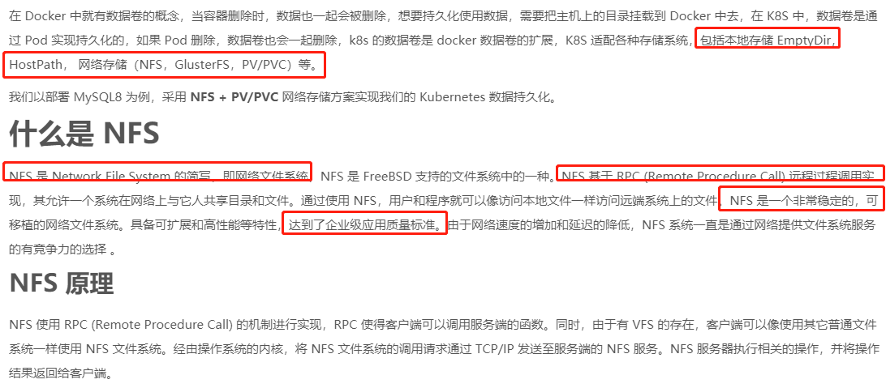
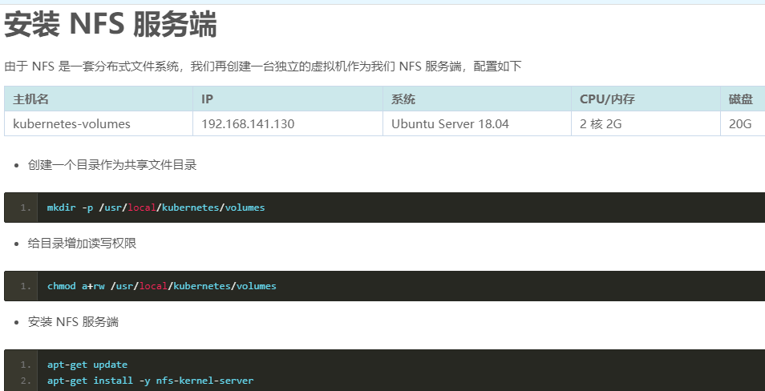
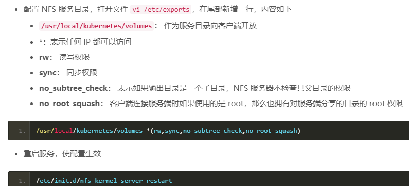
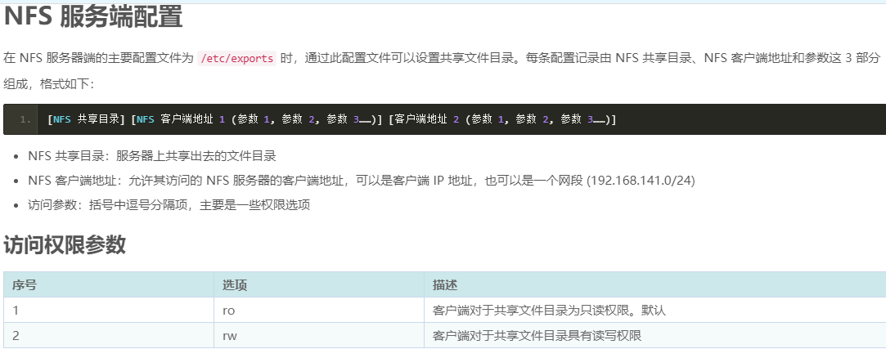
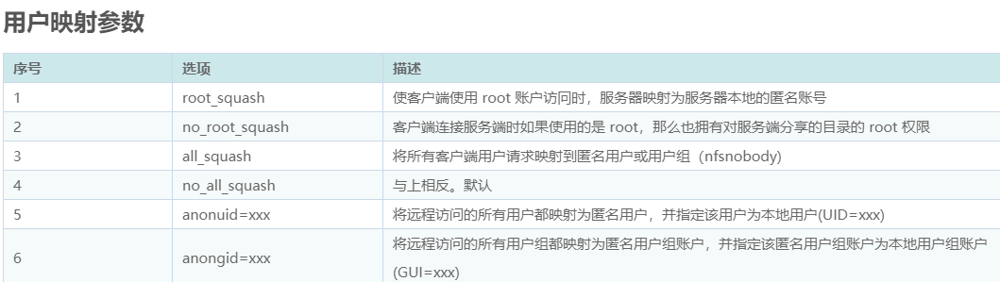
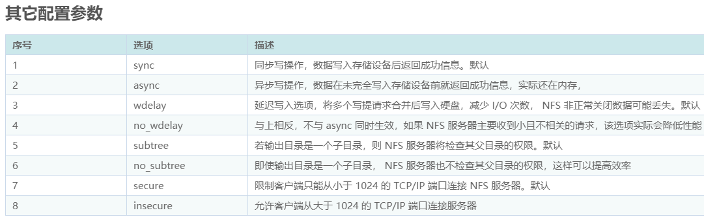
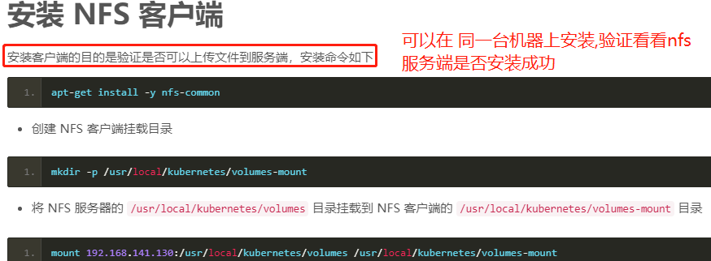

    mount 192.168.32.140:/usr/local/kubernetes/volumes /usr/local/kubernetes/volumes-mount
    
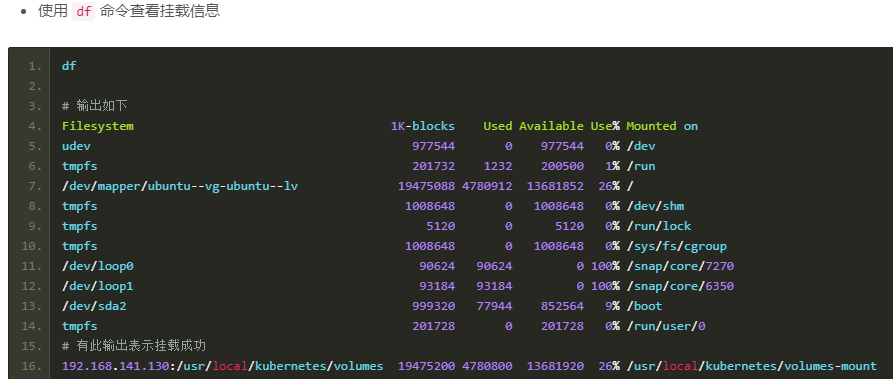

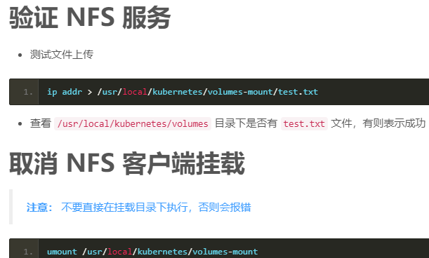

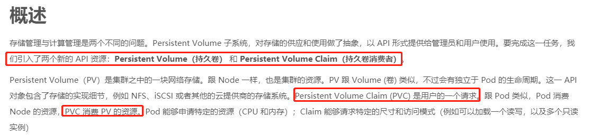
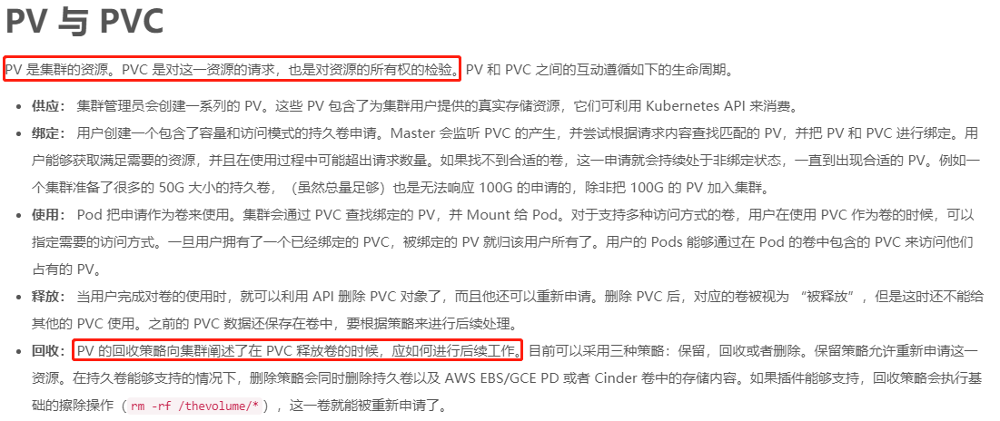
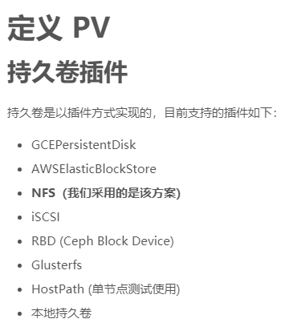

# 定义PV(PersistentVolume)

>创建一个名为 /usr/local/kubernetes/volumes/nfs-pv-mysql.yml 的配置文件

```yaml
apiVersion: v1
kind: PersistentVolume
metadata:
  # pv的名字
  name: nfs-pv-mysql
spec:
  # 设置容量,分配5个G给mysql,这个容量根据自己需求来
  capacity:
    storage: 5Gi
  # 访问模式
  accessModes:
    # 该卷能够以读写模式被多个节点同时加载,因为会有多个nfs节点,会有nfs节点集群
    - ReadWriteMany
  # 回收策略，这里是基础擦除 `rm-rf/thevolume/*`
  persistentVolumeReclaimPolicy: Recycle
  nfs:
    # NFS 服务端配置的路径
    path: "/usr/local/kubernetes/volumes"
    # NFS 服务端地址
    server: 192.168.32.140
    # 只读的
    readOnly: false
```

```shell script
# 部署
kubectl create -f nfs-pv-mysql.yml
# 删除
kubectl delete -f nfs-pv-mysql.yml
# 查看
kubectl get pv
```

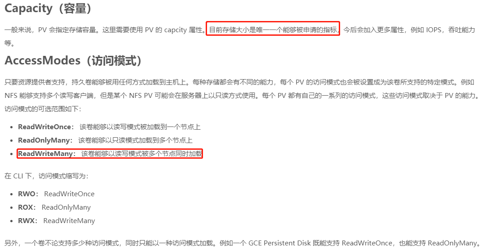
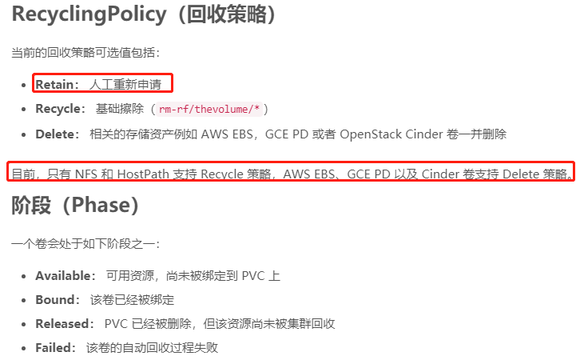

# 定义 PVC

>创建一个名为 /usr/local/kubernetes/volumes/nfs-pvc-mysql-myshop.yml 的配置文件

```yaml
apiVersion: v1
kind: PersistentVolumeClaim
metadata:
  name: nfs-pvc-mysql-myshop
spec:
  accessModes:
  # 需要使用和 PV 一致的访问模式
  - ReadWriteMany
  # 按需分配资源
  resources:
     requests:
       # 只从刚才分配的5个G里面拿一个G来用,我这个消费者只能用5个G中的一个G,
       storage: 1Gi
```

```shell script
# 部署
kubectl create -f nfs-pvc-mysql-myshop.yml
# 删除
kubectl delete -f nfs-pvc-mysql-myshop.yml
# 查看
kubectl get pvc
```

# 部署 MySQL8

>注意： 要在每台 Node 都安装了 NFS 客户端，apt-get install -y nfs-common

    /usr/local/kubernetes/service/mysql.yml

```yaml
apiVersion: apps/v1 
kind: Deployment
metadata:
  name: mysql-myshop
spec:
  replicas: 1
  selector:
    matchLabels:
      app: mysql-myshop
  template:
    metadata:
      labels:
        app: mysql-myshop
    spec:
      containers:
        # 容器名
        - name: mysql-myshop
          # 镜像,要带tag,注意tag要存在,否则deployment会一直处于没有ready的状态
          image: mysql:8.0
          # 只有镜像不存在时，才会进行镜像拉取
          imagePullPolicy: IfNotPresent
          ports:
            # 容器端口
            - containerPort: 3306
          # 同 Docker 配置中的 environment
          env:
          # 环境变量
            - name: MYSQL_ROOT_PASSWORD
              value: "123456"
          # 容器中的挂载目录
          volumeMounts:
            - name: nfs-vol-myshop
              #  mysql容器默认的数据库放的位置就是/var/lib/mysql,为这个位置取了个名字,叫nfs-vol-myshop
              # 相当于是容器里面的放mysql数据库的地方给他起了个名字
              mountPath: /var/lib/mysql
      volumes:
        # 挂载到数据卷,这个名字要和上面的一致,说明你告诉数据卷,你想用的是上面容器里面配置的nfs-vol-myshop对应的/var/lib/mysql的位置
        # 这个位置和nfs-pvc-mysql-myshop这个消费者挂在一起了,说明这个数据就挂上了,这个nfs-pvc-mysql-myshop在nfs-pvc-mysql-myshop.yml中定义好了
        - name: nfs-vol-myshop
          persistentVolumeClaim:
            claimName: nfs-pvc-mysql-myshop
---
# 把上面的deployment暴露出来
apiVersion: v1
kind: Service
metadata:
  name: mysql-myshop
spec:
  ports:
    - port: 3306
      targetPort: 3306
  type: LoadBalancer
  selector:
    app: mysql-myshop
```

```shell script
# 部署
kubectl create -f mysql.yml
# 删除
kubectl delete -f mysql.yml
```

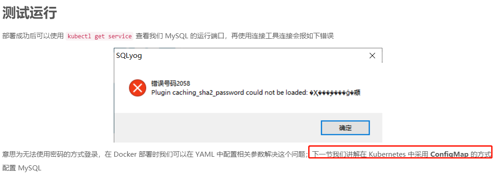
