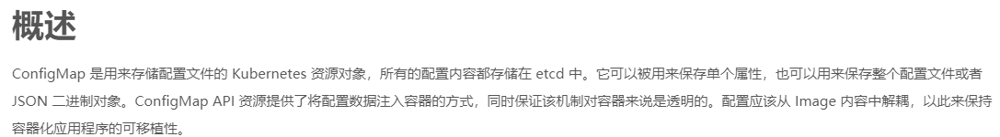

# 使用 ConfigMap 配置 MySQL

    创建一个/usr/local/kubernetes/service/mysql.yml

```yaml
apiVersion: v1
kind: ConfigMap
metadata:
  # ConfigMap的名字
  name: mysql-myshop-config
data:
  # 这里是键值对数据,意思就是我想要ConfigMap重写mysql容器中的 配置文件
  mysqld.cnf: |
    [client]
    port=3306
    [mysql]
    no-auto-rehash
    [mysqld]
    skip-host-cache
    skip-name-resolve
    default-authentication-plugin=mysql_native_password
    character-set-server=utf8mb4
    collation-server=utf8mb4_general_ci
    explicit_defaults_for_timestamp=true
    lower_case_table_names=1
---
apiVersion: apps/v1 
kind: Deployment
metadata:
  name: mysql-myshop
spec:
  replicas: 1
  selector:
    matchLabels:
      app: mysql-myshop 
  template:
    metadata:
      labels:
        app: mysql-myshop
    spec:
      containers:
        - name: mysql-myshop
          image: mysql:8.0
          imagePullPolicy: IfNotPresent
          ports:
            - containerPort: 3306
          env:
            - name: MYSQL_ROOT_PASSWORD
              value: "123456"
          volumeMounts:
            # 以数据卷的形式挂载 MySQL 配置文件目录,ConfigMap->cm,相当于是给/etc/mysql/conf.d这个目录起了个名字,叫cm-vol-myshop
            - name: cm-vol-myshop
              mountPath: /etc/mysql/conf.d
            - name: nfs-vol-myshop
              mountPath: /var/lib/mysql
      volumes:
        # 将 ConfigMap 中的内容以文件形式挂载进数据卷,这个name要和上面的对应,这里是用上面定义的cm-vol-myshop这个名字
       # 意思是这个在volumes中做ConfigMap,哪个ConfigMap呢?就是mysl-myshop-config,就是上面定义的ConfigMap
        - name: cm-vol-myshop
          configMap:
            name: mysql-myshop-config
            items:
                # 对应上面的ConfigMap 中的 Key
              - key: mysqld.cnf
                # ConfigMap Key 匹配的 Value 写入名为 /etc/mysql/conf.d/mysqld.cnf 的文件中
                # 这个/etc/mysql/conf.d上面定义了
                path: mysqld.cnf
        - name: nfs-vol-myshop
          persistentVolumeClaim:
            claimName: nfs-pvc-mysql-myshop
---
apiVersion: v1
kind: Service
metadata:
  name: mysql-myshop
spec:
  ports:
    - port: 3306
      targetPort: 3306
  type: LoadBalancer
  selector:
     app: mysql-myshop
```

```shell script
# 部署
kubectl create -f mysql.yml
# 删除
kubectl delete -f mysql.yml

# 查看 ConfigMap
kubectl get cm
kubectl describe cm <ConfigMap Name>
```

# 常用命令

```shell script
kubectl get pod/pods/node/nodes/service/deployment/ingress/pv/pvc/cm/

kubectl get cm

kubectl describe cm mysql-myshop-config

kubectl delete pod/pods/node/nodes/service/deployment/ingress/pv/pvc/cm/

# 看部署在哪里
kubectl get pod -o wide

# 指定namespace为kubernetes-dashboard
kubectl get service -n kubernetes-dashboard

# 所有namespace
kubectl get service --all-namespaces

kubectl get deployment --all-namespaces

# 看部署在哪里,指定
kubectl get pods -n kubernetes-dashboard -o wide

watch ip a
```