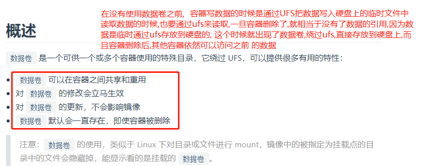
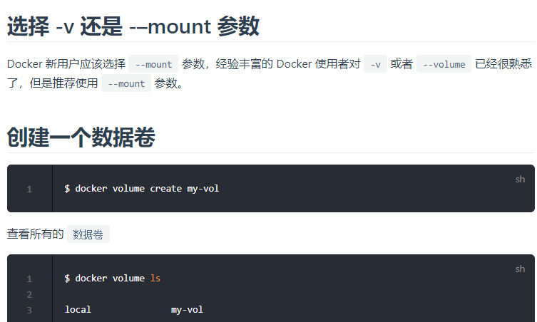
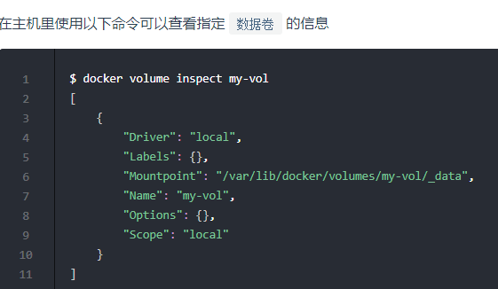
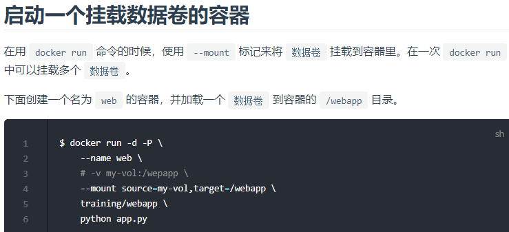
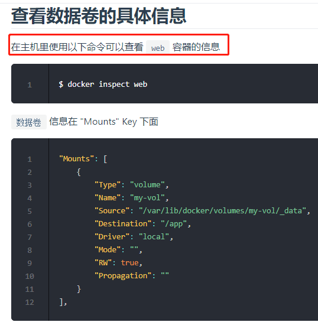
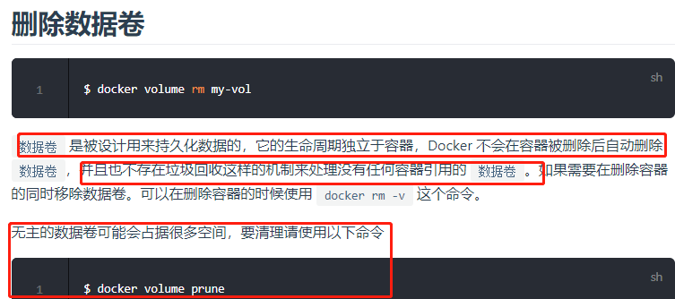

# Volume数据卷

容器一旦被删除,容器中的数据就会被删除,也就是容器中的数据不是持久化状态的.这个时候数据卷就是解决这个问题的.

# 利用数据卷达到tomcat负载均衡的效果

```shell script
# 下载tomcat镜像
# 在宿主机的/usr/local/docker/tomcat/ROOT目录下创建一个index.html

# 然后启动一个叫xzj的tomcat容器,注意-v: 左边是宿主机的目录,右边是容器的目录
# 也就是指定了容器的/usr/local/tomcat/webapps/ROOT要使用宿主机的/usr/local/docker/tomcat/ROOT
docker run -p 8080:8080 --name xzj -d -v /usr/local/docker/tomcat/ROOT:/usr/local/tomcat/webapps/ROOT tomcat
# 再启动一个叫xzj1的tomcat容器
docker run -p 8081:8080 --name xzj -d -v /usr/local/docker/tomcat/ROOT:/usr/local/tomcat/webapps/ROOT tomcat
# 然后外界可以访问ip:8080 or ip:8081, 都可以访问到宿主机的/usr/local/docker/tomcat/ROOT目录下的index.html
# 而且一旦你修改了这个index.html,浏览器的内容也会马上变化
# 这样就达到了负载均衡效果,访问的是同样的数据
```








# Volume命令汇总

```shell
# 查看所有数据卷
docker volume ls

# 删除指定数据卷
docker volume rm [volume_name]

# 删除所有未关联的数据卷
docker volume rm $(docker volume ls -qf dangling=true)
```
