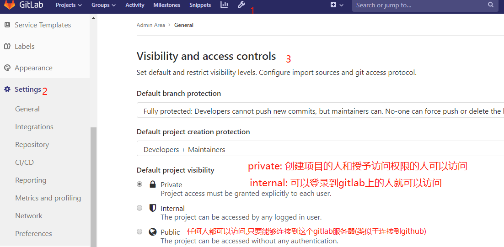
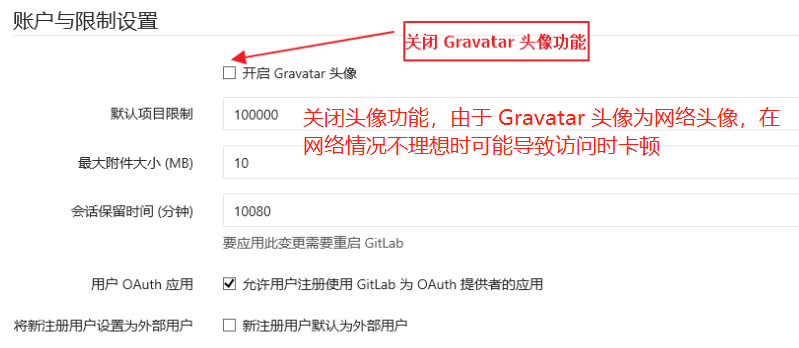
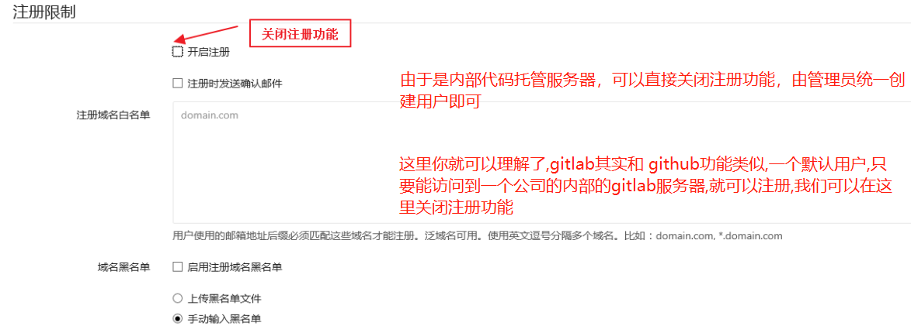
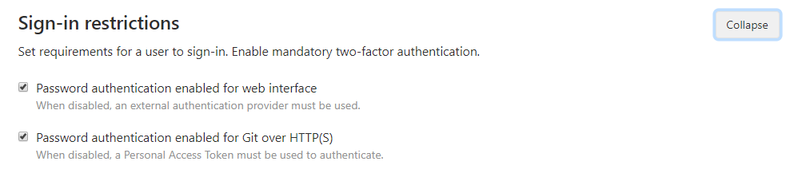
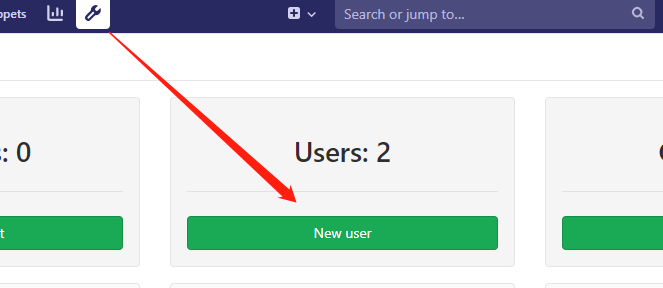
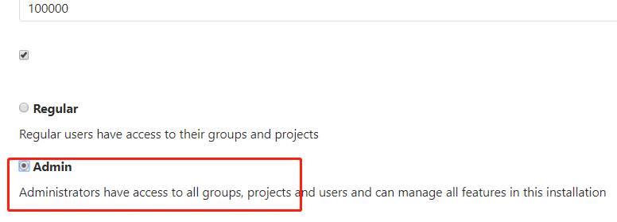
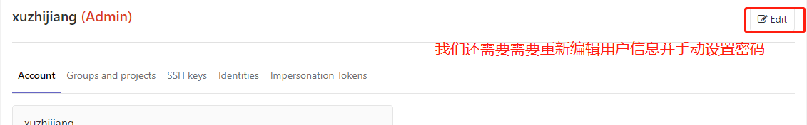

# 安装GitLab

- 到docker hub上搜索搜索"gitlab/gitlab-ce"
- https://hub.docker.com/u/gitlab
- 下载: docker pull gitlab/gitlab-ce
- 如果服务器配置较低，gitlab启动运行可能需要较长时间，请耐心等待
- 登录用户名:root, 密码自己设置.

>我们使用 Docker 来安装和运行 GitLab 中文版，由于新版本问题较多，这里我们使用目前相对稳定的 10.5 版本，docker-compose.yml 配置如下：

```shell script
cd /usr/local/docker && mkdir gitlab && cd gitlab
vim docker-compose.yml
```

```yaml
version: '3'
services:
  web:
    image: 'gitlab/gitlab-ce'
    restart: always
    hostname: '127.0.0.1' # 部署的主机名/域名
    environment:
      TZ: 'Asia/Shanghai'
      # gitlab的初始化操作
      # external_url: 外部访问地址,也就是浏览器访问的地址
      # gitlab能够被访问是由于nginx,nginx做了反向代理,所以能够被访问,所以exernal_url的端口要和nginx[listen_port]要一样
      # gitlab_shell_ssh_port: gitlab支持ssh来访问,这样就可以通过免密来访问,防止22被占用,所以改成2222
      # unicorn是gitlab的内部端口
      GITLAB_OMNIBUS_CONFIG: |
        external_url 'http://127.0.0.1:8078'
        gitlab_rails['gitlab_shell_ssh_port'] = 2222
        unicorn['port'] = 8888
        nginx['listen_port'] = 8078
    # 暴露多个端口,443是ssl连接的安全端口,22是ssh连接的容器内部端口,2222是ssh连接的宿主机端口.
    ports:
      - '8080:8080'
      - '8443:443'
      - '2222:22'
    volumes:
      - /usr/local/docker/gitlab/config:/etc/gitlab
      - /usr/local/docker/gitlab/data:/var/opt/gitlab
      - /usr/local/docker/gitlab/logs:/var/log/gitlab
```

# GitLab 的基本设置






# GitLab 的账户管理

使用时请不要直接通过 root 用户操作，需要先创建一个root账户代理，给与这个用户Admin的权限,然后退出并使用这个代理账户登录,第一次登录账户会提示你修改登录密码,这样保证账户的安全.

然后通过这个代理账户为其他开发人员分配账户.这里给其他人分配的是普通账户(regular),普通账户第一次登录的时候也是会提示你修改登录密码





# 使用 SSH 的方式拉取和推送项目,实现免密拉去和推送


# 持续集成

gitlab集成了持续集成的功能.

代码提交或合并进主干 就会触发自动化测试,构建,持续化集成.

    回滚: 一旦当前版本发生问题,就会滚到上一个版本的构建结果,最简单的做法就是修改一下符号链接(ln),指向上一个版本的目录.

    v1.0.0 有问题,要实现秒级回滚.
    v0.0.9 
    
    webapps/ROOT -> eureka-v1.0.0
                 -> eureka-v0.0.9
    
    镜像指向的修改
    
    tag:v1.0.0
    tag:v0.0.9


# 使用gitlab runner(第一种使用gitlab-runner的方式)

- [linxu安装gitlab-runner](https://docs.gitlab.com/runner/install/linux-repository.html)

```shell
# 注意:安装了gitlab-runner的机器上,专门有一个gitlab-runner用户用来执行相关的操作,这个用户要有足够的权限,否则ci会失败.

# 如果gitlab-runner无法操作docker,则需要将gitlab-runner用户添加到docker组
sudo usermod -aG docker gitlab-runner

# 验证添加到docker组是否生效：
sudo -u gitlab-runner -H docker info

# 所以安装完 GitLab Runner 后系统会增加一个 gitlab-runner 账户，我们将它加进 root 组：
# 这步看情况而定,如果权限不够,就需要添加到root组
gpasswd -a gitlab-runner root

# 配置需要操作目录的权限，比如你的 runner 要在 gaming 目录下操作：
chmod 775 gaming

# 在安装了gitlab runner的机器上,会帮我们从gitlab上下载(这个机器要配置ssh免密拉取代码),然后自动构建,部署.

# 这个安装了gitrunner的机器需要运行mvn和java,所以需要安装java和mvn.

# 注册gitlab runner到gitlab
gitlab-ci-multi-runner register

# 每一个项目都要配置持续集成
# 选择一个项目,然后点击gitlab左边侧栏的Settings,点击CI/CD(持续集成和持续部署)
# 有一个Runners,展开,里面有地址和token.粘贴到ubuntu控制台

# Please enter the gitlab-ci description for this runner
description可以不写

# Please enter the gitlab-ci tags for this runner (comma separated):
# 也就是什么标签下触发ci,可以不写

# Please enter the executor: parallels, ssh, virtualbox, docker, docker-ssh, shell, docker+machine, docker-ssh+machine, kubernetes, custom:
# 使用的是什么命令,我们选择shell,也就是使用shell命令格式
# 然后就注册成功了.

# 在项目工程下编写 .gitlab-ci.yml 配置文件：

# 然后每次提交就会触发持续集成

# 删除注册信息：
gitlab-ci-multi-runner unregister --name "名称"

# 查看注册列表：
gitlab-ci-multi-runner list
```

# 使用GitLab Runner Docker(第2种使用gitlab-runner的方式)

>相比于第一种使用gitlab-runner的方式,就是省去了java和mvn环境的安装和配置.

- [参考](https://www.funtl.com/zh/spring-cloud-itoken-ci/使用-GitLab-Runner-Docker.html)
- [视频](https://www.bilibili.com/video/av29882762/?p=16)

一般gitlab是什么版本,gitlab-runner就使用什么版本的gitlab-runner,如果gitlab-runner没有与gitlab相匹配的version,那么就找比这个gitlab的version低也行,防止gitlab-runner不兼容gitlab.

虚拟机里面不能装虚拟机,但是docker里面可以装docker.所以我们要在docker版的runner中安装docker,用这个安装的docker构建docker镜像.我们还要在这个runner的dokcer中安装java和maven.

```shell
# 在Service Cloud这台机器上
cd /usr/local/docker && mkdir runner
vim docker-compose.yml
```

```yaml
version: '3.1'
services:
  gitlab-runner:
    # docker-compose也可以做镜像构建的工作,environment是目录的名字,
    # 也就是如果你的计算机里没有对应的镜像,会通过environment来构建镜像
    # 所以environmentl里面要有一个Dokcerfile用例构建镜像.
    # 也就是说dokcer-compose不一定非要从网上拉镜像,也可以自己在本地构建镜像,
    # 运行本地的镜像.也就是如果没有镜像,回去enviroment中找Dockerfile ,由
    # dockerfile来构建一个镜像.
    build: environment
    restart: always
    container_name: gitlab-runner
    # 进入docker容器的时候,我们不是真正的root账户权限的角色,加上true之后,
    # 就变成真root账户角色权限了,也就是以真正的管理员的权限操作这个容器.
    privileged: true
    volumes:
      - /usr/local/docker/runner/config:/etc/gitlab-runner
      - /var/run/docker.sock:/var/run/docker.sock
```

```shell
cd /usr/local/docker/runner && mkdir environment
vim Dockerfile
```

```shell
# 因为gitlab-runner不是专门为java而配置的,所以我们要基于官网的gitlab-runner镜像来
# 创建我们自己的runner镜像,里面要包含我们的java,maven等软件环境.
FROM gitlab/gitlab-runner:v12.3.0

MAINTAINER xzj <2233835996.qq.com>

# 修改docker中的软件源为阿里云(在容器中进行,)
RUN echo 'deb http://mirrors.aliyun.com/ubuntu/ xenial main restricted universe multiverse' > /etc/apt/sources.list
RUN echo 'deb http://mirrors.aliyun.com/ubuntu/ xenial-security main restricted universe multiverse' >> /etc/apt/sources.list
RUN echo 'deb http://mirrors.aliyun.com/ubuntu/ xenial-updates main restricted universe multiverse' >> /etc/apt/sources.list
RUN echo 'deb http://mirrors.aliyun.com/ubuntu/ xenial-backports main restricted universe multiverse' >> /etc/apt/sources.list
RUN apt-get update -y && apt-get clean

# 安装 Docker(在容器中进行,相当于是在docker中安装docker)
RUN apt-get -y install apt-transport-https ca-certificates curl software-properties-common gnupg
# apt-key add keyname: 把下载的key添加到本地trusted数据库中
RUN curl -fsSL http://mirrors.aliyun.com/docker-ce/linux/ubuntu/gpg | apt-key add -
RUN add-apt-repository "deb [arch=amd64] http://mirrors.aliyun.com/docker-ce/linux/ubuntu/ $(lsb_release -cs) stable"
RUN apt-get update -y
RUN apt-get install -y docker-ce

# 配置加速器和私服仓库地址(下面有daemon.json文件配置),注意在environment这个目录上下文下.
COPY daemon.json /etc/docker/daemon.json

# 安装 Docker Compose
WORKDIR /usr/local/bin

# 从网上下载docker-compose
RUN wget https://raw.githubusercontent.com/topsale/resources/master/docker/docker-compose
# 修改权限
RUN chmod +x docker-compose

# 在docker中Java(要把jdk.tar.gz放到enviroment上下文下.)
RUN mkdir -p /usr/local/java
WORKDIR /usr/local/java
COPY jdk-8u221-linux-x64.tar.gz /usr/local/java
RUN tar -zxvf jdk-8u221-linux-x64.tar.gz
RUN rm -fr jdk-8u221-linux-x64.tar.gz

# 在docker中安装 Maven
RUN mkdir -p /usr/local/maven
WORKDIR /usr/local/maven
RUN wget https://raw.githubusercontent.com/topsale/resources/master/maven/apache-maven-3.5.3-bin.tar.gz
# COPY apache-maven-3.5.3-bin.tar.gz /usr/local/maven
RUN tar -zxvf apache-maven-3.5.3-bin.tar.gz
RUN rm -fr apache-maven-3.5.3-bin.tar.gz
# COPY settings.xml /usr/local/maven/apache-maven-3.5.3/conf/settings.xml

# 在docker中配置环境变量
ENV JAVA_HOME /usr/local/java/jdk1.8.0_221
ENV MAVEN_HOME /usr/local/maven/apache-maven-3.5.3
ENV PATH $PATH:$JAVA_HOME/bin:$MAVEN_HOME/bin

WORKDIR /
```

```shell
cd /usr/local/docker/runner/enviroment && vim daemon.json
```

```json
{
  "registry-mirrors": [
    "https://registry.docker-cn.com"
  ],
  "insecure-registries": [
    "94.191.29.122:5000"
  ]
}
```

```shell
# 准备完成后:
cd /usr/local/docker/runner
# 启动/usr/local/docker/runner/docker-compose.yml中的镜像.
docker-compose up -d
```
