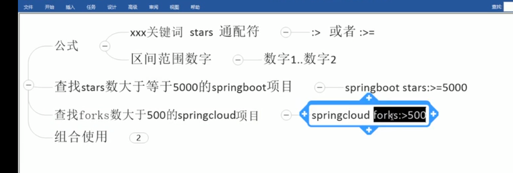
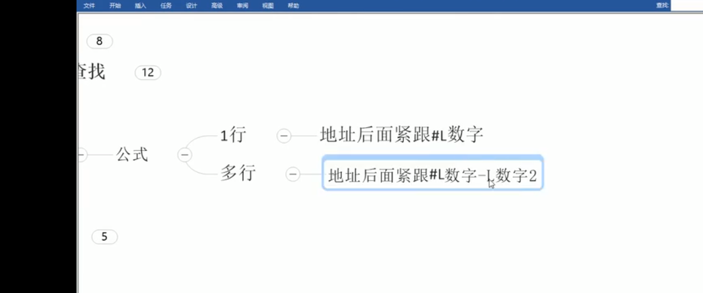
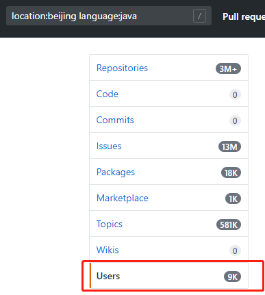

# Github常用操作

    比如你要做一个支付接口/秒杀系统,怎么写代码呢?
    1. 从jd/天猫上买书,买书容易看书难,而且没时间看
    2. 不要总是去买书,可以从githua上寻找优秀源码,来学习提升自己,或者看视频,这样速度快.
---    
    面试题: 如何找到优秀的源码来进行学习,以及自己共享代码?

- 常用关键词
- in关键词限制搜索范围
- 使用stars或fork关键字查找
- awesome加强搜索
- 高亮显示某一行代码
- 项目内搜索
- 搜索某个地区的大佬

## 常用关键词

## in关键词限制搜索范围

    要搜索的关键字 in:name
    要搜索的关键字 in:description
    要搜索的关键字 in:readme
    要搜索的关键字 in:name,description,readme

    比如要搜索mongodb相关的相关:
    mongodb in:name,description,readme

## 使用stars或fork关键字查找

    组合使用: fork在100~200,并且stars在80到100之间的springboot项目
    springboot fork:2000..2500 stars:5000..15000

## awesome加强搜索

    公式: awesome 关键词
    一般用于搜集学习,工具,书籍类相关项目
    
    例子: 搜索优秀的redis相关的项目: awesome redis

## 高亮显示某一行代码

    

## 项目内搜索

    在项目页面输入: t
    然后可以输入你想要搜索的文件名

[更多快捷键](https://help.github.com/en/github/getting-started-with-github/keyboard-shortcuts)

## 搜索某个地区的大佬

    location:地方
    language: 语言
    
    搜索北京地区的java方向的用户: location:beijing language:java
    
    