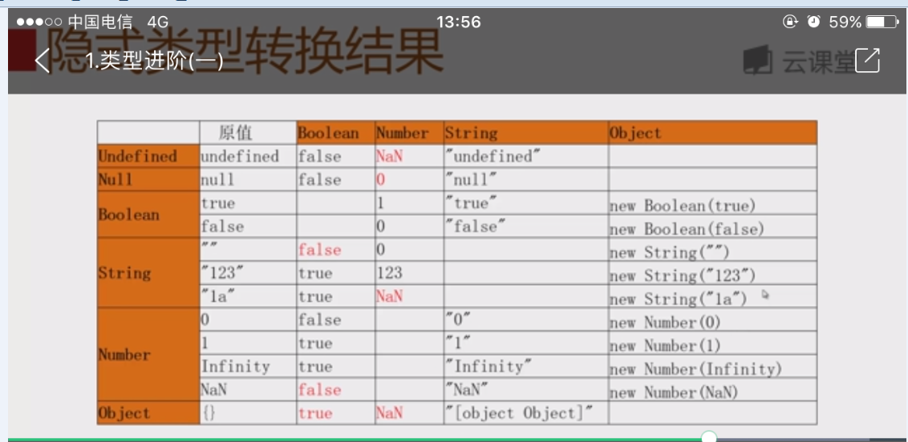

#### CORS(Cross-Origin Resource Sharing)

1，CORS是用来做什么的

	是HTML5规范定义的如何跨域访问资源。如果浏览器支持HTML5，那么就可以一劳永逸地使用新的跨域策略：CORS了。

2, 如何理解CORS

Origin表示本域，也就是浏览器当前页面的域。当JavaScript向外域（如sina.com）发起请求后，浏览器收到响应后，首先检查Access-Control-Allow-Origin是否包含本域，如果是，则此次跨域请求成功，如果不是，则请求失败，JavaScript将无法获取到响应的任何数据。

[CORS img](../img/CORS.png)

假设本域是my.com，外域是sina.com，只要响应头Access-Control-Allow-Origin为http://my.com，或者是*，本次请求就可以成功。

可见，跨域能否成功，取决于对方服务器是否愿意给你设置一个正确的Access-Control-Allow-Origin，决定权始终在对方手中。

上面这种跨域请求，称之为“简单请求”。简单请求包括GET、HEAD和POST（POST的Content-Type类型，仅限application/x-www-form-urlencoded、multipart/form-data和text/plain），并且不能出现任何自定义头（例如，X-Custom: 12345），通常能满足90%的需求。

在引用外域资源时，除了JavaScript和CSS外，都要验证CORS。例如，当你引用了某个第三方CDN上的字体文件时：

```css
/* CSS */
@font-face {
  font-family: 'FontAwesome';
  src: url('http://cdn.com/fonts/fontawesome.ttf') format('truetype');
}
```
如果该CDN服务商未正确设置Access-Control-Allow-Origin，那么浏览器无法加载字体资源。

对于PUT、DELETE以及其他类型如application/json的POST请求，在发送AJAX请求之前，浏览器会先发送一个OPTIONS请求（称为preflighted请求）到这个URL上，询问目标服务器是否接受：

```html
OPTIONS /path/to/resource HTTP/1.1
Host: bar.com
Origin: http://my.com
Access-Control-Request-Method: POST
服务器必须响应并明确指出允许的Method：

HTTP/1.1 200 OK
Access-Control-Allow-Origin: http://my.com
Access-Control-Allow-Methods: POST, GET, PUT, OPTIONS
Access-Control-Max-Age: 86400
```

浏览器确认服务器响应的`Access-Control-Allow-Methods`头确实包含将要发送的AJAX请求的Method，才会继续发送AJAX，否则，抛出一个错误。

由于以POST、PUT方式传送JSON格式的数据在REST中很常见，所以要跨域正确处理POST和PUT请求，服务器端必须正确响应OPTIONS请求。

#### 全局变量和局部变量

全局变量: 全局变量在js中比较特殊，他可以在程序的任何访问,在程序的任何地方都是可以改写的,3种定义全局变量的方式:

```javascript
var test = 'some value'; //js标准的定义全局变量的方法

window.test = 'some value'; //相当于变量是window对象上的一个属性

(function(){
	var a;//a是局部变量，不是全局变量
	test = 'some value';//写了变量的名字，但是没有使用var定义,这样的变量也会被定义到global上面去
	_config = {dd: ‘dd-value’};//_config是全局变量，可以在外面访问,但是由于是以_开头，所以我们人为的把他看做是protected变量，不要在外面直接访问.(其中dd默认就是字符串)
})();

!function(){
    function Modal(){

    }//Modal是局部函数对象，要想在外面访问，必须window.Modal = Modal;

    var a = 'aa';//局部变量

    b = 'bb';//全局变量
}();

function foo(){
    var tt = 'ty';//局部变量
    gg = 'gy';//局部变量
}

kk = 'k_value';//全局变量
window.kk === kk;//true
```

#### 封装-信息隐藏:

```javascript
function A(){
	var _config = ['A', 'B', 'C'];
	this.getConfig = function(){
		return _config;
	}
}
```

这个_config在外部是不可以使用，不可以通过this使用,外部通过getConfig来获取，这样就相当于开放api,我们人为的规定:_step1//有_开头的就是protected的，没有_开头的就是public的

#### 变量作用域

```javascript
var x = 10;
function foo(y){
	var z = 30;
	function bar(q){
		return x + y + z + q;
	}
	return bar;
}
var bar = foo(20);
bar(40);
```

执行第一行代码之前,首先创建global环境:

|     |     global环境   ||
| ------------- |:-------------:| -----:|
| record      | foo:&lt;function>  ||
|       | x:undefined       ||
|       | bar:undefined     ||
| outer |  null    ||

执行x = 10;

|     |     global环境   ||
| ------------- |:-------------:| -----:|
| record      | foo:&lt;function>  ||
|       | x:10       ||
|       | bar:undefined     ||
| outer |  null    ||

执行foo(20)之前，先创建foo环境:

|     |     foo环境   ||
| ------------- |:-------------:| -----:|
| record      | y:20  ||
|       |       ||
|       |      ||
| outer |  指向global环境    ||

开始执行foo(20)

|     |     foo环境   ||
| ------------- |:-------------:| -----:|
| record      | y:20  ||
|       |  z:undefined     ||
|       | bar:&lt;function>     ||
| outer |  指向global环境    ||

执行foo中的第一行语句:z = 30;

|     |     foo环境   ||
| ------------- |:-------------:| -----:|
| record      | y:20  ||
|       |  z:30     ||
|       | bar:&lt;function>     ||
| outer |  指向global环境    ||

执行完return bar;后

|     |     global环境   ||
| ------------- |:-------------:| -----:|
| record      | foo:&lt;function>  ||
|       | x:10       ||
|       | bar:&lt;function>     ||
| outer |  null    ||

执行bar(40)之前，先创建bar环境:

|     |     bar环境   ||
| ------------- |:-------------:| -----:|
| record      | q:40  ||
| outer |  指向foo环境    ||

顺着outer找x，y，z,之后返回值.

* 环境记录

    - 形参
    - 函数
    - 变量

* 对外部环境变量的引用outer

Try—catch词法环境:

```javascript
try{
    e = 'error'
    throw new Error();
}catch(e){
    function f(){alert(e);}
    
    (function(){alert(e);})();
    f();
}
```

f函数中的e指的是global中的e='error';
匿名函数的中e指的是catch(e)中的e;原理是outer指向
不同

With词法环境:
```javascript


var foo = 'abc';
with({
    foo: 'bar'
}){
    function f(){alert(foo);};
    (function (){alert(foo);})();
    f();
}
```
f函数中的foo指的是global中的foo='abc';
匿名函数的中foo指的是with中的foo;原理是outer指向
不同

```javascript
var x=10;
function foo(){
	alert(x);
}
function bar(){
	var x=20;
	foo();
}
bar();
```

##### 变量的生命周期和作用范围

1. 在其他语言中if语句，for语句，while语句，他会产生一个块级作用域
2. js没有块级作用域的,只有两种作用域:(全局作用域，函数作用域)
3. ES5使用词法环境来管理静态作用域:

##### 函数声明和函数表达式的区别：

在引擎中，函数声明的函数对象是提前创建的，函数表达式创建的函数对象是执行到这个语句create的，2种都会创建一个函数对象

#### 闭包

```javascript
Function add(){
	Var i = 0;
	Return function(){
		Alert(i++);
    };//函数表达式
}

Var f = add();
F();
F();
```

一个函数，在没有执行之前是scope，执行的时候就变成了outer

闭包就是:函数+函数的相关引用环境, add结果的返回函数就是一个闭包。
add结果是一个匿名函数，这个函数同时它又保存了外部的环境，
这个匿名函数有一个scope的指针指向了这个add环境

- 保存现场
- 做封装

#### 对象

* 原生对象

    Boolean
    String
    Number
    Object
    Function
    Array
    Date
    RegExp
    Error
    JSON
    Math
    arguments

* 宿主对象

    document
    navigator
    window
    ....

* 浏览器扩展对象(跟浏览器厂家有关)

    ActiveXObject
    ...

#### JS中如何创建对象:
```
var car = new Object();
var car = {};//这个对象是空的

var car = {
    color : "red",
    run : function(){alert("run")}
};

访问对象属性: 
car.color;
car["color"];

修改对象属性
car.color = "white";

增加对象属性:
car.type = "suv";

运行对象方法：
car.run();
car["run"]();

增加对象方法：
car.stop = function(){alert("stop")};

修改对象方法：
car.run = function(){alert("run2")};

delete car.color;
car.color; //undefined

var num = new Number(123);
num.constructor;//得到num对象的构造函数

var num = new Number(123);
num.toString();//"123"

obj.valueOf();//获取这个对象的原始值
var num = new Number(123);
num.valueOf();// 123

obj.hasOwnProperty();
car.hasOwnProperty("color");//true
car.hasOwnProperty("logo");//false
//还可以验证这个属性是不是通过继承得来的,返回false的话，就是继承而来的，不是他自己的
```

原型对象: 以一个现成的对象为原型来构造对象

由原型对象构造出对象的方法:

1, 设置对象的原型:

> Object.create(proto[,propertiesObject])

- proto  一个对象，他会作为新创建对象的 原型对象
- propertiesObject   对象上新定义的属性(用的不多)

* 先定义原型对象
```
var landRover = {
    name: 'landRover',
    start: function(){
        alert(this.logo + ' start');
    },
    run: function(){
        alert(this.logo + ' run');
    },
    stop: function(){
        alert(this.logo + ' stop');
    }
};
```

* 使用定义好的原型对象创建新的对象

```
var landWind = Object.create(landRover);
landWind.logo = 'landWind';
landWind.start();
```

2. 构造函数的方式创建对象

- 函数可以作为构造函数，可以用函数来创建自定义的对象

- 函数有个属性叫做prototype,使用prototype设置原型

- 这个prototype属性呢就是这个自定义对象的原型

- 使用new关键字作用于函数，创建对象


Car构造函数
```javascript
function Car(logo){
	this.logo = logo || 'unknown name';
}

//设置Car的prototype属性
Car.prototype = {
    start: function(){
        alert(this.logo + ' start');
    },
    run: function(){
        alert(this.logo + ' run');
    },
    stop: function(){
        alert(this.logo + ' stop');
    }
}
//构造函数
var landRover = new Car('landRover');
var landWind = new Car('landWind');
landRover.start();

使用new key word来创建的时候，分为3步:

1. create a 新的Car 类型的对象landRover
2. 设置landRover的_proto_,_proto_设置成构造函数Car的prototype的属性(很重要), _proto_这个属性是隐式的属性，是不能够在编程的时候被修改的
3. 使用landRover作为this去执行这个构造函数Car.//Car.apply(landRover,arguments)

note: landRover.constructor;//就可以找到这个landRover对象是由哪个方法构建出来的。
```

#### 原型链

```javascript
//Car构造函数
function Car(logo){
	this.logo = logo || 'unknown name';
}
//设置Car的prototype属性
Car.prototype = {
	start : function(){
		console.log('%s start', this.logo);
	},
	run : function(){
		console.log('%s running', this.logo);
	},
	stop : function(){
		console.log('%s stop', this.logo);
	}
}

//landRover构造函数
function landRover(serialno){
	this.serialNumber = serialno;
}
landRover.prototype = new Car('landRover');
//把这个对象赋值给landRover的prototype
//landRover这个构造函数的原型不再是Object，而是一个 Car类型的对象

创建landRover对象
var landRover1 = new landRover(1000);
var landRover2 = new landRover(1001);
console.log(landRover1.serialNumber);//1000
alert(landRover1.logo);//landRover
```

```javascript
Car.prototype = new Object();
alert(Car.prototype.__proto__ === Object.prototype); //car.prototype的原型(_proto_)是Object.prototype

原型链作用,对象的属性的访问，修改，删除和原型链都直接相关
js中访问对象的属性的时候，会优先在对象的本身去查找，那么对象本身没有定义这个属性,
就会顺着这个链去查找，直到找到为止
找landRover1的toString方法，会顺着原型链去查找，直到找到了Object.prototype上有

修改和删除只能修改和delete对象自身的属性，
landRover1上的属性的删除和修改只会影响到landRover1，不会影响到landRover2，
也不会影响到原型上的属性

landRover1.logo = 'landWind';//会在自身创建logo属性来赋值，而不是修改_proto_上的logo
删除属性
delete landRover1.logo;
delete landRover1.name;
//再次删除之前已经删除过的属性
delete landRover1.logo;//没有效果，不会删除掉_proto_上的logo属性
对于landRover2来说，仍然可以访问到logo属性

hasOwnProperty
每一个对象都有一个hasOwnProperty method,
这个方法来自于Object.prototype上，会判断传入的属性是否是对象自身的属性，返回true和false
landRover2.hasOwnProperty('logo');//false

函数function在JS中也是对象，Car是可以通过new Function()来创建出来的
Car既可以访问Function.prototype上的属性，也可以访问Object.prototype上的属性，
也有hasOwnProperty这样的方法的.

Car.__proto__ === Function.prototype//true
Function.prototype.__proto__ === Object.prototype//true
```

#### 函数

```javascript
function foo(a, b) {}
alert(foo === window.foo);// true
```

The This keyword:

In javascript,the thing called this, is the object that “owns” the current code. The value of this, when used in a function, is the object that owns the function.

The Global Object:

function myFunction() {
    return this;
}

myFunction(); // will return the window object

When a function is called without an owner object, the value of this becomes the global object.In a web browser the global object is the browser window.
This example returns the window object as the value of this:

Invoking a Function as a Method:（Object Method）

The following example creates an object (myObject), with two properties (firstName and lastName), and a method (fullName):

var myObject = {
    firstName:"John",
    lastName: "Doe",
    fullName: function () {
        return this.firstName + " " + this.lastName;
    }
}

myObject.fullName(); //will return "John Doe"

the fullName method is a function.The function belongs to the object.myObject is the owner of the function.the thing called this, is the object that “owns” the JavaScript code.In this case the value of this is myObject.
Invoking a function as an object method, causes the value of this to be the object itself.

Invoking a Function with a Function Constructor
If a function invocation is preceded with the new keyword, it is a constructor invocation.
It looks like you create a new function, but since JavaScript functions are objects you actually create a new object:

This is a function constructor:

function myFunction(arg1, arg2) {
    this.firstName = arg1;
    this.lastName  = arg2;
}

// This creates a new object
var x = new myFunction("John", "Doe");
x.firstName;// Will return "John"

A constructor invocation creates a new object. The new object inherits the properties and methods from its constructor.
The this keyword in the constructor does not have a value.
The value of this will be the new object created when the function is invoked.

Functions are Object Methods
With call(), you can use a method belonging to another object.

var person = {
    firstName:"John",
    lastName: "Doe",
    fullName: function() {
        return this.firstName + " " + this.lastName;
    }
}

var myObject = {
    firstName:"Mary",
    lastName: "Doe",
}

person.fullName.call(myObject);  // Will return "Mary Doe"

#### 函数的参数

* 实参数量少于形参

function add(num0, num1){}
var x = add(2);//num0=2,num1=undefined
var y = add(2,3,4);//num0=2,num1=3,
调用函数的时候，有一个隐藏的变量arguments
arguments:
		0: 2
		1: 3
		2: 4
		length: 3

参数为原始类型:值传递
参数为对象类型:引用传递(和java一样)

构造函数
function Point(x, y){
	this.x = x;
	this.y = y;
	this.move = function(stepX, stepY){
		this.x += stepX;
		this.y += stepY;
	}
}
var point = new Point(1,1);   //Point(1,1)就是普通的函数调用
//new Point(1,1);就是构造函数的call
当我们进入函数的时候，会传入this这个空对象
之后给this这个空对象增加一个属性x，值为1,....
构造函数的返回结果相当于返回this这个对象

原型
function Point(x, y){
  this.x = x;
  this.y = y;
  this.move = function(stepx, stepy){
      this.x += stepx;
      this.y += stepy;
  }
}
//这样的构造函数有什么问题呢?
var point = new Point(1,1); {x:1,y:1,move:function{}}
var point2 = new Point(2,2);  {x:1,y:1,move:function{}}
var point3 = new Point(3,3);   {x:1,y:1,move:function{}}
//造成了每个对象都有自己的move function，浪费，这就引出了原型的概念

Point.prototype.move = function(stepx, stepy){
    this.x += stepx;
    this.y += stepy;
};
function Point(x, y){
  this.x = x;
  this.y = y;
}
var point = new Point(1,1); {x:1,y:1}
var point2 = new Point(2,2);  {x:2,y:2}
var point3 = new Point(3,3);   {x:3,y:3}//构造出来的对象有一个隐藏的属性，指向构造函数的原型的公共属性

1. 函数声明与函数表达式，对象实例化的区别:
-函数声明(可以在声明之前调用)
function add(i, j){
	return i + j;
}
-函数表达式(可以在表达式之后调用)
var add = function(i, j){
	return i + j;
}

2. 对象实例化与函数声明，函数表达式的区别:
(function(){
	var i = 10;
	function add(j){
		j = 1;
		console.log(i+j);
		debugger;
	}
	add(1);
})();
//可以访问到父函数(闭包引用环境)上的变量
//11

(function(){
	var i = 10;
	var add = new Function("j", "console.log(i+j);debugger;");
	add(1);
})();
会抛出i is undefined error
通过对象实例化的方式不可以访问到父函数上的变量(也就是引用环境里面的变量)
通过对象实例化的方式定义的函数都会定义在全局作用域,因此无法访问到他的父函数上面的所有的变量

可以在console打印某一个对象的属性(console.dir(add);)，实例对象是没有prototype原型属性的，这样一个属性的，这说明原型属性prototype是函数的专利，只有函数有prototype这样一个属性

构造函数和普通函数的区别：
本质上是没有区别
我们前面定义的add的函数也可以用new来创建对象
虽然没有本质区别，但是我们有默认的习惯:
1, 构造函数通常会有this指定的实例属性，原型对象上通常有一些公共方法
比如start，stop等，而通常普通方法是不需要有这些属性和方法的，
2，构造函数命名通常首字母大写， because 构造函数代表了一系列对象 属性以及行为的封装，这些在oop中成为类型，实际上构造函数代表了 一系列对象的类型，
我们通过用首字母大写表明这是一种类型，比如Boolean等

我们所定义的函数在chrome调试器中的结构：
我们通过console.dir(add);来打印一下我们所定义的add函数
有2个重要的属性:
第一个是:prototype(函数的原型对象属性):
这个prototype上面只有constructor和__proto__这样一个原型链属性，其他没有任何有意义的属性
第二个很重啊哟的属性就是他的原型链属性
__proto__:
这个属性是一个隐藏的属性，在编码时我们不能通过显示的方法去调用。
__proto__这样的一个原型链属性，但是原型链属性上面的方法可以被我们所创建的
对象所直接调用到，这个所隐藏的原型链属性实际上来自于我们的Function构造函数的原型对象prototype,我们可以看到这两部分是完全一模一样的
__proto__这样的一个隐藏的属性实际上来自于实例化生成add这样一个函数时，他引用了Function构造函数上的原型对象属性prototype，因此这两个是一模一样的,
Function构造函数

function Car(type, color){
	this.type = type;
	thie.color = color;
}

Car.prototype.start = function(){
	
}

Car.prototype.stop = function(){
	
}

函数调用模式:

函数调用时，在函数内部会自动生成2个parameters，this、arguments

根据函数调用时this参数做一个分类4类:

1,  构造函数的调用模式
2， 方法调用模式
3， 函数调用模式
4， apply(call)调用模式

1, 构造函数的调用模式:
new Car('LandRover')中的 this指向创建出的对象

2，方法调用模式：也就是对象调用方法,方法就是作为对象的属性,方法内部的this是指向对象本身的

3, 函数调用模式
	在函数调用模式当中，在函数内部创建的函数，在这个函数调用时，函数内部this它的值仍然是指向window这个对象，而不是它的上级的对象，要注意
	//
	var myNumber = {
			value: 1,
			double: function(){
				var helper = function(){
					this.value = add(this.value, this.value);//this指向window
				}
				helper();
			}
		}
	怎么解决呢?
	function就是作为方法被调用，刚刚讲过，也就是2，作为方法调用时，方法内部的this就是指向对象本身的。
	var myNumber = {
		value: 1,
		double: function(){			
			this.value = add(this.value, this.value);//this指向myNumber
		}
	}
	or 使用闭包
	var myNumber = {
			value: 1,
			double: function(){
				var that = this;
				var helper = function(){
					that.value = add(that.value, that.value);
				}
				helper();
			}
		}

	任何在函数内部定义的子函数，他在调用是，函数内部的 this是window，而不是上一级对象

### arguments

Array-like(like array but not array)

- arguments[index]
- arguments.length

arguments converts to array:

```javascript
function add(i, j){
	var arr = Array.prototype.slice.apply(arguments);
    //可以调用forEach说明arr确实是一个数组
	arr.forEach(function(item){
		console.log(item);
	});
}
add(1, 2, 3);
```

`.slice`除了通过`Array.prototype`访问当然还可以通过对象直接量访问:

`[].slice.call(arguments)`

#### arguments.callee

```javascript
console.log(
	(function(i){
		if(i==0){
			return 1;
		}
        //arguments.callee在函数内部指向函数本身，使用场景是匿名函数递归调用
		return i * arguments.callee(i-1);
	})(5)
);
```

### The Difference Between call() and apply()

The only difference is:

- call() takes any function arguments separately.
- apply() takes any function arguments as an array.

The apply() method is very handy if you want to use an array instead of an argument list.

Note: While the syntax of this function is almost identical to that of apply(), the fundamental difference is that call() accepts an argument list, while apply()accepts a single array of arguments.

### apply

apply指的是Function构造函数原型对象上面的方法(Function.prototype.apply),这说明所有的函数都可以调用apply这样
一个方法,

Object.prototype.toString.apply("123");//"[object String]"

Function.prototype.apply: 借用函数的功能
Function.prototype.bind: 创建绑定函数

bind() 最简单的用法是创建一个函数，使这个函数不论怎么调用都有同样的 this 值。JavaScript新手经常犯的一个错误是将一个方法从对象中拿出来，然后再调用，希望方法中的 this 是原来的对象。（比如在回调中传入这个方法。）如果不做特殊处理的话，一般会丢失原来的对象。从原来的函数和原来的对象创建一个绑定函数，则能很漂亮地解决这个问题：
this.x = 9; 
var module = {
  x: 81,
  getX: function() { return this.x; }
};

module.getX(); // 返回 81

var retrieveX = module.getX;
retrieveX(); // 返回 9, 在这种情况下，"this"指向全局作用域

// 创建一个新函数，将"this"绑定到module对象
// 新手可能会被全局的x变量和module里的属性x所迷惑
var boundGetX = retrieveX.bind(module);
boundGetX(); // 返回 81
// // bind的使用
// function Point(x, y){
//     this.x = x;
//     this.y = y;
// }
// Point.prototype.move = function(x, y) {
//     this.x += x;
//     this.y += y;
// }
// var p = new Point(0,0);
// var circle = {x:1, y:1, r:1};
// var circleMove = p.move.bind(circle, 2, 1);
// circleMove();

闭包:
在函数内部定义了一个函数，这个函数调用到了父函数上面的临时变量，
这个临时变量就会被放到闭包里面
闭包作用:
属性隐藏，对象封装
记忆函数(可以减少函数的计算量，看例子)
function (){
	var a = 0;
	function b(){
		a = 1;
		debugger;
	}
	b();
}

// curry函数柯里化
function add(value){
   var helper = function(next){
      value = typeof(value)==="undefined"?next:value+next;
      return helper;
   }
   helper.valueOf = function(){
     return value;
   }
   return helper
}

var add = new Function('a, b', 'return a + b');//我们通过new Function()
//构造函数来创建一个函数，这时可以明显看出函数是对象：
alert(add(1, 3));//4
//在这段代码中，毫无疑问add()是一个对象，因为它是由构造函数创建的。这里并不推荐使用Function()
//构造函数来创建函数（和eval()一样糟糕）

alert(add.name);//anonymous

// 具名函数表达式
var add1 = function add1(a, b) {
    return a + b;
};
alert(add1.name);//add1

// 匿名函数表达式，又称匿名函数
var add2 = function (a, b) {
    return a + b;
};
alert(add2.name);//add2
类型进阶
数据类型种类:
Number String Boolean Object null Undefined
Number
整数 八进制的数(0开头) 十六进制(0x开头，其他的可以大写或者小写)
浮点数 1.2 var num = 3.12e2
特殊值 NaN(Not a Number)
Infinity(无穷,要分正负的,1/0,-1/0)
String "" or '',var name = "hello"; var name = 'hello';
Boolean true or false,都必须是小写的，大写会变为标识符
Object是一组无序的键值对的集合
Object的定义:1. var cat = {
    name: 'kitty',
    mew: function{
        console.log('喵喵喵');
    }
}
2.var dog = new Object();
Null（这是一种类型）
    类型说明:
    值： null(只有一个值)
    出现场景：
    表示对象不存在
    var car = null;
Undefined(一种类型)
    值:undefined(只有这一个值)
    出现场景:
    1,  已声明未赋值的变量   var a; console.log(a);//undefined
2,  获取对象中不存在的属性的时候 var cat = {a:1,b:2};  console.log(cat.c);//undefined
3,  变量没有定义的时候
类型识别:
    typeof
    var num;
    typeof num;//undefined
    var num = 1;
    typeof num;//number
    var num = 'hello';
    typeof num;//string
    var num = true;
    typeof num;//boolean
    var num = null;
    typeof num;//object,虽然表示一个不存在的对象，它也是一个对象，而不是Null
    var object = {a:1};
    typeof object;//object

原始类型和引用类型

原始类型:               引用类型：
Number                          Object
String
Boolean
Undefined
Null

原始类型和引用类型的区别？
var num1 = 123;
var num2 = num1;
num2 = 456;
console.log(num1);//123

var obj1 = {a:1};
var obj2 = obj1;
obj2.a = 3;
console.log(obj1.a);//3

Undefined Null Boolean String Number Object
前5种是值类型
Object是引用类型:var obj = {};
var arr = [];
var date = new Date();
在js中，通过js操作的东西基本上都是js对象。

js是一种弱类型语言，因此语言本身会做一系列的隐式类型转换，因此我们需要了解js会在什么情况下做隐式类型转换，这些转换的结果会是什么样子的，在这些隐式类型转换不满足我们的需求时，我们应该如何显示的进行我们的类型转换
隐式类型转换



数字运算符
+ 在做运算的时候，会把数字转换成字符串，之后连接，
除了 +，其他运算符都会把字符串转为数字运算

数字型直接量和字符串直接量要看Number和String原型链上有多少构造方法就知道了
所有的直接量用.（点号）去调用某一个方法的时候，js运行环境会将这个直接量转换成对应的对象类型，来调用对象类型的方法。

if语句:系统会把括号中的result强制的转换成boolean值来判断, 由于 && 的功能：
如果前面的表达式的隐式转换为boolean的结果是false，那么后面的都不会计算了，直接为false
隐式类型转换的结果表:
有一些是不符合预期的：
type        原值      Boolean   Number  String   Object
Undefined undefined               NaN
Null                              0
String      ""          false
非空字符串在任何情况下转换成boolean都是true
带有非数字("1a")的字符串，转成Number是NaN
Number      Nan(特殊的数字类型值NaN)转换成Boolean是false
Object      {}          true      NaN
所有的对象转成Boolean都是true
all对象转成Number是NaN

当隐式类型结果转换不满足我们的预期时，我们应该进行怎么样的显示类型转换。
Number(string) + 10

显示类型转换的方法:
Number()转成数字,String()转换成字符串,Boolean()转换成boolean
parseInt(),parseFloat() 将字符串转换成数字整型和浮点数
!,  !!(!!取到所对应的对象的boolean值)

类型识别的方法:
typeof
instanceof
Object.prototype.toString.call
constructor

typeof是一个操作符,而不是一个方法
typeof("a")     //string
typeof "a"      //string

typeof "jerry";//"string"
typeof 12;//"number"
typeof true;//"boolean"
typeof undefined;//"undefined"
typeof null;//"object"
typeof {name: "jerry"};//"object"

typeof 可以识别标准类型(Null除外)

typeof function(){};//"function"
typeof [];//"object"
typeof new Date;//"object"
typeof /\d/;//"object"
function Person(){};
typeof new Person;//"object"

typeof 不能识别具体的对象类型(Function除外)

instanceof
//能够判别内置对象类型
[] instanceof Array;//true
/\d/ instanceof RegExp;//true
//不能判别原始类型
1 instanceof Number;//false
"jerry" instanceof String;//false
instanceof  能够判别内置对象类型,不能判别原始类型
instanceof 可以识别自定义对象类型及父子类型
instanceof 可以识别所有的对象类型

Object.prototype.toString.call

constructor
是构造这个对象的构造函数本身
在浏览器控制台console.dir(new Date());
我们用构造函数本身来识别这个对象是什么类型
//判断原始类型
注意：.会把原始类型转换成对应的对象类型
"jerry".constructor(取到的是字符串对象的构造函数,我们知道字符串对象的构造函数就是String)
"jerry".constructor === String;//true
(1).constructor === Number;//true
true.constructor === Boolean;//true
({}).constructor === Object;//true

constructor总结:
可以判别标准类型(Undefined/Null除外,因为Undefined和Null没有构造函数)
//判断内置对象类型
new Date().constructor === Date;//true
[].constructor === Array;//true
//判断自定义对象类型
function Person(name){
	this.name = name;
}
new Person("jerry").constructor === Person;//true
可以判断自定义对象类型

//获取对象构造函数名称
function getConstructorName(obj){
	return obj && obj.constructor && obj.constructor.toString().match(/function\s*([^(]*)/)[1];
}

getConstructorName([]) === "Array";//true

obj.constructor.toString().match(/function\s*([^(]*)/)[1];	//获取对象构造函数的名称

//将构造函数转换成字符串
obj.constructor.toString()	//"function Number(){[native code]}"

//提取Number
.match(/function\s*([^(]*)/)[1];//"Number"

obj.constructor就是为了保证后面的表达式(obj.constructor.toString().match(/function\s*([^(]*)/)[1])能够被执行的，obj.constructor如果存在，才会执行后面那一句，如果不存在，他就不执行了，如果不存在，后面的就不会执行
obj是为了保证如果我的入参是null or undefined时，他也能够正常返回，因为我们知道null和undefined他是没有constructor的，因此如果我传入null和undefined,直接去执行obj.constructor就会报错了，所以要做判断，如果是null或者undefined，就直接返回他们本身

Ajax
XMLHttpRequest对象的open()方法有3个参数，第一个参数指定是GET还是POST，第二个参数指定URL地址，第三个参数指定是否使用异步，默认是true，所以不用写。
注意，千万不要把第三个参数指定为false，否则浏览器将停止响应，直到AJAX请求完成。如果这个请求耗时10秒，那么10秒内你会发现浏览器处于“假死”状态。
最后调用send()方法才真正发送请求。GET请求不需要参数，POST请求需要把body部分以字符串或者FormData对象传进去。

#### Cookie

缺陷：
只要满足cookie的作用路径和域，都会带上cookie信息(携带请求头中的Cookie字段)，所以会产生流量代价，
cookie是明文传递的，所以不secure

常用HTTP方法:

    方法            描述	          是否包含主体
	GET    从服务器端获取一份文档     no
	POST   向服务器发送需要处理的数据  yes
	PUT    将请求的主体部分存储在服务器上 yes
	DELETE 从服务器端删除一份文档        no
	HEAD   只获取服务器端文档的头部     no

常见的Http status code:

    200	  请求成功，一般用于GET POST请求         ok
    301   资源移动，所请求的资源自动到新的URL，浏览器自动跳转到新的URL Moved Permanently
    302 Moved temporarily
    304   你访问的资源未修改，所请求的资源未修改，浏览器读取缓存数据                   Not Modified
    400   请求语法错误，服务器无法理解		Bad Request
    404   未找到资源，可以设置个性的404界面		Not Found
    500	   服务器内部错误	Internal Server error

两个主机拥有相同的protocol，port，host，就是同源(origin),
不满足同源策略就是跨域资源访问cors，现在浏览器已经支持了cors的支持了

#### 数组

```javascript
创建数组的方式:
var array = new Array();
var array = []; //用的更多
var array = [163, "netease", {color:"red"}, [], true];//可以有多种类型

arr.indexOf(searchElement[,fromIndex=0]);//fromIndex默认为0，一般我们都不传第二个
var telephones = [110,120,140];
telephones.indexOf(120);//1
telephones.indexOf(119);//-1

arr.forEach(callback[,thisArg])

arr.slice(begin[,end]);
从begin到end拷贝，但是包括begin，不包括end

var students = {
	{id:1,score:80},
	{id:2,score:50},	
	{id:3,score:70}
};

var newStudents = students.slice(0,2); 0<= <2
{
	{id:1,score:80},
	{id:2,score:50}
}//只是复制了一份出来，并没有改变原来的结果

arr.concat(value1,...,valueN);可以传入number，string，不一定非要是数组
//连接

var students1 = {
	{id:1,score:80},	
};

var students2 = {
	{id:2,score:80},	
};

var students3 = {
	{id:3,score:70}
};

var newStudents = students1.concat(students2,students3);
{
	{id:1,score:80},
	{id:2,score:80},	
	{id:3,score:70}
}

"aaa;bbb;ccc;ddd".split(";");//用;分割，之后得到数组

arr.join([separator]);
var email = ["aaa","bbb","ccc"];
email.join(";");//"aaa;bbb;ccc;ddd"

var score = [60,70,80];
var newScores = [];
var addScore = function(item,index,array){
	newScores.push(item+5);
};
score.forEach(addScore);
newScores;//[65,75,85]
//不改变数组score本身

arr.map(callback[,thisArg]);
var score = [60,70,80];
var addScore = function(item,index,array){
	return item + 5;
};
score.map(addScore);//返回一个array,是[65,75,85]


arr.reduce(callback,[initialValue]);
var sum = function(previousResult,item,index,array){//前面的结果，当前这个元素，当前这个元素的index，数租本身
	return previousResult + item.score;
}
students.reduce(sum,0);

slice,concat,join,map,reduce,共同的特点是对原来的数组没有修改

arr.forEach(callback[, thisArg]);
把array中all elements都遍历执行，都传给这个callback执行，第二个参数，是让callback中的this执行thisArg这个对象
var students = {
	{id:1,score:80},	
	{id:2,score:50},	
	{id:3,score:70}
};
var editScore = function(item, index, array){
	item.score += 5;	
};
students.forEach(editScore);//传入的参数个数小于3个，所以editScore就表示item
,而且第一个值必须是数组的元素
并不改变这个数组本身

arr.reverse();//把数组中的元素反转

arr.sort([compareFunction]);
//排序的，里面的参数是回掉函数

var students = {
	{id:1,score:80},	
	{id:2,score:50},	
	{id:3,score:70}
};

var byScore = function(a,b){
	return b.score - a.score;	
};//返回小于0

students.sort(byScore);

执行之后的结果:
{
	{id:1,score:80},	
	{id:3,score:70},	
	{id:2,score:50}
};

sort方法直接改变了原来students这个数组。

var studentNames = ["wq","xl","gp"];
studentNames.sort();
//studentNames;//["gp","wq","xl"];
//比较unicode的编码的顺序来比较

arr.push(element1,...,elementsN);
var students = {
	{id:1,score:80},	
	{id:2,score:50},	
	{id:3,score:70}
};
students.push({id:4,score:90},{id:5,score:60});
{
	{id:1,score:80},	
	{id:2,score:50},	
	{id:3,score:70},
	{id:4,score:90},
	{id:5,score:60}
};

arr.unshift(element1,...,elementsN);
var students = {
	{id:1,score:80},	
	{id:2,score:50},	
	{id:3,score:70}
};
students.unshift({id:4,score:90},{id:5,score:60});
{
	{id:5,score:60},
	{id:4,score:90},
	{id:1,score:80},	
	{id:2,score:50},	
	{id:3,score:70},
};

arr.shift();
var students = {
	{id:1,score:80},	
	{id:2,score:50},	
	{id:3,score:70}
};

students.shift();
{
	{id:2,score:50},	
	{id:3,score:70}
}//获取第一个元素，并且原来的第一个元素会被删掉

arr.pop();
var students = {
	{id:1,score:80},	
	{id:2,score:50},	
	{id:3,score:70}
};

students.pop();
{
	{id:1,score:80},	
	{id:2,score:50}
}//获取last一个元素，并且原来的last一个元素会被删掉

arr.splice(index, howMany[,ele1[,...[,eleN]]]);
在某index为某一个值得位置开始删，删多少,之后添加最后的参数中的元素
arr.splice(1,1,{id:4,score:90});
在第index为1个位置开始删，删除一个，之后插入数据
var students = {
	{id:1,score:80},	
	{id:2,score:50},	
	{id:3,score:70}
};
students.splice(1,1,{id:4,score:90})
{
	{id:4,score:90},	
	{id:2,score:50},	
	{id:3,score:70}
};

students.splice(1,1);//达到删除的效果
students.splice(1,0,{id:4,score:90});//达到add的效果

reverse,sort,push,unshift,shift,pop,splice
以上这些方法都改变了原来的array
```

#### CSS

##### Display

<!--  display: block|inline|inline-block|none -->

inline: 默认宽度是内容的宽度,高度是内容高度,不可设置宽高(改为inline-block就可以设置宽高了)，同行显示, 默认情况下(没有设置display属性)display是inline的元素 span,a,em, label,cite.... 

block是:一个element就占一行的空间

默认情况下(没有设置display属性)display是block的元素: div,p,h1-h6,ul,li,form...

block: 默认宽度是父元素的宽度,默认高度是元素高度,可以设置宽高的，换行显示 

像字体什么的，如果没有设置，就是默认继承父元素的值.
注意：text-align不能作用于block元素，必须要把block变成inline-block元素才可以.
<!--  text-align 只能对行级元素(inline)起效果 -->

<!--  inline-block: 默认宽度是内容宽度,可以设置宽高的，如果前面和后面的元素是inline元素，那么同行显示 ,如果后续是inline-block的元素，并且宽度超过了这行的边界，会换行
,如果是inline的元素，可以在元素内换行，这是不同。 默认的inline-block元素有 -input, textarea,select,button.... -->

<!--  display:none，设置元素不显示. 和visibility:hidden的区别是后者占据空间. -->
display: table;宽度跟着内容走
display: flex;父元素有这个css属性，子元素自然就是flex item，flex item默认的宽度是auto的，也就是跟内容变化，/*justify-content: center;*/（居中对齐）

<!-- Text-align:center指的是line-height的居中，而不是height的居中，所以此时一般都需要设置line-height等于height -->

<!-- height is the vertical measurement of the container. -->

<!-- 行高指的是文本行的基线间的距离。 -->

<!--  position: static|relative|absolute|fixed 默认的是static -->

<!--  relative 是以自己为参照物，仍然在文档流中,top,left是以自己原来在文档流中的位置为参考的，可以提高浮动元素的层级，使浮动元素被选中  -->

<!--  relative使用场景: 绝对定位元素的参照物 （因为relative是不脱离文档流的，对其他元素的位置没有影响,所以当做绝对定位的参照物）-->

<!--  absolute: 默认没有宽度,宽度是内容的宽度，脱离文档流(不再占据他原来占据的位置), 浮在其他元素上面 参照物为第一个有position:relative;的父元素,如果父元素上没有定位元素，那就以body为参照物 -->

<!--  fixed: 脱离文档流（不再占据原来的位置），宽度为内容的宽度,固定定位元素的参照物为视窗，也就是窗口,注意他是相对于视窗来定位的，并不是相对于html元素, 相对于视窗，也就是即使有滚动条，他也不会随着滚动条滚动 -->

<!--  元素叠加的效果用position来实现 -->

css 中 overflow: hidden清楚浮动的真正原因
外层ul设置overflow为hidden, 内层li设置float为left左浮动

为什么ul去掉overflow: hidden之后没在了, 其实不是没在了, 看到由于没有设置高度, height: auto为自动值, 就是根据里面的内容自动设置高度, 但是li设置了左浮动, 已经浮动起来了属于浮动流, 不在普通流中, 但是ul还是在普通流, 他普通流中的内容为空, 所以没有高度.

overflow的意思: 属性规定当内容溢出元素框时发生的事情, w3school解释如下, 简单的说hidden 的意思是超出的部分要裁切隐藏掉
那么如果 float 的元素li不占普通流位置,
普通流的包含的ul设置了overflow: hidden要根据内容高度裁切隐藏, 
并且ul高度是默认值auto, 那么不计算其内浮动元素高度就裁切就有可能会裁掉float的li
，所以li肯定要保留，所以如果没有明确设定容器ul高情况下，它要计算内容全部高度才能确定在什么位置hidden，浮动流的高度就要被计算进去, 就是li的高度, 一旦计算进去就顺带达成了清理浮动的目标
body,ul的高度是不包含浮动元素的高度的
style:display:none;隐藏

##### 浮动Float

float: left | right | none | inherit, none是默认值,

    1, 浮动元素的默认宽度是内容宽度
    2, 是半脱离文档流的,还是会占据旁边非浮动元素的空间，但是不会遮挡非浮动元素里面的内容，旁边的非浮动元素会环绕它，float对于后续的元素来说是脱离文档流的，但是对于后续的内容是在文档流中的
    3，向指定的方向一直移动(移动到不能移动的位置,靠住父元素)
    4，float的元素在同一文档流，按顺序排列 ，包含float的元素的父元素此时没有包含任何内容，因为float脱离了文档流，所以父元素没有了高度。用float来做多列布局
    5，浮动的元素可以同行显示(即使他是div)，所以可以实现块级别元素同行显示，之后在父元素上加一个清除浮动，这样的好处就是后续元素不受浮动的影响 ，这样就可以实现两列布局

height is the vertical measurement of the container.
line-height is the distance from the top of the first line of text
to the top of the second.

##### clear

> clear: both|left|right|none|inherit
 
    1，	clear：默认是none，通常使用both，因为both包含了left和right的功能，直接clear both就好了
    2，	clear用来清除浮动元素对后续元素的影响，一般应用于block level element

clear使用一般有两种方式:

    .clearfix:after{content:'.';display: block;height: 0;overflow: hidden;visibility: hidden;clear: both;}
    在浮动元素的父元素加一个 类名clearfix，他就会在浮动元素的后面，append一个点号，用一个不可见的点号来清除浮动
    参考阮一峰网站
    
Note: 子元素默认会继承父元素的css属性

##### CSS3

transform: translateX(-50%);/*translateX就是自身宽度为参照物的*/
弹性布局

创建弹性布局flex container display: flex;

只有弹性容器中的在文档流中的子元素才是flex item弹性元素,而且必须是直接子元素，不能使孙子元素
一个布局是弹性的布局，那这个容器就叫做弹性容器flex container，flex item，main axis ,cross axis

##### sublime usage

    (ctrl+shift+p ssp，把语法设置为python)
    ctrl+p(可以快速找到某文件)
    ctrl+G(跳到某一行)
    ctrl + R(可以定位到一个具体的js函数名，css的选择器,python 函数..)
    ctrl+shift+p
    alt+f3 选择全部的变量。
    Ctrl + shift + k:删除一行.
    Ctrl + L,select line.
    Ctrl + end:go to the last line.
    Ctrl + home:go to the first line.
    Ctrl + shift + enter: insert line before
    Ctrl + enter: insert line after
    Ctrl + m: jump to matching brackets
    F12: go to definition
    Ctrl + shift + f: find in files
    ctrl+n: create new file
    ctrl+M:find matching bracket
    sources →  ctrl + o(查找某一个文件), ctrl+shift+o(查找函数)
    esc调出console
    console.dir(function name);

#### google search

搜文档： max site:http://python.org
问问题： how to find max value in a list site:http://stackoverflow.com

#### 原型继承

```javascript
(function(){
    var proto = {
        action1: function(){},
        action2: function(){}
    };
    var obj = Object.create(proto);
})();

模拟Object.create(proto),实现clone：
var clone = (function(){
    var F = function(){};
    return function(proto){
        F.prototype = proto;
        return new F();
    };
})();
```

#### 类继承

```javascript
(function(){
    function ClassA(){}
    ClassA.classMethod = function(){}
    ClassA.prototype.api = function(){}
    
    function ClassB(){
        ClassA.apply(this, arguments);
    }
    ClassB.prototype = new ClassA();
    ClassB.prototype.constructor = ClassB;
    ClassB.prototype.api = function(){
        ClassA.prototype.api.apply(this, arguments);
    }
    var b = ClassB();
    b.api();
})();
```

class继承是我们去模拟其他语言的继承
原型继承是js中固有的特性
使用obj = Object.create(proto) 就可以基于原型创建出一个对象
obj对象就以proto对象为原型
obj这个对象有一个隐士的proto一个指针去指向proto这个对象，当我去访问obj对象上的属性的时候，他会顺着这个原型的原型链去查找的，这个就是原型继承的方式

#### BOM

页面需要包含一些基本信息来描述这个页面
width=device-width;之后设置initial-scale=1.0;也就是初始缩放为1.0，当写了这个值的时候，这个网站就不会被缩小，这样设置就不会缩小了。user-scalable=no;防止用户手动缩放,一般情况下采用了响应式这种方式的话，我们不需要用户手动缩放的
我们可以用display:none;display:block;去控制他们的显示或者隐藏
避免使用使用import方式引入css，因为每个import都会产生一个同步的请求，就是第一个请求完成后再去请求第二个请求

#### Git

git rm $(git ls-files --deleted):

删除已经在暂存区被记录但是在工作区被删除的文件

git rm --cached :仅从暂存区删除

git rm :从暂存区和workdir删除

git commit -a -m "full commit"

git log --pretty=oneline(多用就会了)

git log --oneline

master分支的内容会覆盖缓存区和工作区的相应文件，工作区和缓存区未提交的内容会丢失，慎重！(一般不要用):

git checkout HEAD -- <filename>

git log -p <file> #查看指定文件的提交历史

#### 分支操作

git branch <branchName> 创建一个分支

git branch -d <branchName> 删除

git branch -v 显示左右的分支信息

git checkout <branchname>

git checkout -b <branchname>

git checkout <reference>(commit id)

git checkout -b issue-26

git reset:

git reset --mixed <commit-id

移动到commit-id的提交,将当前的 内容复制到暂存区

git reset --soft <commit-id>

移动到commit-id的提交.工作目录和暂存区不会有任何变化，仅仅只是指针发生了改变

git reset --hard <commit-id>

移动到commit-id的提交,将当前的 内容复制到暂存区和工作目录

git reset HEAD <filename> (撤销暂存区的内容)

git stash : 保存目前的工作目录和暂存区返回到干净的工作空间

git stash save "push to stash area"

stash 相当于一个栈

git stash list

git stash apply stash@{0}

git stash drop stash@{0} 由于已经恢复了工作状态，可以把之前记录的对应的stash状态删除掉

stash pop = stash apply + stash drop(捷径)

git merge <branch a>:

合并a分支上的内容到当前分支上,遇到冲突需手动解决

git cat-file -p HEAD 显示某一个具体对象的信息

git merge next --no-ff not fast forward:

不要使用fast forward的方式进行合并

>	有种情况不希望fast-forward,因为merge有一个分叉产     生，可以告诉我们在这个节点上，我们
	发生了合并，在产品开发中，当在feature分支合并到development分支时，我们是需要知道这次合并的，
	因为这样我们就可以知道这次合并在哪个节点发生，就可以git merge next --no-ff

git rebase是重演，而不是复制

这样提交历史就变的线性了，就类似于fast-forward

git rebase --onto:

(不需要把feature上的所有的提交在master上重演

就可以自己挑选需要重演的那个节点到master分支上:

git rebase --onto master 5751363

千万不要在公有分支上使用rebase，master分支就是一个例子.

git tag 对某一个提交设置一个不变的别名

git tag v0.1 7632121

git checkout v0.1

git tag --list

git init ~/git-server

git remote add origin ~/git-server(添加远程仓库别名)

git remote -v查看远程仓库的信息

cat .git/config

一般会把默认远程分支的别名取为origin

git push origin master

git fetch 获取远程仓库的提交历史

git fetch origin master

git merge origin/master

git pull =git fetch + git merge

#### 为什么大部分情况下，git fetch 要优于直接使用 git pull?

    不难发现， 课程中对于可能常用的 git pull 命令着墨不多.  而把大量的时间放在了 git fetch + git merge 的工作原理上,git fetch是把有冲突的代码拉取下来，不会自动合并，需要手动进行合并，可以看到冲突的具体细节。
    而git pull是自动合并。看不到具体细节，然而合并完后有问题，却找不到具体问题在哪。
    所以说大部分情况下，git fetch 要优于直接使用 git pull。

git fetch --all

git merge --no-ff origin/develop

----进入master下，会将develop的修改更新到master上

git merge --no-ff origin/master

----进入develop下，会将master的修改更新到develop上

git whatchanged 每次修改的文件列表

git whatchanged fileName

git show commitid --stat

git show 某次的提交哈希值 文件名(查看某次提交某个文件的变化)

#### merge and rebase

feature上的62ecb3合并到master分支
```shell
git checkout master
git cherry-pick 62ecb3
```

> 假设你需要合并feature分支的commit 76cada ~62ecb3 到master分支。
首先需要基于feature创建一个新的分支，并指明新分支的最后一个commit,
然后，rebase这个新分支的commit到master（--ontomaster）。
76cada^ 指明你想从哪个特定的commit开始。
得到的结果就是feature分支的commit 76cada ~62ecb3 都被合并到了master分支。

```shell
git checkout -b newbranch 62ecb3
git rebase --onto master 76cada^
```