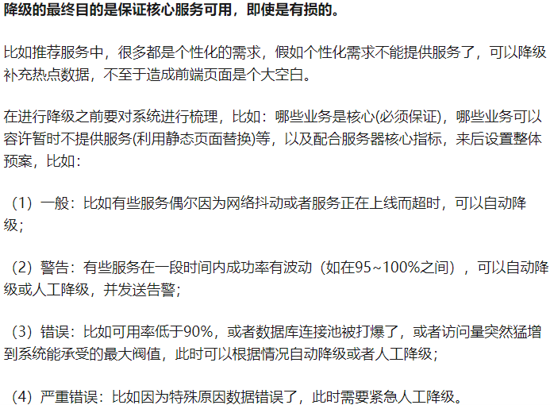
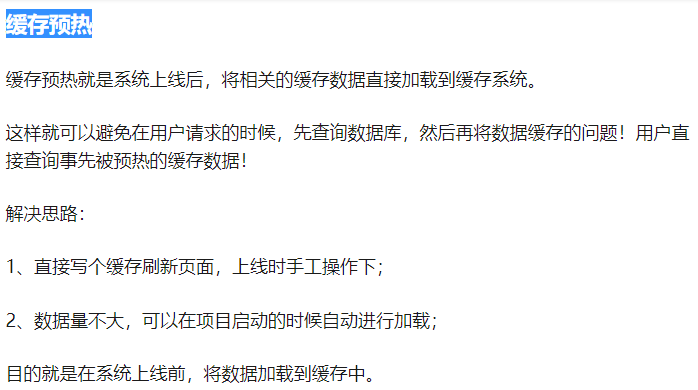

# 缓存雪崩与缓存穿透

## 缓存雪崩

当Redis缓存的数据设置了过期时间，在同一时间内缓存大量失效，或者缓存服务器宕机(redis集群大面积故障)导致数据请求全部转为DB层，DB同一时间访问请求压力瞬间增大导致崩溃。缓存失效导致的雪崩效应对底层系统的冲击是很大的。
 

## 缓存雪崩解决方案：

a. 设置redis key的失效时间时，分散在不同时间段，降低缓存失效的重叠时间;
b. 如果是redis宕机引起，可以采用Redis Sentinel 和 Redis Cluster方案，也可以采用多级缓存，redis加Memcache来缓存数据；
c. 缓存降级,主要还是对源服务访问进行限流、资源隔离（熔断）、降级等。当访问量剧增、服务出现问题仍然需要保证核心服务还是可用的。
d. 快速缓存预热
e. 最后，建议还是在项目上线前，演练缓存层宕掉后，应用以及后端的负载情况以及可能出现的问题，对高可用提前预演，提前发现问题。

## 缓存穿透
 
缓存穿透是指查询一个一不存在的数据，从缓存redis没有命中，需要从mysql数据库查询，查不到数据则不写入缓存，这将导致这个不存在的数据每次请求都要到数据库去查询，造成缓存穿透，可能会使后端数据库压力增大，很可能导致宕机；
 
## 缓存穿透解决方案：

1. 如果查询数据库也为空，直接给这个key设置一个默认值存放到缓存,这样第二次到缓冲中获取就有值了，而不会继续访问数据库,前端取到数据判断为默认值(可以和前端协定这个默认值)则认为是null.我们可以给这个空的key设置一个过期时间或者当有值的时候将缓存中的值替换掉即可。
2. 可以给key设置一些格式规则，然后查询之前先过滤掉不符合规则的Key。

## 缓存预热

