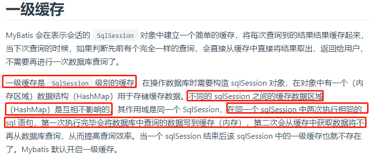
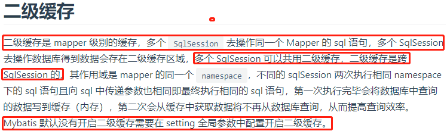
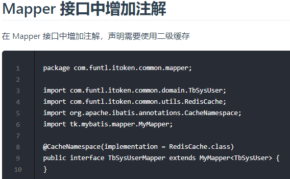

# 分布式缓存

- memcached缓存
- Redis缓存

# Redis的缓存与数据一致性

Redis经常被用过当做高速缓存，存放热点数据；一般在服务启动会从数据库初始化数据至内存中，然后取数据的时候先从内存中取，取不到再查找数据库；

如果此时执行更改操作，就会涉及到`先更新缓存再更新数据库`还是`先更新数据库再更新缓存`的问题；这两个更新步骤不在同一个事务中，也会有数据库更新成功，redis更新不成功这种问题。

a. 更新缓存还是让缓存失效

1. 当修改数据库数据也需要更新缓存时，判断更新缓存的逻辑或者代价，如果逻辑简单代价很小可以直接更新缓存；
2. 如果更新缓存需要调用很多接口，代价很大，可以直接让缓存key失效，下次读数据从DB加载，重新放入内存；

b. 先更新数据库还是先更新缓存

由于更新数据库和更新缓存两个步骤不能保证原子性，会出现临时不一致的情况，不过要保证最终数据一致性(也就是数据库和缓存一致)；

c. 最终一致性的实现方案

上面提到的两个步骤，比如我们先更新数据库，执行成功了，然后更新Redis缓存，执行失败了，此时可以将失败信息放入MQ中间件里，让服务消费这些消息，保证最终一致性

## 更新缓存的原子性

在写回 Redis 的时候如果是 `Tomcat` 集群，多个进程同时写那很有可能出现脏数据，这时就会出现更新原子性的问题。

可以有以下解决方案:
- 可以将多个 Tomcat 中的数据写入到 MQ 队列中，由消费者进行单线程更新缓存。
- 利用[分布式锁](https://github.com/crossoverJie/Java-Interview/blob/master/MD/Java-lock.md#%E5%9F%BA%E4%BA%8E%E6%95%B0%E6%8D%AE%E5%BA%93)，只有获取到锁进程才能写数据。

## 如何写缓存

写缓存时也要注意，通常来说分为以下几步：

- 开启事务。
- 写入 DB 。
- 提交事务。
- 写入缓存。

这里可能会存在数据库写入成功但是缓存写入失败的情况，但是也不建议将写入缓存加入到事务中。
因为写缓存的时候可能会因为网络原因耗时较长，这样会阻塞数据库事务。
如果对一致性要求不高并且数据量也不大的情况下，可以单独起一个服务来做 DB 和缓存之间的数据同步操作。

更新缓存时也建议做增量更新。

## 负载策略

缓存负载策略一般有以下两种：
- 轮询机制。
- 一致哈希算法。

轮询的优点是负载到各个服务器的请求是均匀的，但是如果进行扩容则缓存命中率会下降。

一致哈希的优点是相同的请求会负载到同一台服务器上，命中率不会随着扩容而降低，但是当大流量过来时有可能把服务器拖垮。

所以建议两种方案都采用：
首先采用一致哈希算法，当流量达到一定的阈值的时候则切换为轮询，这样既能保证缓存命中率，也能提高系统的可用性。

# 配置 MyBatis Redis 二级缓存

