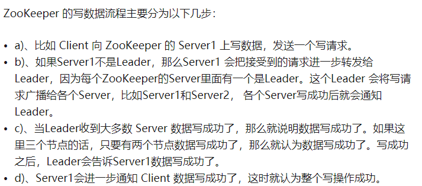
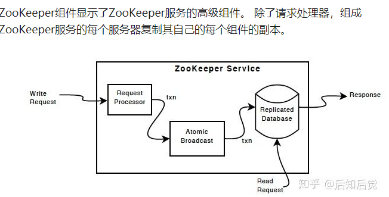
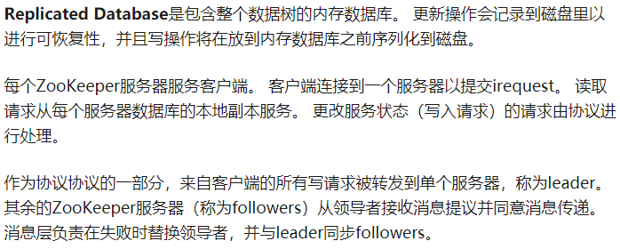
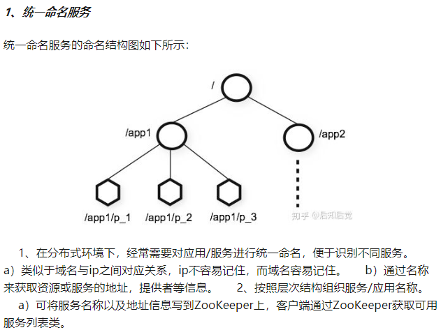
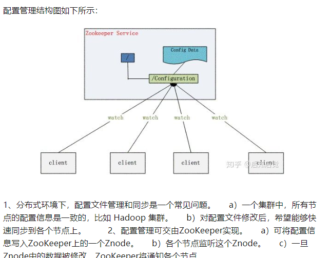
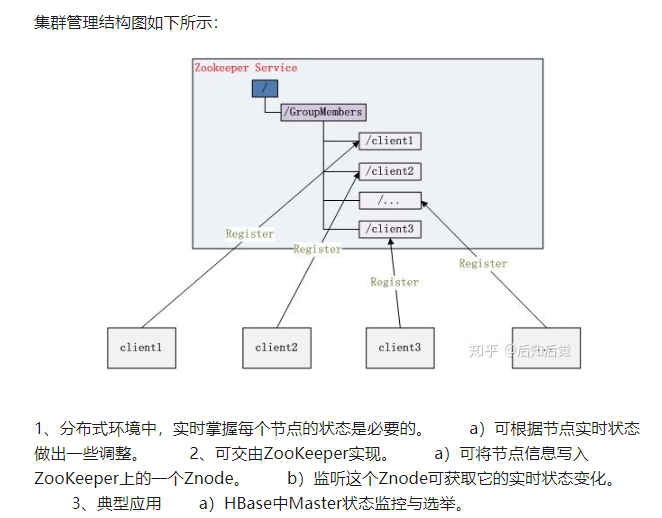
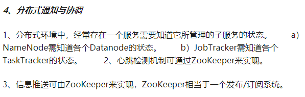
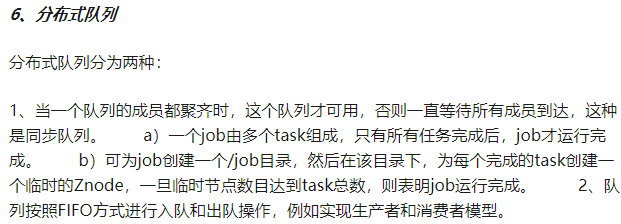

# ZooKeeper 特点

- 最终一致性：为客户端展示同一视图，这是 ZooKeeper 最重要的性能
- 可靠性：如果消息被一台服务器接受，那么它将被所有的服务器接受。
- 实时性：ZooKeeper 不能保证两个客户端同时得到刚更新的数据，如果需要最新数据，应该在读数据之前调用sync()接口
- 等待无关（wait-free）：慢的或者失效的 client 不干预快速的client的请求
- 原子性：更新只能成功或者失败，没有中间其它状态.
- 顺序一致性：对于所有Server，同一消息发布顺序一致.

对于client的每一个事务请求，ZooKeeper 都会为其分配一个全局唯一的事务ID（Zookeeper Transaction Id）,用 ZXID 来表示，通常是一个64位的数字。每一个ZXID对应一次更新操作，**从这些 ZXID 中可以间接地识别出Zookeeper处理这些更新操作请求的全局顺序**。

# ZooKeeper 基本原理

## 1. ZooKeeper 系统架构

1. ZooKeeper分为服务器端（Server） 和客户端（Client），客户端可以连接到整个 ZooKeeper服务的任意服务器上（除非 leaderServes 参数被显式设置， leader 不允许接受客户端连接）。
2. 客户端使用并维护一个 TCP 连接，通过这个连接发送请求、接受响应、获取观察的事件以及发送心跳。如果这个 TCP 连接中断，客户端将自动尝试连接到另外的 ZooKeeper服务器。客户端第一次连接到 ZooKeeper服务时，接受这个连接的 ZooKeeper服务器会为这个客户端建立一个会话。当这个客户端连接到另外的服务器时，这个会话会被新的服务器重新建立。
3. 上图中每一个Server代表一个安装Zookeeper服务的机器，即是整个提供Zookeeper服务的集群（或者是由伪集群组成）；
4. 为了保证高可用，最好是以集群形态来部署 ZooKeeper，这样只要集群中大部分机器是可用的（能够容忍一定的机器故障,只要半数以上节点存活），那么 ZooKeeper 本身仍然是可用的
5. ZooKeeper 启动时，将从实例中选举一个 leader，Leader 负责处理数据更新等操作，一个更新操作成功的标志是当且仅当大多数Server在内存中成功修改数据。每个Server 在内存中存储了一份数据。
6. Zookeeper是可以集群复制的，集群间通过Zab协议（Zookeeper Atomic Broadcast）来保持数据的一致性；
7. Zab协议包含两个阶段：leader election阶段和Atomic Brodcast阶段。

---
a) 集群中将选举出一个leader，其他的机器则称为follower，所有的写操作都被传送给leader，并通过brodcast将所有的更新告诉给follower。
b) 当leader崩溃或者leader失去大多数的follower时，需要重新选举出一个新的leader，让所有的服务器都恢复到一个正确的状态。
c) 当leader被选举出来，且大多数服务器完成了和leader的状态同步后，leadder election 的过程就结束了，就将会进入到Atomic brodcast的过程。
d) Atomic Brodcast同步leader和follower之间的信息，保证leader和follower具有相同的系统状态。
---

### 会话

---
    一个客户端连接是指客户端和服务器之间的一个TCP长连接。客户端启动的时候，首先会与服务器建立一个 TCP 连接，从第一次连接建立开始，会话的生命周期也开始了。**通过这个连接，客户端能够通过心跳检测与服务器保持有效的会话，也能够向Zookeeper服务器发送请求并接受响应，同时还能够通过该连接接收来自服务器的Watch事件通知。
    
    Session的`sessionTimeout`值用来设置一个客户端会话的超时时间。当由于服务器压力太大、网络故障或是客户端主动断开连接等各种原因导致客户端连接断开时，**只要在`sessionTimeout`规定的时间内能够重新连接上集群中任意一台服务器，那么之前创建的会话仍然有效。**
    
    在为客户端创建会话之前，服务端首先会为每个客户端都分配一个sessionID。由于 sessionID 是 Zookeeper 会话的一个重要标识，许多与会话相关的运行机制都是基于这个 sessionID 的，因此，无论是哪台服务器为客户端分配的 sessionID，都务必保证全局唯一。
---

## 2、Zookeeper 角色

**最典型集群模式： Master/Slave 模式（主备模式）**。在这种模式中，通常 Master服务器作为主服务器提供写服务，其他的 Slave 服务器从服务器通过异步复制的方式获取 Master 服务器最新的数据提供读服务。但是，**在 ZooKeeper 中没有选择传统的  Master/Slave 概念，而是引入了Leader、Follower 和 Observer 三种角色**

启动 Zookeeper 服务器集群环境后，多个 Zookeeper 服务器在工作前会选举出一个 Leader。选举出 leader 前，所有 server 不区分角色，都需要平等参与投票(obServer不参与投票),选举过程完成后，存在以下几种角色：   

### 思考

３、为什么在Zookeeper集群中Server 数目一般为奇数？

---
    我们知道在Zookeeper中 Leader 选举算法采用了Paxos协议。Paxos核心思想是当多数 Server 写成功，则任务数据写成功。 
    ①如果有3个Server，则最多允许1个Server 挂掉。 
    ②如果有4个Server，则同样最多允许1个Server挂掉。 
    既然3个或者4个Server，同样最多允许1个Server挂掉，那么它们的可靠性是一样的，所以选择奇数个ZooKeeper Server即可，这里选择3个Server。
    
    所谓的zookeeper容错是指，当宕掉几个zookeeper服务器之后，依然可用,假如我们有5台，那么最大允许宕掉2台(3/5的多数)，如果我们有6台的的时候也同样只允许宕掉2台。才能保证多数(4/6的多数).
    
    综上，何必增加那一个不必要的zookeeper呢？
---

## 3、ZooKeeper 写数据流程
   

## 4、ZooKeeper 组件
   

# ZooKeeper 应用场景总结

## 1、统一命名服务

   
## 2、配置管理

**Watcher（事件监听器），是Zookeeper中的一个很重要的特性。Zookeeper允许client在指定节点上注册一些Watcher，并且在一些特定事件触发的时候，ZooKeeper服务端会将事件通知到感兴趣的client上去，该机制是Zookeeper实现分布式协调服务的重要特性。**
   
## 3、集群管理

   
## 4、分布式通知与协调

   
## 5、分布式锁
   
处于不同节点上不同的服务，它们可能需要顺序的访问一些资源，这里需要一把分布式的锁。

分布式锁具有以下特性：

---
    1、ZooKeeper是强一致的。比如各个节点上运行一个ZooKeeper客户端，它们同时创建相同的Znode，但是只有一个客户端创建成功。
    
    2、实现锁的独占性。创建Znode成功的那个客户端才能得到锁，其它客户端只能等待。当前客户端用完这个锁后，会删除这个Znode，其它客户端再尝试创建Znode，获取分布式锁。
    
    3、控制锁的时序。各个客户端在某个Znode下创建临时Znode，这个类型必须为CreateMode.EPHEMERAL_SEQUENTIAL，这样该Znode可掌握全局访问时序。
---   

关于如何使用 zookeeper 实现分布式锁:  	
[基于Zookeeper的分布式锁](https://blog.csdn.net/qiangcuo6087/article/details/79067136)

## 6、分布式队列
   

# ZooKeeper 安装部署

zookeeper 的安装模式有三种：
  
1. 单机模式（ stand-alone）：单机单 server；
2. 集群模式：多机多 server，形成集群；
3. 伪集群模式：单机多个 server，形成伪集群；

[https://zhuanlan.zhihu.com/p/67140930](https://zhuanlan.zhihu.com/p/67140930)
