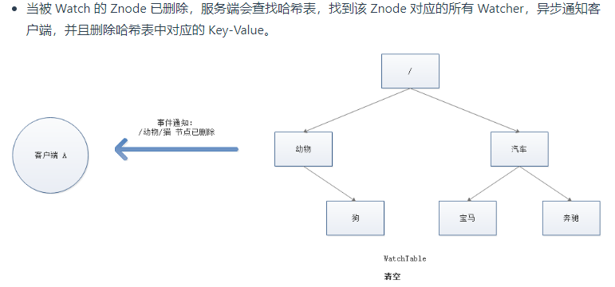
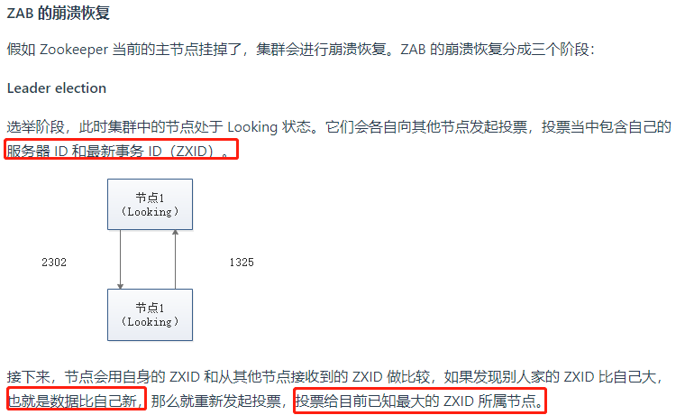
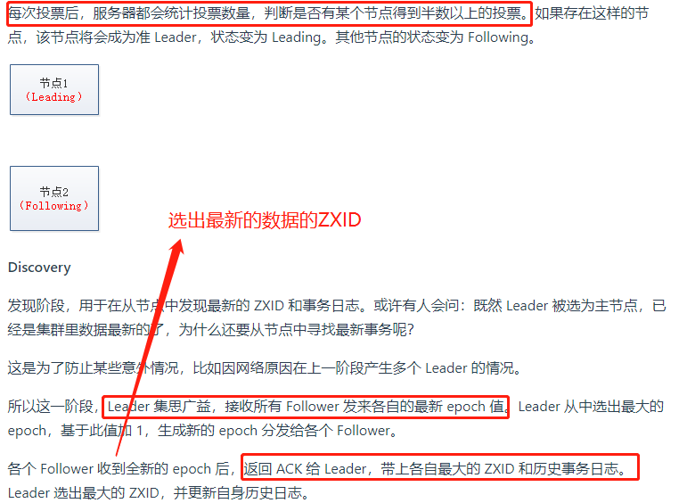
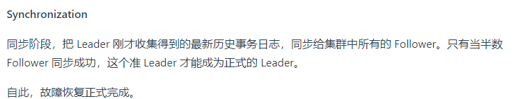
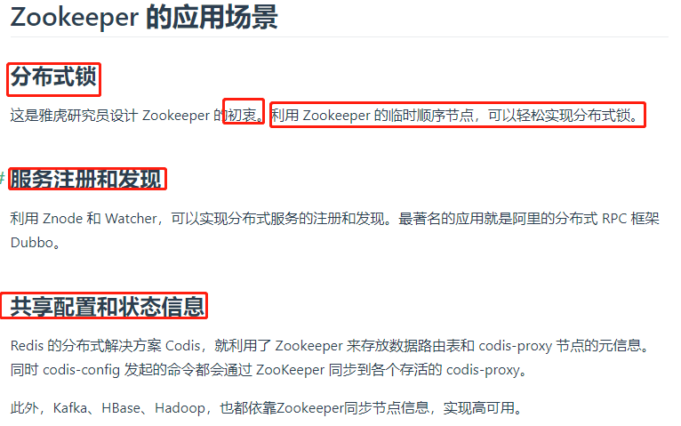

# ZooKeeper介绍

Zookeeper 是 Hadoop下的一个子项目,是一个分布式协调组件,是一个典型的分布式数据一致性解决方案(也就是可以当分布式锁).

最常用的使用场景就是用于担任服务生产者和服务消费者的注册中心，服务生产者将自己提供的服务注册到Zookeeper中心，服务的消费者在进行服务调用的时候先到Zookeeper中查找服务，获取到服务生产者的详细信息之后，再去调用服务生产者的内容与数据，简单示例图如下：


>ZooKeeper将数据保存在内存中，这也就保证了高吞吐量和低延迟（但是内存限制了能够存储的容量不太大，此限制也是保持znode中存储的数据量较小的进一步原因）,ZooKeeper 是高性能的。 在“读”多于“写”的应用程序中尤其地高性能.

>这里需要注意一点，Zookeeper 是为读多写少的场景所设计。Znode 并不是用来存储大规模业务数据，而是用于存储少量的状态和配置信息，每个节点的数据最大不能超过 1MB。

# Znode

Zookeeper将所有数据存储在内存中，ZNode是ZooKeeper中数据的最小单元,znode用由斜杠分割的路径表示，例如/foo/path1

>在Zookeeper中，node可以分为持久节点和临时节点两类:

1. 持久节点: 是指一旦被创建了，除非主动进行ZNode的移除操作，否则这个ZNode将一直保存在Zookeeper上。
2. 临时节点就不一样了，它的生命周期和客户端会话绑定，一旦客户端会话失效，那么这个客户端创建的所有临时节点都会被移除。

# ZNode的结构

每个 ZNode 由2部分组成:

- stat：包含 Znode 的各种元数据，比如事务 ID、版本号、时间戳、大小等等。
- data：zookeeper相对于redis的好处
- ACL：记录 Znode 的访问权限，即哪些人或哪些 IP 可以访问本节点。
- child：当前节点的子节点引用

通过 get 命令来获取根目录下的 dubbo 节点的内容:

```shell
[zk: 127.0.0.1:2181(CONNECTED) 6] get /dubbo    
# 该数据节点关联的数据内容为空
null
# 下面是该数据节点的一些状态信息，其实就是 Stat 对象的格式化输出
cZxid = 0x2
ctime = Tue Nov 27 11:05:34 CST 2018
mZxid = 0x2
mtime = Tue Nov 27 11:05:34 CST 2018
pZxid = 0x3
cversion = 1
dataVersion = 0
aclVersion = 0
ephemeralOwner = 0x0
dataLength = 0
numChildren = 1
```

这些状态信息其实就是 Stat 对象的格式化输出。Stat 类中包含了一个数据节点的所有状态信息的字段，包括事务ID、版本信息和子节点个数等，如下图所示:


# Zookeeper 的基本操作

- 创建节点: create
- 删除节点: delete
- 判断节点是否存在: exists
- 获得一个节点的数据: getData
- 设置一个节点的数据: setData
- 获取节点下的所有子节点: getChildren

>这其中，exists，getData，getChildren 属于读操作。Zookeeper 客户端在请求读操作的时候，可以选择是否设置 Watch

# Zookeeper 的事件通知




# Zookeeper 的一致性

Zookeeper 身为分布式系统协调服务，如果自身挂了如何处理呢？为了防止单机挂掉的情况，Zookeeper 维护了一个集群.


Zookeeper Service 集群是一主多从结构。

在更新数据时，首先更新到主节点（这里的节点是指服务器，不是 Znode），再同步到从节点。

在读取数据时，直接读取任意从节点。

为了保证主从节点的数据一致性，Zookeeper 采用了 ZAB 协议，这种协议非常类似于一致性算法 Paxos 和 Raft。

# ZAB

Zookeeper Atomic Broadcast，有效解决了2个问题,我们一一讨论:

- Zookeeper 集群崩溃恢复
- 主从同步数据的问题


## ZAB解决集群崩溃恢复





## ZAB解决 主从同步数据的问题


# Zookeeper的应用场景

