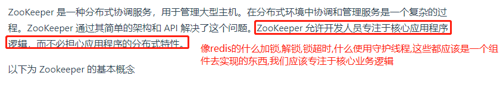

# 分布式协调技术

分布式协调技术用来解决分布式环境中多个进程对临界资源的有序访问问题，防止造成数据不一致.(库存就剩一件商品,但是卖了2次.)

为了防止分布式系统中的多个进程之间相互干扰，我们需要一种分布式协调技术来对这些进程进行调度。而这个分布式协调技术的核心就是来实现这个分布式锁。例如:zk就是分布式锁的一个实现框架.

# 分布式锁(分布式互斥锁-互斥多个访问临界资源的进程)

在单jvm实例的时候,可以基于cpu的cas（compare And Swap）控制，以及java语法自带的锁,可以很好的解决多线程高并发下的资源抢占问题。那么，跨jvm进程的多实例呢？

在分布式场景下，对不同机器上的不同进程进行加锁，就需要使用分布式锁。

很多大型网站都是分布式部署，分布式场景中的数据一致性问题一直是一个比较重要的话题。在很多场景中，我们为了保证数据的最终一致性，需要很多的技术方案来支持，比如分布式事务、分布式锁等。

在很多互联网产品应用中，有些场景需要加锁处理，比如：秒杀(总数是有限的)，全局递增ID等。

.png)

# 分布式锁应该有的功能

1. 互斥: 任何时候,只有一个客户端能持有同一个锁.
2. 不会死锁: 最终client一定会得到锁,就算一个持有锁的客户端宕掉或者发生网络分区异常.
3. 分区容错性: 当部分节点宕机时,客户端仍然能够获取锁和释放锁

# 分布式锁应该具备哪些条件

1. 基于数据库.(知道就好，这种方法不好)
2. 基于ZooKeeper的分布式锁,zookeeper天生就是做分布式协调服务的;(个人感觉此方法比较好)，利用 Zookeeper 的顺序临时节点，来实现分布式锁和等待队列。Zookeeper 设计的初衷，就是为了实现分布式锁服务的。
3. 基于Redis的分布式锁,这里要注意: Redis天生不是干这个的,Redis天生是用于数据缓存的,但是可以利用它自己的一些特性来干分布式锁的事情,(利用 Redis 的 setnx 命令。此命令同样是原子性操作，只有在 key 不存在的情况下，才能 set 成功)
4. Memcached：利用 Memcached 的 add 命令。此命令是原子性操作，只有在 key 不存在的情况下，才能 add 成功，也就意味着线程得到了锁。(类似于redis,memcached天生也不是干这个事情的,只是利用了它自己的一些特性来干分布式锁的事情)

>哪种方式都无法做到完美。需要根据不同的应用场景选择最适合自己的才是王道。

# 实现的复杂性角度（从低到高）

>Zookeeper >= 缓存 > 数据库

# 性能角度（从高到低）

> 缓存 > Zookeeper >= 数据库

# 可靠性角度（从高到低）

>Zookeeper > 缓存 > 数据库