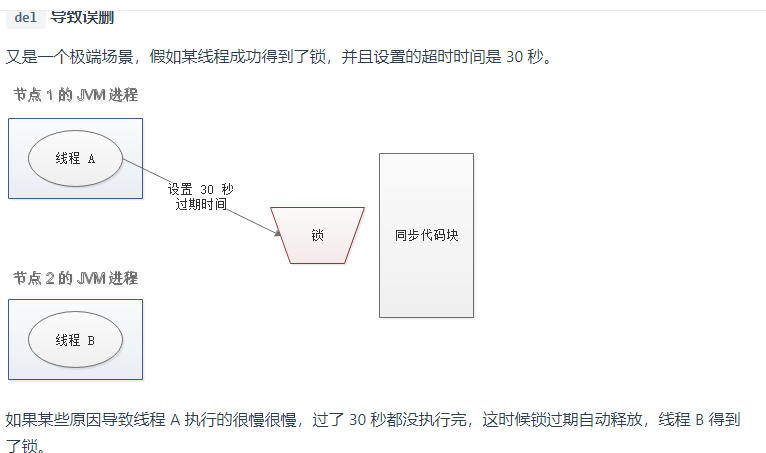
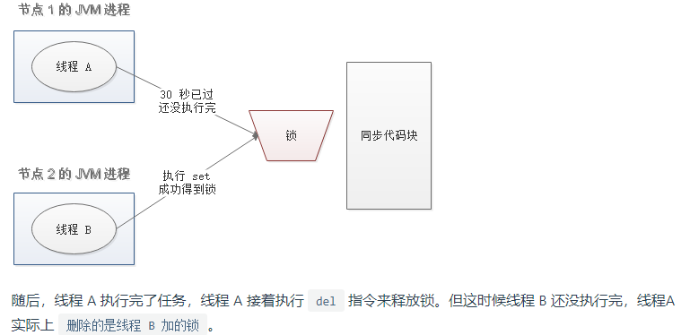
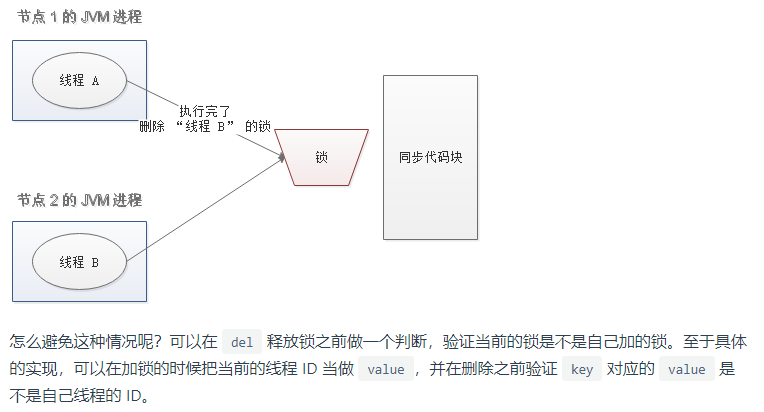
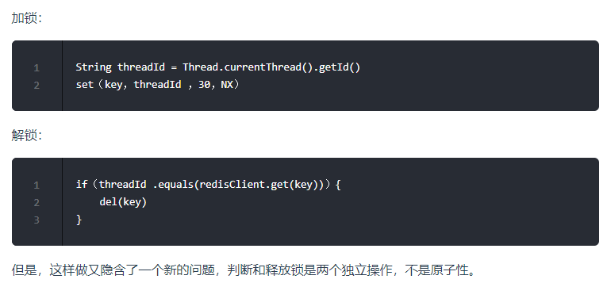
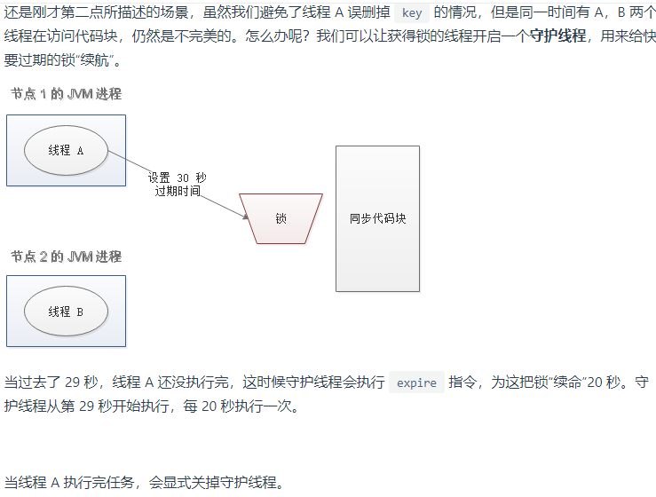
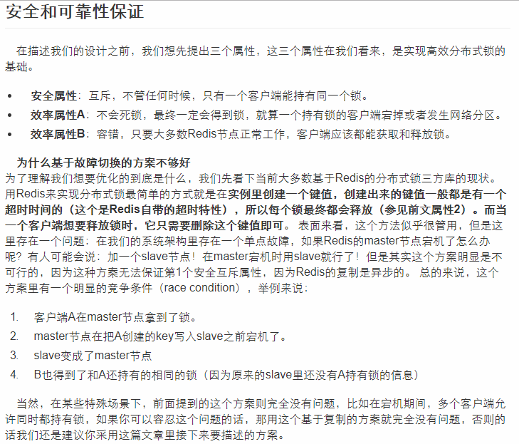
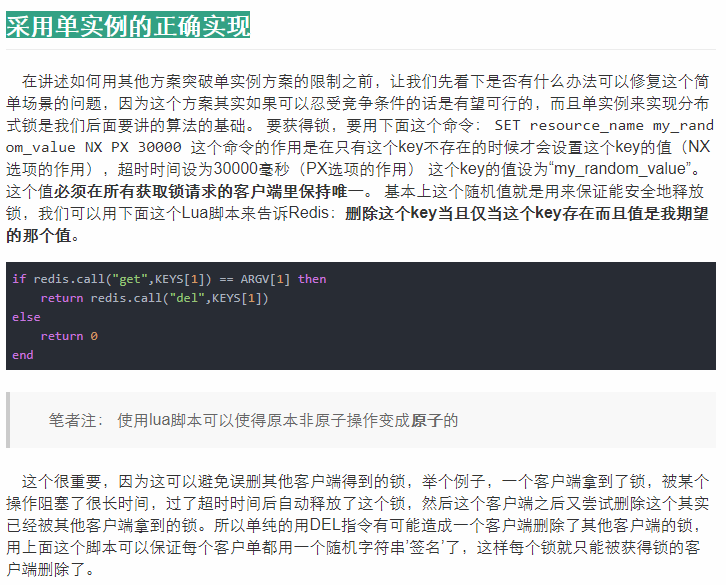
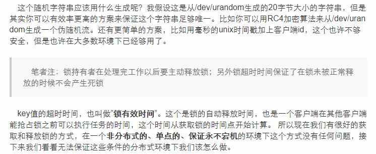
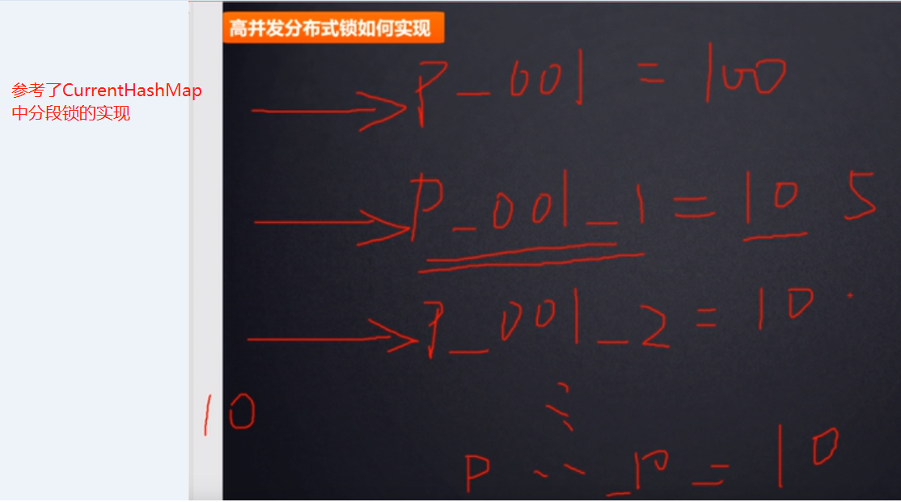

# redis分布式锁(核心：加锁，解锁，锁超时)

Redis为单进程模式，多个client并发操作，按照先到先执行的原则，先到的先执行，其余的阻塞。

也就是将并发访问变成串行访问，且多客户端对Redis的连接并不存在竞争关系。

其次Redis提供一些命令SETNX，可以方便实现分布式锁机制。

本着批判性原则，现在网上可以随手搜索到很多基于Redis的分布式锁实现，但可能是时间原因吧，那些实现方式不是很完美，有些文章，阅读数量挺大的，但是其内容比较老旧，而且也不是很好的解决方案，因为有些实现机制牵扯到全局时钟一致。在分布式环境中要想实现全局时钟完全同步是非常困难的，个人感觉也没有必要。

# redis分布式锁要达到的特性

1. 互斥:任何时候,只有一个客户端能持有同一个锁.
2. 不会死锁:最终client一定会得到锁
3. 容错性:当部分redis节点宕机时,客户端仍然能够获取锁和释放锁

# 基于redis分布式锁的实现原理

技术是为业务服务的，所以我们要找一个现成的解决方案帮我解决掉这个问题，让我们注意力和精力放在业务本身上面，redis明显是相对比较麻烦的分布式锁方案,有很多问题，我们一般要谨慎使用，除非没有其他更好的方案了。(我们主要还是使用专门用于解决分布式协调方案的zk)

# 基于redis分布式锁的解决方案

- redisson
- redlock

# redlock

相对完美的解决方案（并非真的完美）

这也是redis官网提出的推荐的方案,[官网推出了一种叫Redlock的锁](https://redis.io/topics/distlock)

## 在redis单节点上实现分布式锁

分布式锁需要考虑的: 锁时效(能租用锁多长时间)，锁等待(阻塞/非阻塞)，锁释放通知，锁粒度可控，JDK有的分布式锁都要有，what？redis客户端redisson都已经实现的差不多了。

## Redlock

[http://www.kailing.pub/article/index/arcid/168.html](http://www.kailing.pub/article/index/arcid/168.html)

- [开箱即用的分布式所](https://github.com/kekingcn/spring-boot-klock-starter)

# redisson

# 如何提高redis分布式锁的性能

使用redis来实现分布式锁天生不是为了高并发而生的,虽然redis实现分布式锁的性能很高,比zk要高,但是它天生是为了解决你的业务问题而生的.

