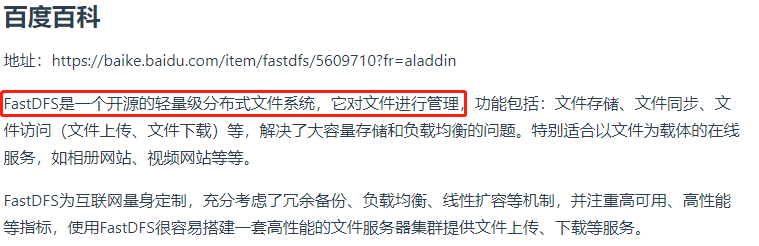
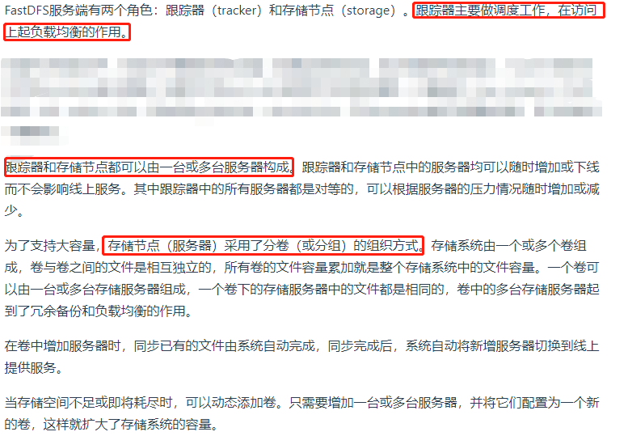
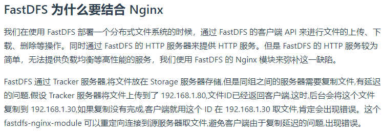
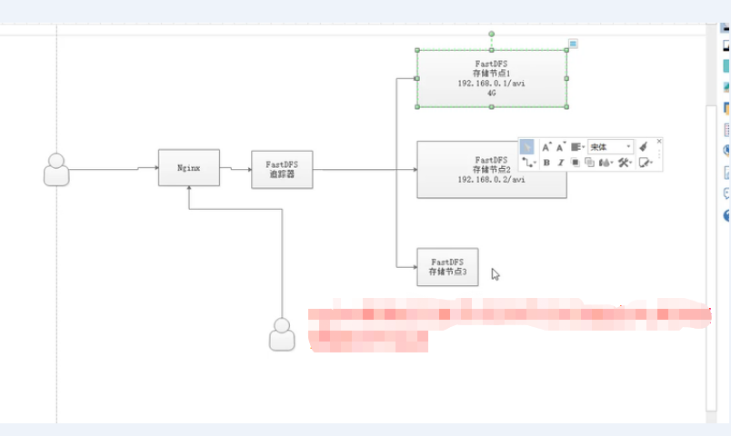
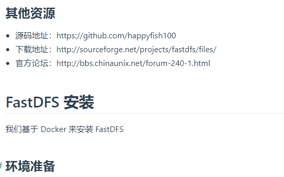
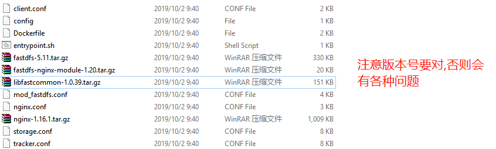
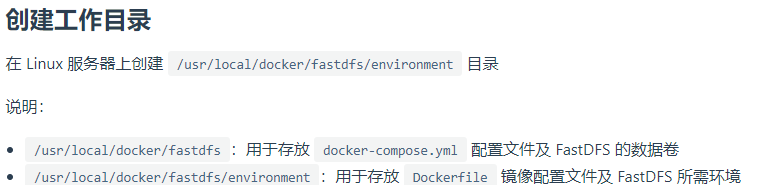
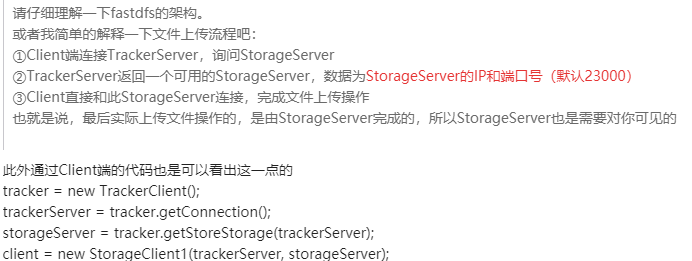

# 分布式文件系统FastDFS













    下载所需文件

```shell script
https://github.com/happyfish100/fastdfs-nginx-module/releases
https://github.com/happyfish100/fastdfs/releases
https://github.com/happyfish100/libfastcommon/releases
```    

    docker-compose.yml

```yaml
version: '3.1'
services:
  fastdfs:
    build: environment
    restart: always
    container_name: fastdfs
    ports:
      - 8888:8888
      - 22122:22122
      - 23000:23000
    volumes:
      - ./storage:/fastdfs/storage
```

    Dockerfile

```shell script
FROM ubuntu:xenial
# 作者信息
MAINTAINER xzj@qq.com

# 更新数据源
WORKDIR /etc/apt
RUN echo 'deb http://mirrors.aliyun.com/ubuntu/ xenial main restricted universe multiverse' > sources.list
RUN echo 'deb http://mirrors.aliyun.com/ubuntu/ xenial-security main restricted universe multiverse' >> sources.list
RUN echo 'deb http://mirrors.aliyun.com/ubuntu/ xenial-updates main restricted universe multiverse' >> sources.list
RUN echo 'deb http://mirrors.aliyun.com/ubuntu/ xenial-backports main restricted universe multiverse' >> sources.list
RUN apt-get update

# 安装依赖
RUN apt-get install make gcc libpcre3-dev zlib1g-dev --assume-yes

# 复制工具包
# ADD的意思是解压tar.gz,并且拷贝
ADD fastdfs-5.11.tar.gz /usr/local/src
ADD fastdfs-nginx-module-1.20.tar.gz /usr/local/src
ADD libfastcommon-1.0.39.tar.gz /usr/local/src
ADD nginx-1.16.1.tar.gz /usr/local/src

# 安装 libfastcommon
WORKDIR /usr/local/src/libfastcommon-1.0.39
RUN ./make.sh && ./make.sh install

# 安装 FastDFS
WORKDIR /usr/local/src/fastdfs-5.11
RUN ./make.sh && ./make.sh install

# 配置 FastDFS 跟踪器
# tracker的在fastdfs安装好后,用我们的配置文件覆盖默认的配文件,我们的配置文件也是先拷贝默认的配置文件,然后改好的
ADD tracker.conf /etc/fdfs
# tracker.conf中的base_path
RUN mkdir -p /fastdfs/tracker

# 配置 FastDFS 存储
# 覆盖storage.conf的默认配置文件
ADD storage.conf /etc/fdfs
# storage.conf中的base_path
RUN mkdir -p /fastdfs/storage

# 配置 FastDFS 客户端
ADD client.conf /etc/fdfs

# 配置 fastdfs-nginx-module
ADD config /usr/local/src/fastdfs-nginx-module-1.20/src

# FastDFS 与 Nginx 集成
WORKDIR /usr/local/src/nginx-1.16.1
RUN ./configure --add-module=/usr/local/src/fastdfs-nginx-module-1.20/src
RUN make && make install
ADD mod_fastdfs.conf /etc/fdfs

WORKDIR /usr/local/src/fastdfs-5.11/conf
RUN cp http.conf mime.types /etc/fdfs/

# 配置 Nginx
ADD nginx.conf /usr/local/nginx/conf

COPY entrypoint.sh /usr/local/bin/
# entrypoint只可以使用一次,所以我们的启动服务的功能写在脚本中.
ENTRYPOINT ["/usr/local/bin/entrypoint.sh"]

WORKDIR /
EXPOSE 8888
# CMD只可以使用一次
CMD ["/bin/bash"]
```

    entrypoint.sh

```shell script
#!/bin/sh
/etc/init.d/fdfs_trackerd start
/etc/init.d/fdfs_storaged start
/usr/local/nginx/sbin/nginx -g 'daemon off;'
# 注：Shell 创建后是无法直接使用的，需要赋予执行的权限，使用 chmod +x entrypoint.sh 命令
```

    tracker.conf

```shell script
# FastDFS tracker配置文件，容器中路径为：/etc/fdfs，我们先拷贝出来,然后修改几个地方：
base_path=/fastdfs/tracker
# tracker默认监听22122
```

    storage.conf

```shell script
# FastDFS storage配置文件，容器中路径为：/etc/fdfs，修改其中的一部分：
# storage的默认监听的端口是23000
base_path=/fastdfs/storage
store_path0=/fastdfs/storage
# 配置tracker的地址,这样才可以和tracker通信
tracker_server=192.168.32.128:22122
# 在这个storage服务器上的web服务器的端口
http.server_port=8888
```

    client.conf

```shell script
# FastDFS client配置文件，容器中路径为：/etc/fdfs，修改为：
# client.conf在fastdfs-5.11.tar.gz,我们拷贝出来,定制下
base_path=/fastdfs/tracker
tracker_server=192.168.32.128:22122
```    

    config

```shell script
# fastdfs-nginx-module 配置文件，容器中路径为：/usr/local/src/fastdfs-nginx-module/src，修改为：
# ngx_module_incs="/usr/include/fastdfs /usr/include/fastcommon/"
# CORE_INCS="$CORE_INCS /usr/include/fastdfs /usr/include/fastcommon/"
```

    mod_fastdfs.conf

```shell script
# fastdfs-nginx-module 配置文件，容器中路径为：/usr/local/src/fastdfs-nginx-module/src，修改为：
connect_timeout=10
# 让nginx知道追踪器tracker的地址,因为我们是通过nginx来访问图片的
tracker_server=192.168.32.128:22122
url_have_group_name = true
# 要知道存储路径的位置
store_path0=/fastdfs/storage
```

    nginx.conf

```shell script
# Nginx 配置文件，容器中路径为：/usr/local/src/nginx-1.16.1/conf，修改为：
user  root;
worker_processes  1;

events {
    worker_connections  1024;
}

http {
    include       mime.types;
    default_type  application/octet-stream;

    sendfile        on;

    keepalive_timeout  65;

    server {
        listen       8888;
        server_name  localhost;

        location ~/group([0-9])/M00 {
            ngx_fastdfs_module;
        }

        error_page   500 502 503 504  /50x.html;
        location = /50x.html {
            root   html;
        }
    }
}
```

# 测试上传

```shell script
#交互式进入容器
docker exec -it fastdfs /bin/bash

#测试文件上传
/usr/bin/fdfs_upload_file /etc/fdfs/client.conf /usr/local/src/fastdfs-5.11/INSTALL

#服务器反馈上传地址
group1/M00/00/00/wKhLi1oHVMCAT2vrAAAeSwu9TgM3976771

#测试 Nginx 访问
http://192.168.32.128:8888/group1/M00/00/00/wKhLi1oHVMCAT2vrAAAeSwu9TgM3976771
```

# FastDFS java client SDK



[使用java client连接](https://github.com/happyfish100/fastdfs-client-java)