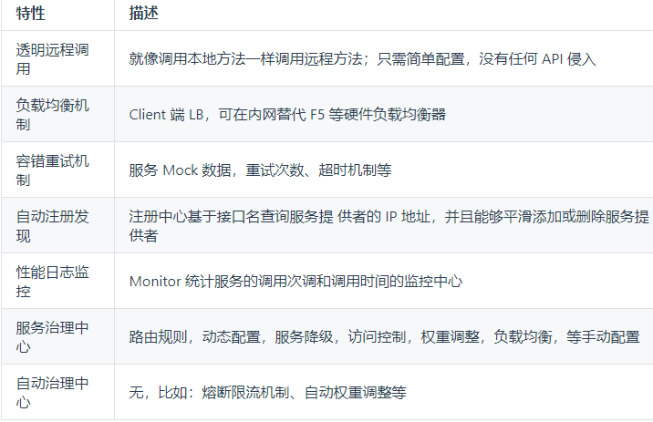

# 什么是 Duboo？

Apache Dubbo |ˈdʌbəʊ| 是一款高性能、轻量级的开源Java RPC 框架，它提供了三大核心能力：`面向接口的远程方法调用`，`智能容错`和`负载均衡`，以及`服务自动注册和发现`。简单来说 Dubbo 是一个分布式服务框架，一个RPC远程服务调用方案.

她最大的特点是按照分层的方式来架构，使用这种方式可以使各个层之间解耦合（或者最大限度地松耦合）。

Dubbo 采用的是一种非常简单的模型，要么是提供方提供服务，要么是消费方消费服务，所以基于这一点可以抽象出服务提供方（Provider）和服务消费方（Consumer）两个角色。

- [官网](http://dubbo.apache.org/zh-cn)
- [GitHub](https://github.com/apache/dubbo-admin)
- [Dubbo Spring Boot (v0.2.0)](https://github.com/apache/incubator-dubbo-spring-boot-project)
- [Dubbo (v2.6.2)](https://github.com/apache/incubator-dubbo)



# Dubbo 的组件角色

后面会使用 zookeeper 作为注册中心，这也是 Dubbo 官方推荐的一种方式(现在最新的已经不推荐使用zookeeper了)


-  **Provider**   暴露服务的服务提供方
- **Consumer**  调用远程服务的服务消费方
- **Registry**  服务注册与发现的注册中心
- **Monitor**   统计服务的调用次数和调用时间的监控中心
- **Container**   服务运行容器

**调用关系说明：**
1. 服务容器负责启动，加载，运行服务提供者。
2. 服务提供者在启动时，向注册中心注册自己提供的服务。
3. 服务消费者在启动时，向注册中心订阅自己所需的服务。
4. 注册中心返回服务提供者地址列表给消费者，如果有变更，注册中心将基于长连接推送变更数据给消费者。
5. 服务消费者，从提供者地址列表中，基于软负载均衡算法，选一台服务提供者进行调用，如果调用失败，再选另一台调用。
6. 服务消费者和提供者，在内存中累计调用次数和调用时间，定时每分钟发送一次统计数据到监控中心。

# 使用Dubbo Admin管理控制台

管理控制台包含：路由规则，动态配置，服务降级，访问控制，权重调整，负载均衡，等管理功能。

>搭建dubbo admin控制台步骤:

- git clone https://github.com/apache/dubbo-admin.git
- 安装nodejs后,依照官网,配置taobao代理
- 在 dubbo-admin-server/src/main/resources/application.properties中指定zk注册中心地址
- 构建: mvn clean package
- 启动: mvn --projects dubbo-admin-server spring-boot:run
- http://localhost:8080

## dubbo admin Frontend Build Setup

```shell
# 安装依赖(配置淘宝镜像加速)
npm install --registry=https://registry.npm.taobao.org

# serve with hot reload at localhost:8081
# 用热加载在localhost:8081进行服务
npm run dev

# build for production with minification
# 为缩小生产而建造
npm run build

# build for production and view the bundle analyzer report
npm run build --report
```
