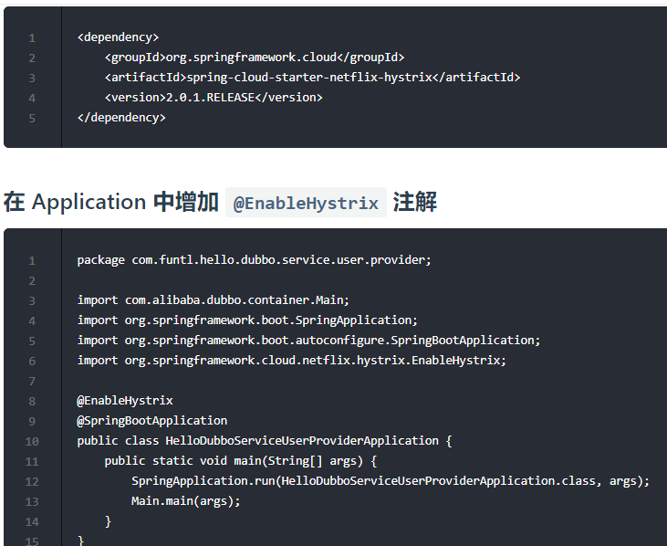
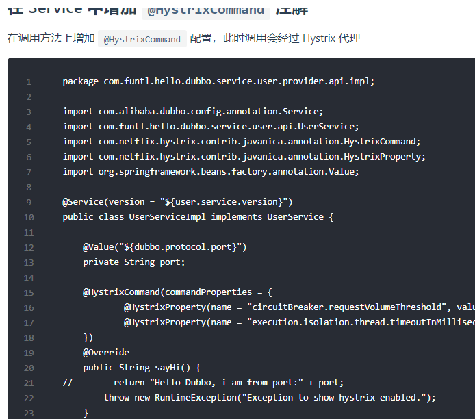
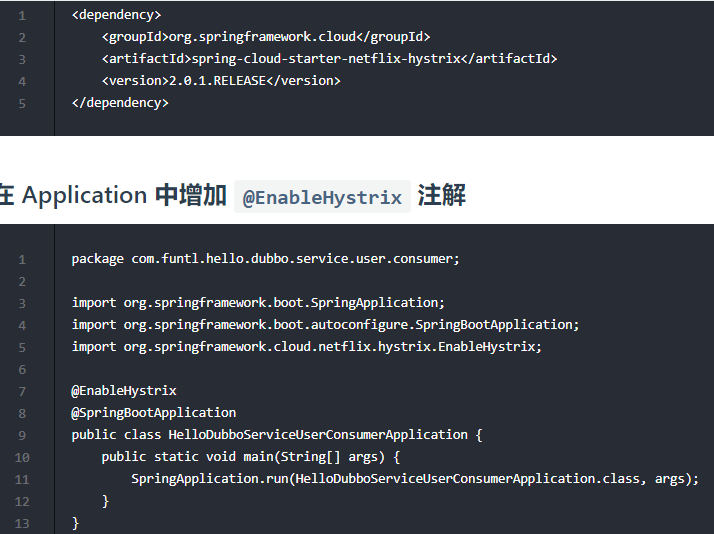
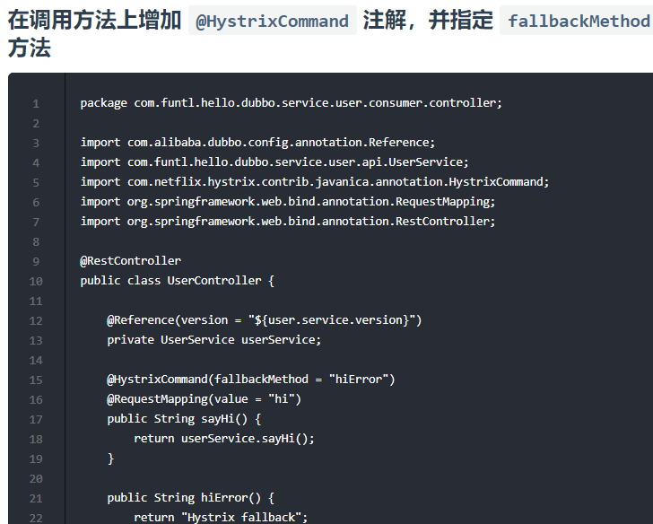

# Dubbo + Hystrix 实现服务熔断

# 熔断器简介

在微服务架构中，根据业务来拆分成一个个的服务，服务与服务之间可以通过 RPC 相互调用，为了保证其高可用，单个服务通常会集群部署。由于网络原因或者自身的原因，服务并不能保证 100% 可用，如果单个服务出现问题，调用这个服务就会出现线程阻塞，此时若有大量的请求涌入，Servlet 容器的线程资源会被消耗完毕，导致服务瘫痪。服务与服务之间的依赖性，故障会传播，会对整个微服务系统造成灾难性的严重后果，这就是服务故障的 “雪崩” 效应。

为了解决这个问题，业界提出了熔断器模型。

Netflix 开源了 Hystrix 组件，实现了熔断器模式，Spring Cloud 对这一组件进行了整合。在微服务架构中，一个请求需要调用多个服务是非常常见的，如下图：

较底层的服务如果出现故障，会导致连锁故障。当对特定的服务的调用的不可用达到一个阀值（Hystrix 是 5 秒 20 次） 熔断器将会被打开。

熔断器打开后，为了避免连锁故障，通过 fallback 方法可以直接返回一个固定值。

# Dubbo Provider 中使用熔断器

# Dubbo Consumer 中使用熔断器

