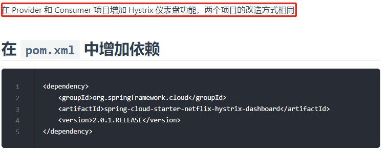
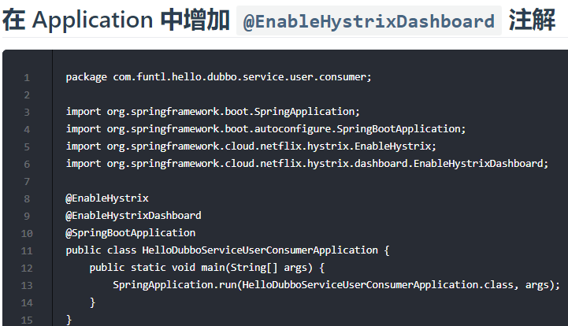
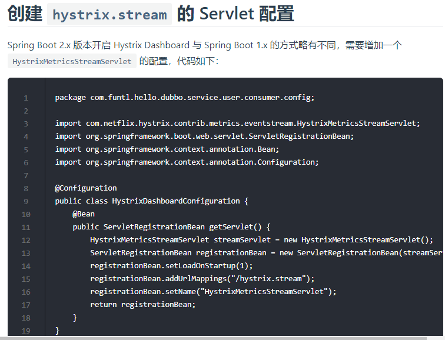
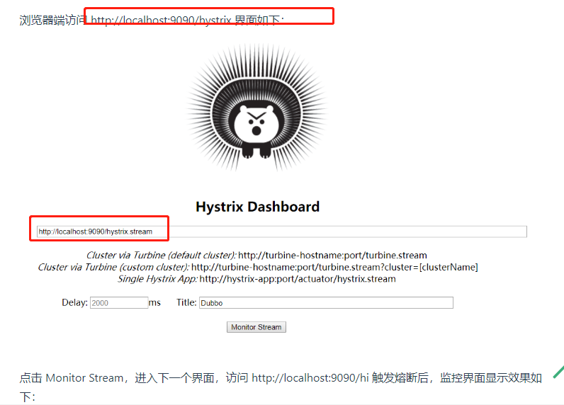
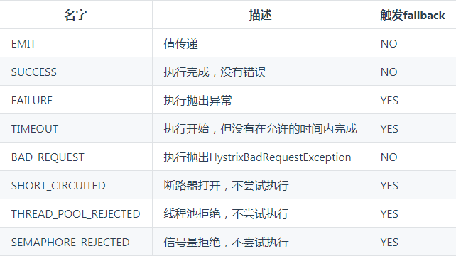
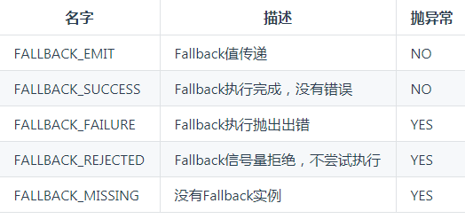
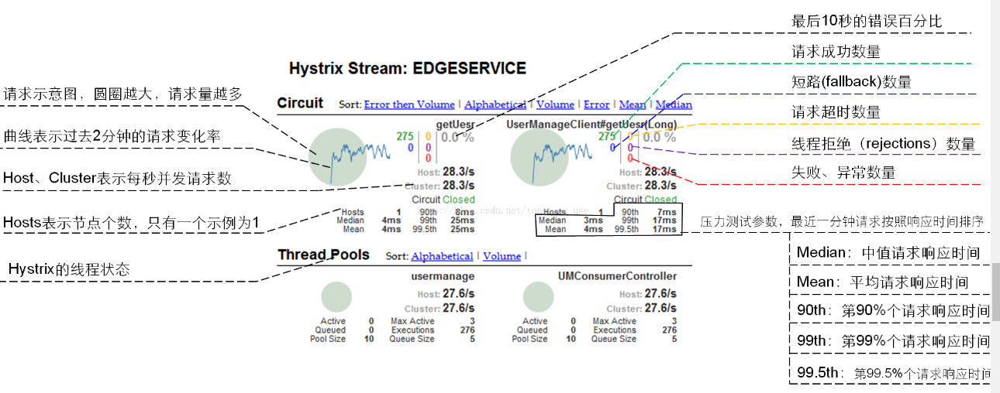

# 使用熔断器仪表盘监控

# 附：Hystrix 说明

## 什么情况下会触发 fallback 方法

## fallback 方法在什么情况下会抛出异常

# Hystrix Dashboard 界面监控参数

    Hystrix 常用配置信息

# 超时时间（默认1000ms，单位：ms）

- hystrix.command.default.execution.isolation.thread.timeoutInMilliseconds：在调用方配置，被该调用方的所有方法的超时时间都是该值，优先级低于下边的指定配置
- hystrix.command.HystrixCommandKey.execution.isolation.thread.timeoutInMilliseconds：在调用方配置，被该调用方的指定方法（HystrixCommandKey 方法名）的超时时间是该值

# 线程池核心线程数

- hystrix.threadpool.default.coreSize：默认为 10

# Queue

- hystrix.threadpool.default.maxQueueSize：最大排队长度。默认 -1，使用 SynchronousQueue。其他值则使用 LinkedBlockingQueue。如果要从 -1 换成其他值则需重启，即该值不能动态调整，若要动态调整，需要使用到下边这个配置
- hystrix.threadpool.default.queueSizeRejectionThreshold：排队线程数量阈值，默认为 5，达到时拒绝，如果配置了该选项，队列的大小是该队列
- 注意： 如果 maxQueueSize=-1 的话，则该选项不起作用

# 断路器

- hystrix.command.default.circuitBreaker.requestVolumeThreshold：当在配置时间窗口内达到此数量的失败后，进行短路。默认 20 个（10s 内请求失败数量达到 20 个，断路器开）
- hystrix.command.default.circuitBreaker.sleepWindowInMilliseconds：短路多久以后开始尝试是否恢复，默认 5s
- hystrix.command.default.circuitBreaker.errorThresholdPercentage：出错百分比阈值，当达到此阈值后，开始短路。默认 50%

# fallback

- hystrix.command.default.fallback.isolation.semaphore.maxConcurrentRequests：调用线程允许请求 
- HystrixCommand.GetFallback() 的最大数量，默认 10。超出时将会有异常抛出，注意：该项配置对于 THREAD 隔离模式也起作用

# 属性配置参数

- 参数说明：https://github.com/Netflix/Hystrix/wiki/Configuration
- HystrixProperty 参考代码：http://www.programcreek.com/java-api-examples/index.php?source_dir=Hystrix-master/hystrix-contrib/hystrix-javanica/src/test/java/com/netflix/hystrix/contrib/javanica/test/common/configuration/command/BasicCommandPropertiesTest.java

