# ubuntu安装ElasticSearch

企业有些业务场景下,模糊查询会导致索引失效,索引失效就会全表扫描,这样速度会很慢.这个要靠全文搜索引擎解决.

全文搜索引擎技术: es和solr,不过solr有点老.

---
    为什么要使用es?

    面对复杂的搜索业务和数据量,使用传统数据库搜索不够用(索引失效,从1千万的数据中找5条,会比较慢,因为需要全表扫描),
    一般涉及到海量数据的搜索,我们都会使用全文检索引擎技术,比如es/solr.这两个都是面向企业级的,
    (他们2个底层都是基于lucene: 使用到了倒排索引,所以速度快)
---

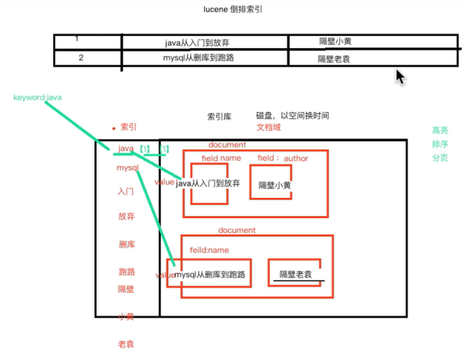


```shell script
# elastic search使用的时候不可以使用root,必须要建立单独的用户
useradd es
passwd es

# 查看是否添加成功
cat /etc/passwd 

su es

# 下载tar.gz的安装包
# https://www.elastic.co/downloads/elasticsearch
# https://www.elastic.co/downloads/kibana
# https://www.elastic.co/cn/downloads/
cd /home/es

wget https://artifacts.elastic.co/downloads/elasticsearch/elasticsearch-7.4.1-linux-x86_64.tar.gz
wget https://artifacts.elastic.co/downloads/kibana/kibana-7.4.1-linux-x86_64.tar.gz

tar -zxvf elasticsearch-7.4.1-linux-x86_64.tar.gz
mv elasticsearch-7.4.1 /usr/local/elasticsearch

chown -R es:es /usr/local/elasticsearch
su - es
```

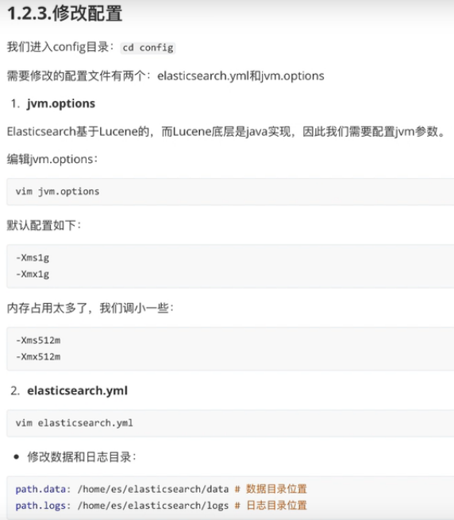

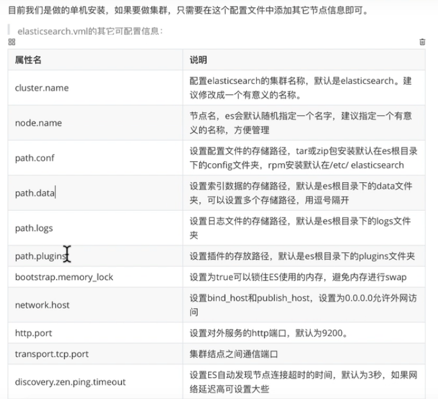
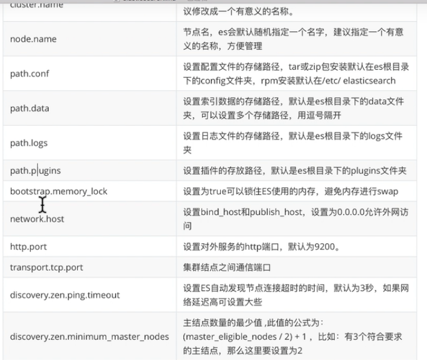

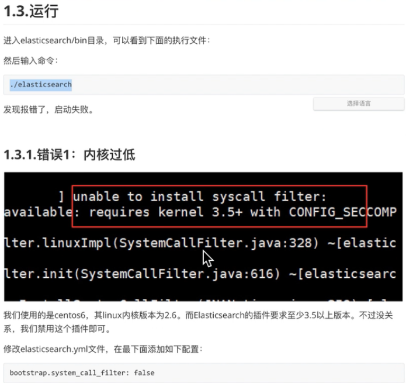
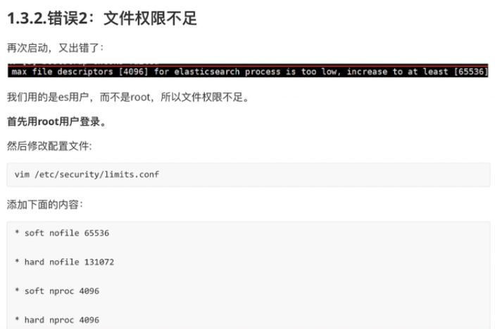
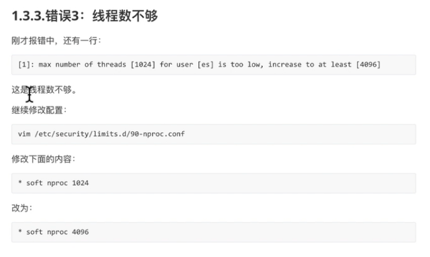

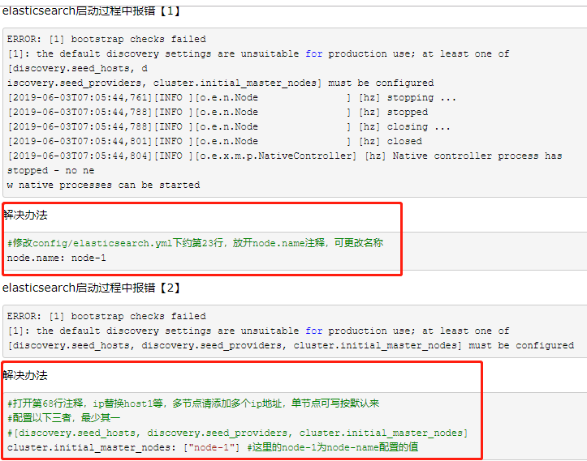

# ubuntu安装Kibana


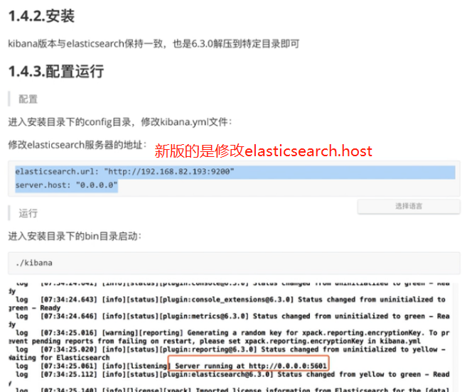

# ubuntu安装elasticsearch-analysis-ik

```shell script
# 这是一个中文分词器,对中文的分词支持比较好
# 从https://github.com/medcl/elasticsearch-analysis-ik/releases下载
wget https://github.com/medcl/elasticsearch-analysis-ik/releases/download/v7.4.1/elasticsearch-analysis-ik-7.4.1.zip

# 解压到指定文件夹下
unzip /home/elasticsearch-analysis-ik-7.4.1.zip -d /usr/local/elasticsearch/plugins/ikanalyzer
# 解压完之后,先关闭kibana,然后重新启动es,然后再重新启动kibana.
```

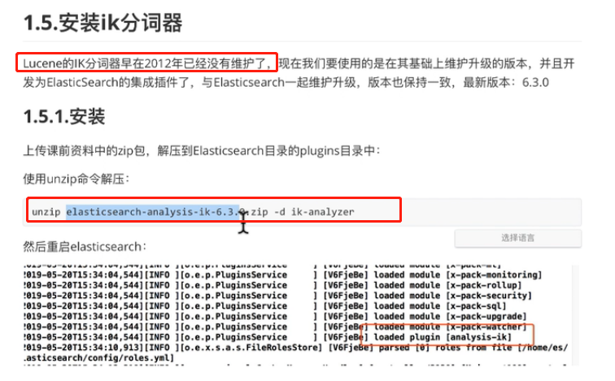


```shell script
POST _analyze
{
  "analyzer": "ik_max_word",
  "text": "我是中国人"
}
```

```shell script
POST _analyze
{
  "analyzer": "ik_smart",
  "text": "我是中国人"
}
```


# elasticsearch-head安装


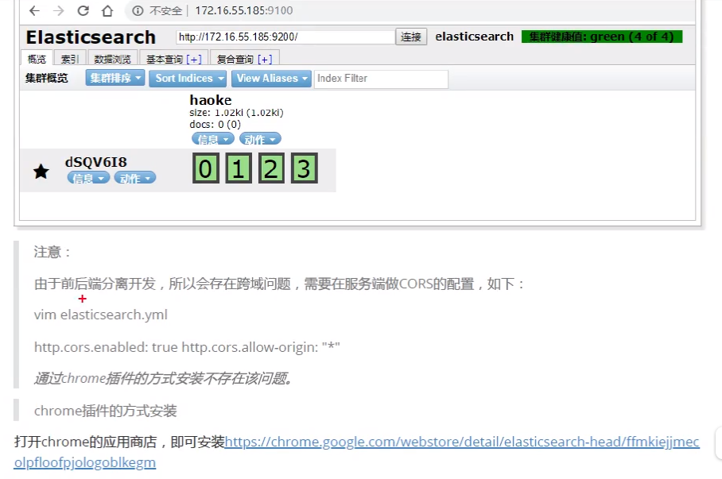

```yml
http.cors.enabled: true
http.cors.allow-origin: "*"
```

[elasticsearch-head安装](https://github.com/mobz/elasticsearch-head)

# 参考

[资料](https://www.bilibili.com/video/av67957955?p=1)