# 索引概念

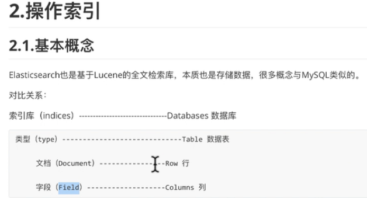
    
    es中文档(Document)以json格式存储.
    
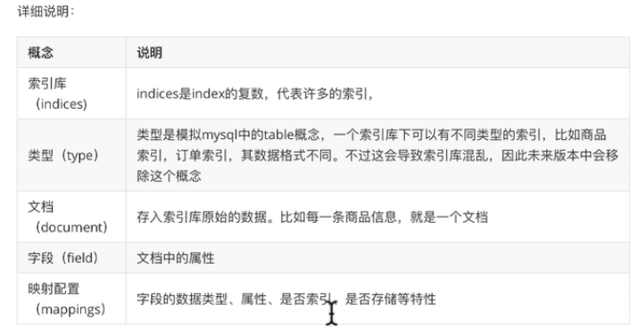

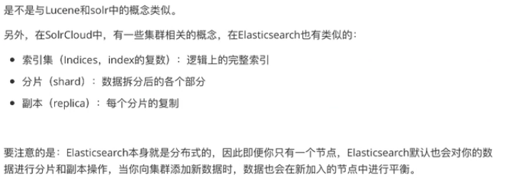

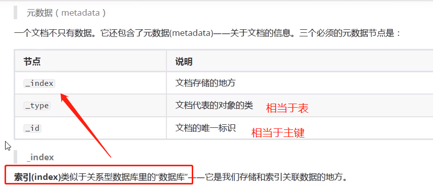

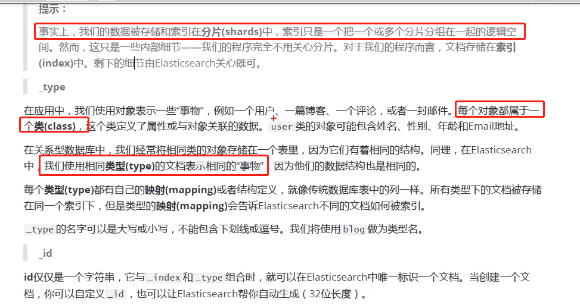

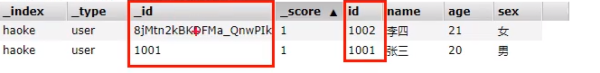

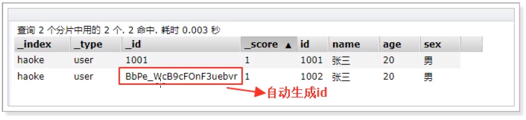

# 创建索引

    使用http请求创建索引,发起PUT方法请求(注意使用的是PUT,不是POST): http://192.168.32.128:9200/qf
    
```json
{
	"settings": {
		"number_of_shards": 3,
		"number_of_replicas": 2
	}
}
```


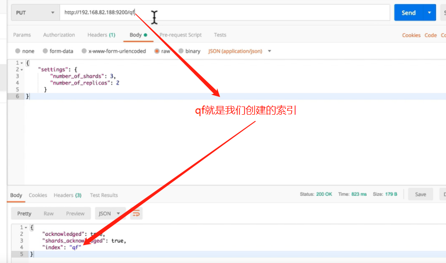

    在kibana中创建索引

```shell script
PUT /qf
{
  "settings": {
		"number_of_shards": 3,
		"number_of_replicas": 2
	}
}
```

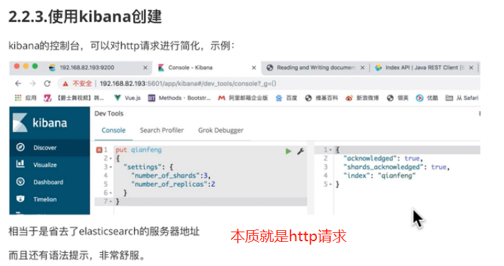

# 查看索引

```shell script
# 查看所有索引
GET /_all

# 查看具体索引
GET qf

# 查看索引是否存在
HEAD /索引名
```

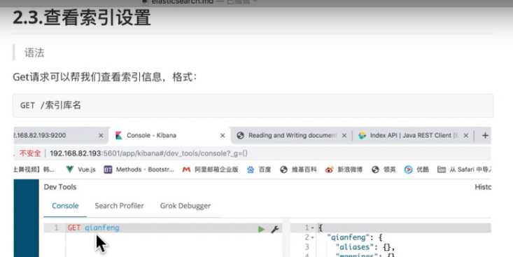

# 删除索引

```shell script
# 相当于删除数据库
DELETE /索引库名

# 或者发起delete的http请求
http://192.168.32.128:9200/索引库名/
```


# 创建映射

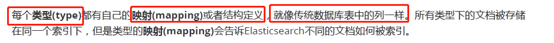

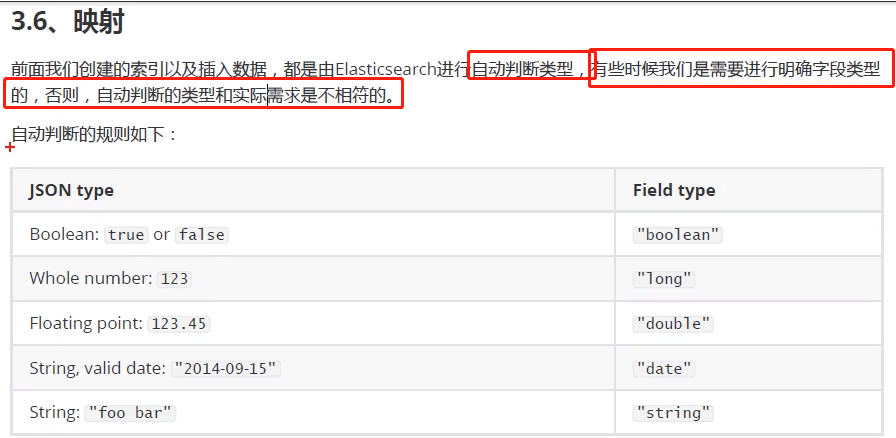

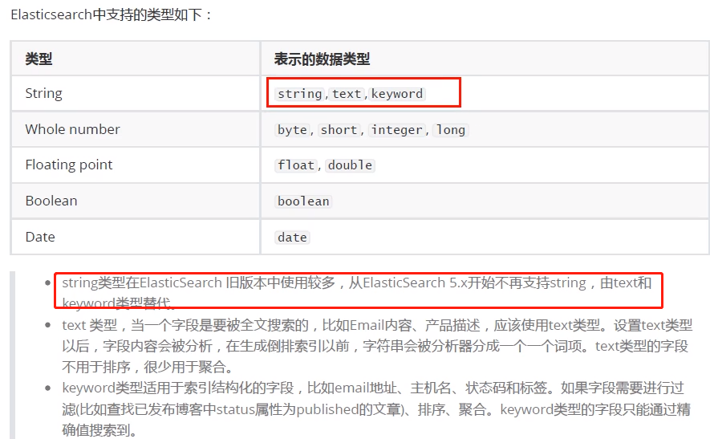

    映射说白了就是表结构是如何定义的.

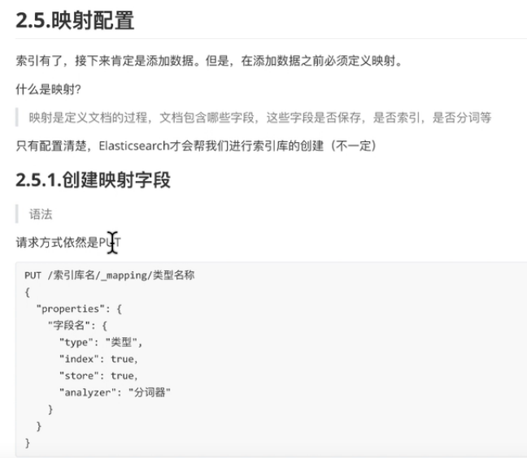


```shell script
# 一般碰到报错:”Types cannot be provided in put mapping requests, 
# unless the include_type_name parameter is set to true”，都是因为ElasticSearch从低版本升级到高版本造成的。
# 新的ElasticSearch 7.x，做了调整，要求mapping时不需要提交type，为了确保旧代码的兼容性，加入了一个include_type_name的参数。
POST /qf/_mapping/tb_items?include_type_name=true
{
  "properties": 
  {
    "title": {
      "type":"text",
      "index":true,
      "analyzer":"ik_smart"
    },
    "sellpoint": {
      "type":"text",
      "index":true
    },
    "price": {
      "type":"long",
      "index":true
    }
  }
}
```

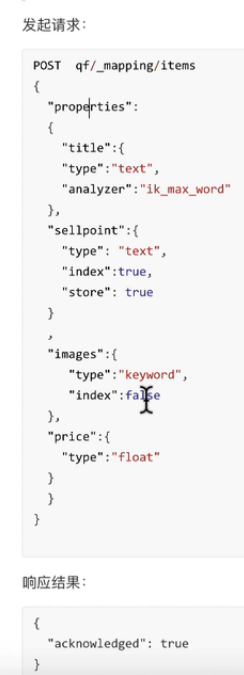

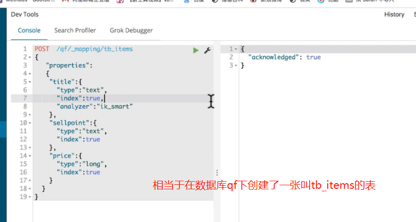

```shell script
# 完整的创建索引
POST /school/person
{
  "settings": {
    "number_of_shards": 3,
		"number_of_replicas": 2
  },
  "mappings": {
    "properties": {
        "name": {
          "type": "text"
        },
        "age": {
          "type": "integer"
        },
        "mail": {
          "type": "text"
        },
        "hobby": {
          "type": "keyword"
        }
      }
  }
}
```

# 查看映射

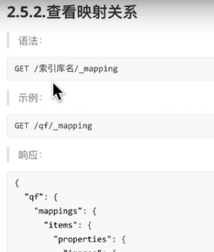

```shell script
# 查看映射关系
GET /qf/_mapping
```

# 字段属性详解

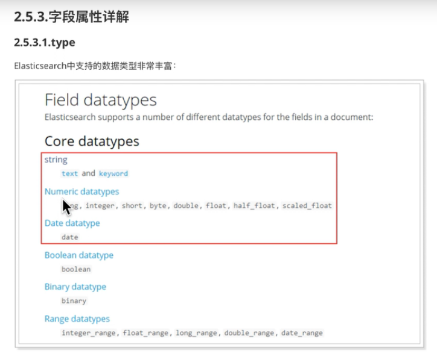

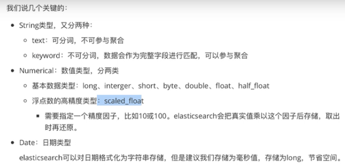

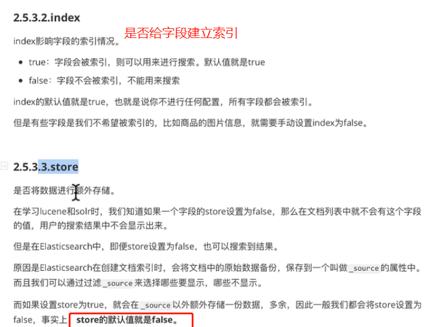
