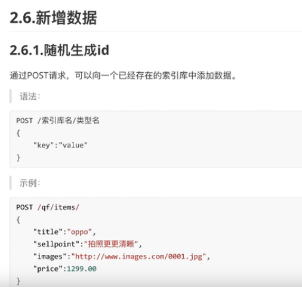
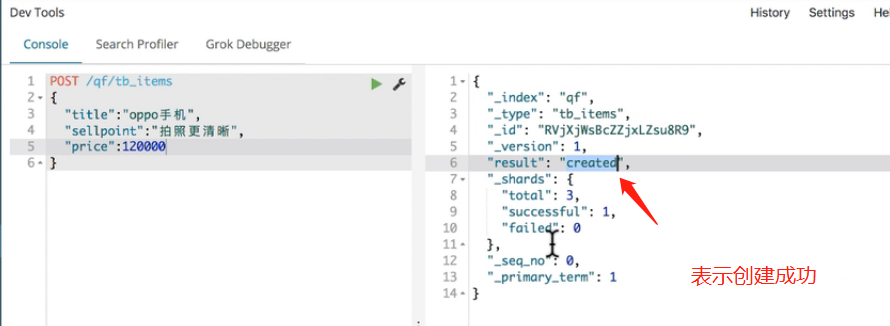
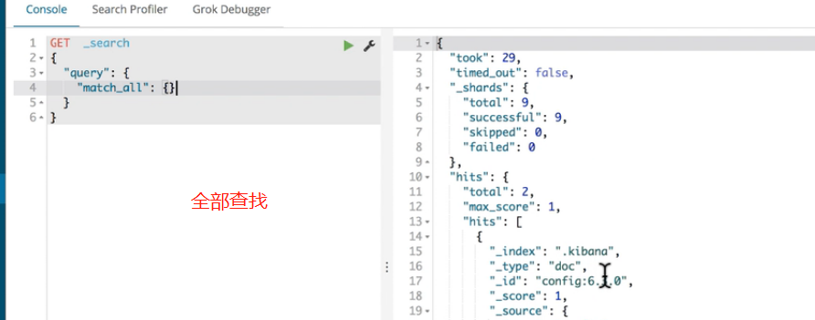
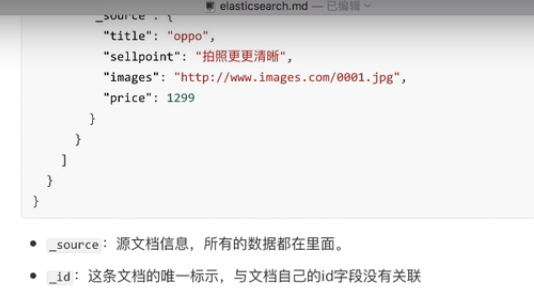
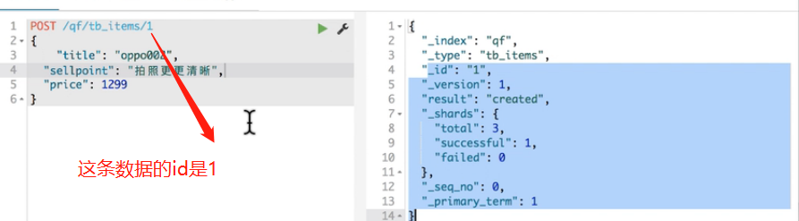
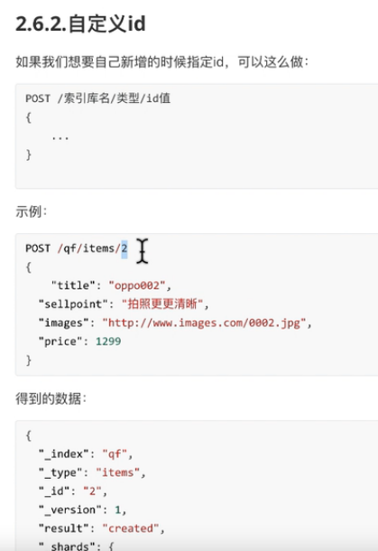
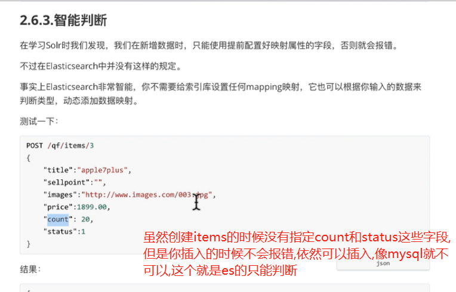
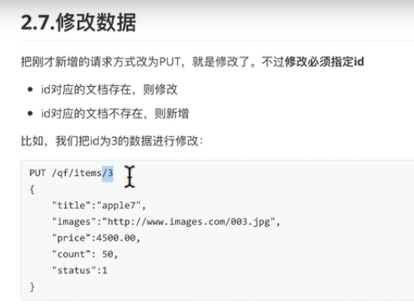
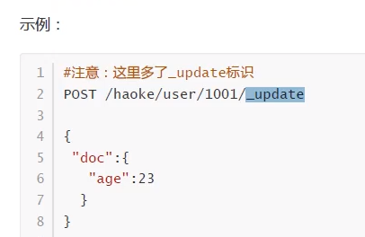
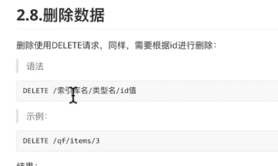

# 新增数据



    url规则: POST /索引库/类型/id
    id是文档的唯一标识符,如果不指定id,es会自动生成

```shell script
# 索引可以不用事先创建,直接插入数据就会自动创建索引

POST /qf/tb_items/
{
  "title": "oppo",
  "sellpoint": "拍照更清晰",
  "images": "http://www.images.com/0001.jpg",
  "price": 1299.00
}
```



# 如何判断数据是否存在

```shell script
# 判断数据是否存在,发起HEAD请求,看是否返回200,最后的5为文档的id
# 返回404意思就是不存在
http://192.168.32.128:9200/qf/tb_items/5
```

```shell script
GET _search
{
  "query": {
    "match_all": {}
  }
}
```











# 更新数据(全量覆盖和局部更新)

    es中,通过发起put请求来进行 覆盖式的更新.



    注意这种方式做的是全量的覆盖,也就是比如你更新的时候,没有携带title字段,那么更新后结果title字段就是空的.

    问题来了,可以局部更新么?
    
        

# 删除数据

    删除成功,返回200,失败,返回404


