# 基本的数据查询

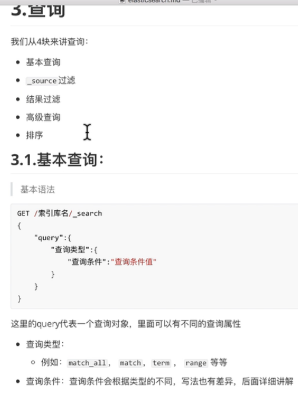

```shell script
# 查询某一条数据
GET http://192.168.32.128:9200/qf/tb_items/5

# 关键字的搜索
# 查询title等于oppo的商品,如果title做了分词,那么就会查询title包含oppo的商品.
GET http://192.168.32.128:9200/qf/tb_items/_search?q=title:oppo
```

```shell script
# pretty可以让返回结果美化
GET http://192.168.32.128:9200/qf?pretty
GET http://192.168.32.128:9200/qf/tb_items/1?pretty
```

# 查询所有(match_all)
    
```shell script
# 查询全部数据(默认只返回10条,超过10条需要做分页)
GET http://192.168.32.128:9200/qf/tb_items/_search
GET /qf/_search
{
  "query": {
    "match_all": {}
  }
}
# 使用get和post都可以,严格来说是使用post,因为post可以提交我们的json格式的查询条件.
```

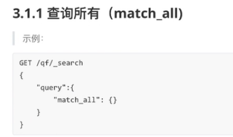

```shell script
POST /qf/_search
{
  "query": {
    "match": {
      "title": "oppo"
    }
  }
}

# 新插入2条数据
POST /qf/tb_items/3
{
  "title": "oppo003",
  "sellpoint": "",
  "images": "http://www.images.com/003.jpg",
  "price": 5899.00,
  "status": 1
}

POST /qf/tb_items/4
{
  "title": "oppo004",
  "sellpoint": "",
  "images": "http://www.images.com/004.jpg",
  "price": 5899.00,
  "status": 1
}

POST /qf/tb_items/5
{
  "title": "oppo",
  "sellpoint": "",
  "images": "http://www.images.com/005.jpg",
  "price": 5899.00,
  "status": 1
}

POST /qf/tb_items/6
{
  "title": "oppo 手机就是棒",
  "sellpoint": "oppo 手机就是棒",
  "images": "http://www.images.com/006.jpg",
  "price": 5899.00,
  "count": 20,
  "status": 1
}

POST /qf/tb_items/7
{
  "title": "international 手机",
  "sellpoint": "拍照更清晰",
  "images" : "http://www.images.com/007.jpg",
  "price" : 5899.0
}

POST /qf/tb_items/8
{
  "title": "vivo手机",
  "sellpoint": "拍照很好",
  "images" : "http://www.images.com/008.jpg",
  "price" : 2329.0
}
```

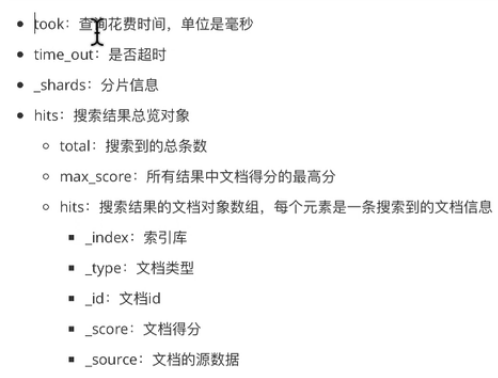

```shell script
# 把title中包含 oppo 或者 手机 的查出来
# or关系
GET /qf/_search
{
  "query": {
    "match": {
      "title": "oppo 手机"
    }
  }
}
```

# match查询

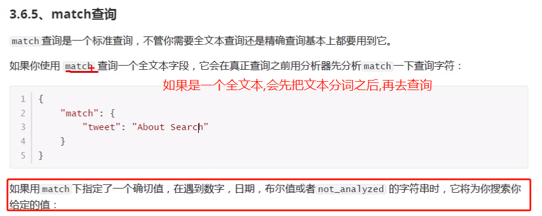

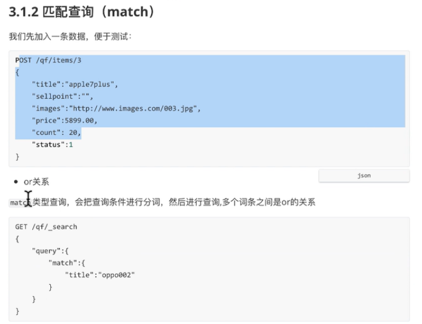

```shell script
# and关系,相当于精确匹配
# 把oppo003查询出来
GET /qf/_search
{
  "query": {
    "match": {
      "title": {
        "query": "oppo003", "operator": "and"
      }
    }
  }
}

GET /qf/tb_items/_search
```

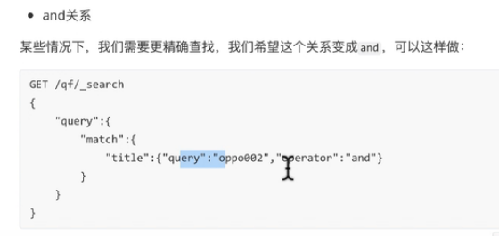

```shell script
# 满足匹配的百分数就可以查找出来
GET /qf/_search
{
  "query": {
    "match": {
      "title": {
        "query": "手机",
        "minimum_should_match": "50%"
      }
    }
  }
}
```

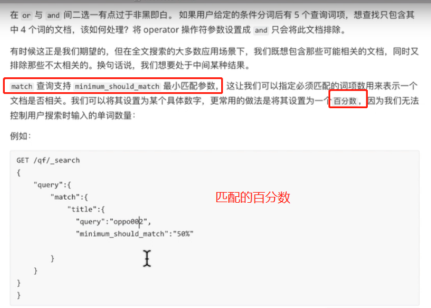


# 多字段查询

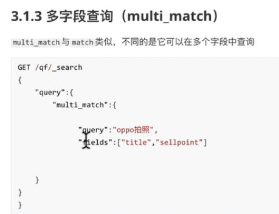

```shell script
# 把title和sellpoint中包含oppo和拍照的都查询出来了
# 自动会对oppo和拍照进行分词
GET /qf/_search
{
  "query": {
    "multi_match": {
      "query": "oppo拍照",
      "fields": ["title","sellpoint"]
    }
  }
}
```


```shell script
# price中1299或者5899都会查询出来
GET /qf/_search
{
  "query": {
    "terms": {
      "price": [
        "1299",
        "5899"
      ]
    }
  }
}
```

# term查询

    精确匹配数字,日期,布尔值,或者不能做分词的字符串

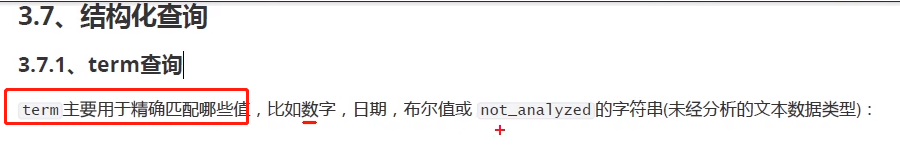

```shell script
POST /school/person/_search
{
  "query": {
    "term": {
      "age": 27    
    }   
  } 
}
```         

# terms多词条精确匹配

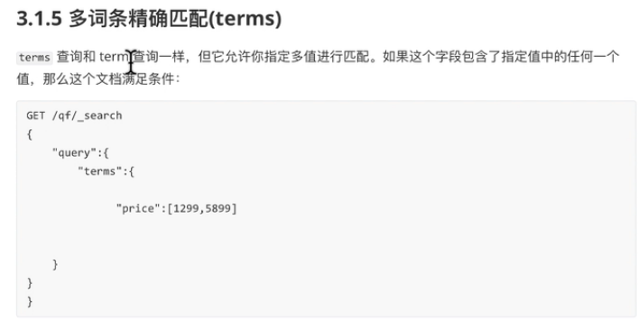

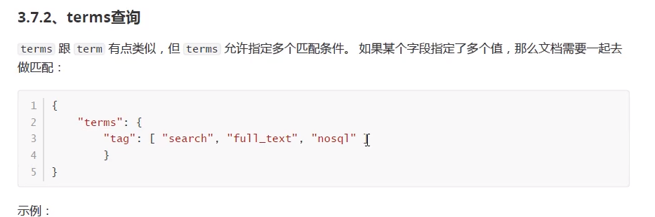

```shell script
POST /school/person/_search
{
  "query": {
    "terms": {
      "age": [27,28]
    }
  } 
}
```

# 布尔组合(bool)

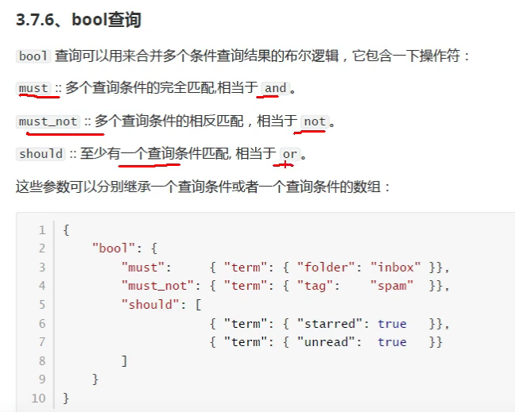


```shell script
# must: title中要包含oppo
# must_not: sellpoint中不能包含"拍照"
# 价格可以是5899的查询出来
GET /qf/_search
{
  "query": {
    "bool": {
      "must": [
        {
          "match": {
            "title": "oppo"
          }
        }
      ],
      "must_not": [
        {
          "match": {
            "sellpoint": "拍照"
          }
        }
      ],
      "should": [
        {
          "match": {
            "price": "5899"
          }
        }
      ]
    }
  }
}
```

# 范围查询(range)


```shell script
GET /qf/_search
{
 "query": {
   "range": {
     "price": {
       "gte": 1000,
       "lte": 11000
     }
   }
 }
}

GET /_search
{
  "query": {
    "range": {
      "price": {
        "gte": 10,
        "lte": 20000
      }
    }
  }
}
```


```shell script
GET /qf/_search
{
  "query": {
    "fuzzy": {
      "title": "ppo"
    }
  }
}

GET /qf/_search
{
  "query": {
    "fuzzy": {
      "title": "oapo"
    }
  }
}

# 允许2个字母出错
GET /qf/_search
{
  "query": {
    "fuzzy": {
      "title": {
        "value": "lnternationao",
        "fuzziness": 2
      }
    }
  }
}
```

# 过滤查询(filter)


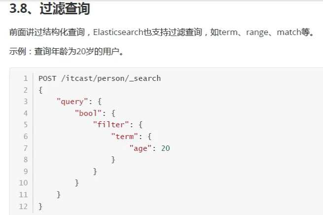

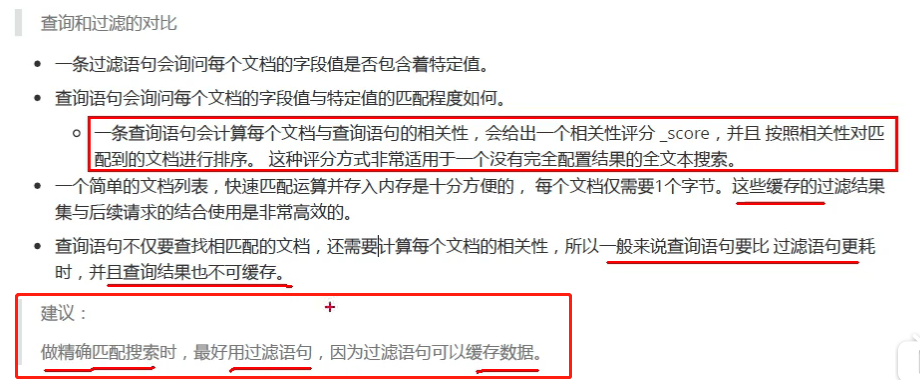

```shell script
GET /qf/_search
{
  "query": {
    "bool": {
      "must": [
        {
          "match": {
            "title": "oppo"
          }
        }
      ],
      "filter": {
        "range": {
          "price": {
            "gte": 10,
            "lte": 6000
          }
        }
      }
    }
  }
}
```


```shell script
# title中带有oppo的,价格升序排序
GET /qf/_search
{
  "query": {
    "match": {
      "title": "oppo"
    }
  },
  "sort": [
    {
      "price": {
        "order": "asc"
      }
    }
  ]
}

# title中带有oppo的,价格升序排序,分数升序排序
GET /qf/_search
{
  "query": {
    "match": {
      "title": "oppo"
    }
  },
  "sort": [
    {
      "price": {
        "order": "asc"
      }
    },
    {
      "_score": "asc"
    }
  ]
}
```

# exists查询

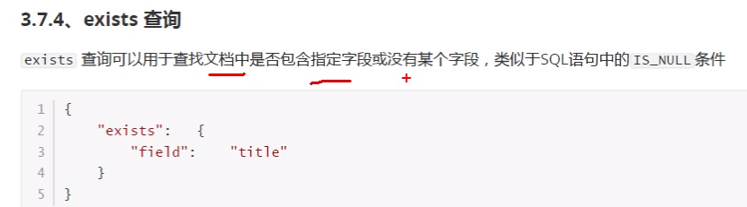

```shell script
GET /qf/_search
{
  "query": {
    "exists": {
      "field": "title"
    }
  }
}
```