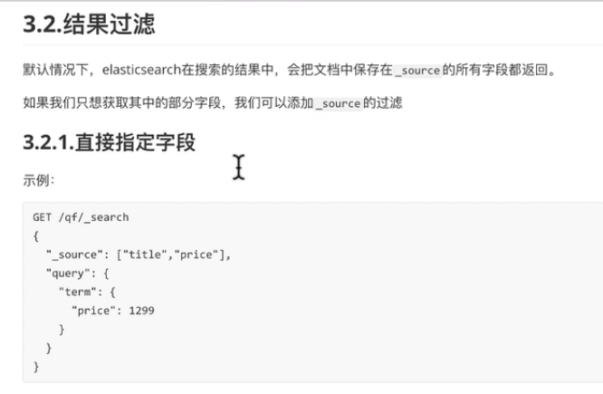
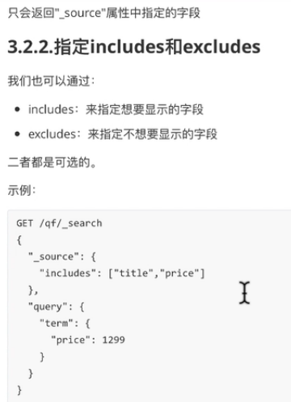

# 结果过滤



```shell script
# 我想要的只有title和price,并且price是1299,sellpoint就不会被查出来了

http://192.168.32.128:9200/qf/tb_items/5?_source=title,price&pretty

GET /qf/_search
{
  "_source": ["title", "price"],
  "query": {
    "terms": {
      "price": [
        "1299",
        "12"
      ]
    }
  }
}

# 只返回原始数据
http://192.168.32.128:9200/qf/tb_items/5/_source
http://192.168.32.128:9200/qf/tb_items/5/_source?_source=title,price&pretty
```



```shell script
GET /qf/_search
{
  "_source": {
    "includes": ["title","price"]
  },
  "query": {
    "terms": {
      "price": [
        "1299",
        "12"
      ]
    }
  }
}
```