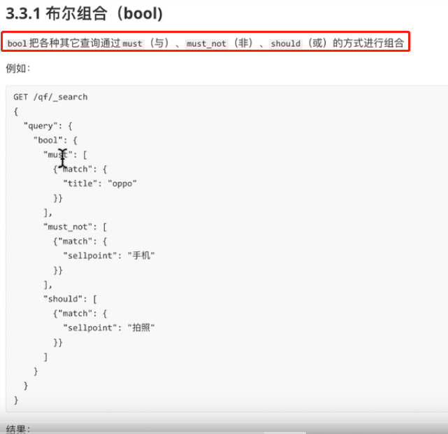
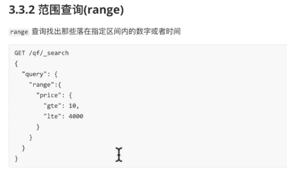
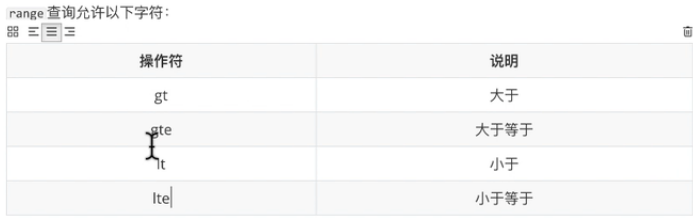
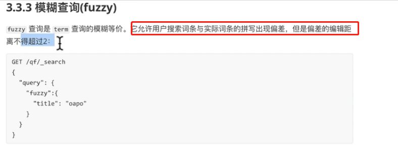
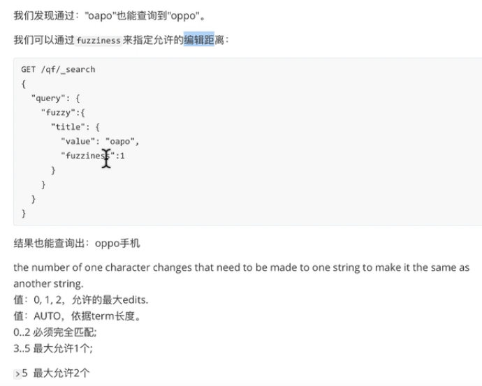
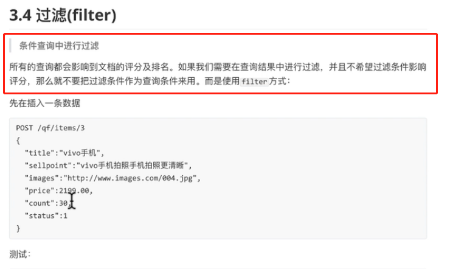
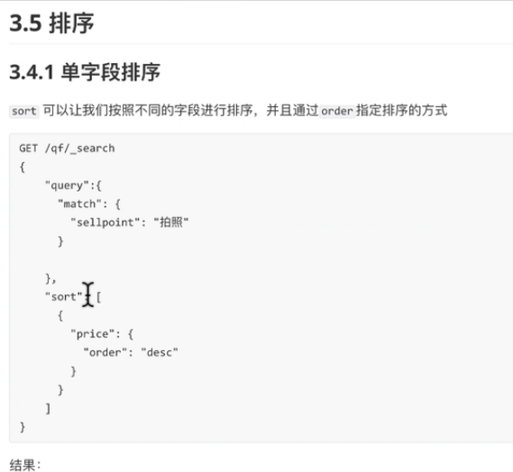
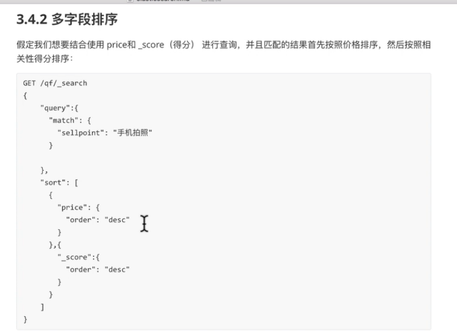

```shell script
# 把title中一定包含oppo
# sellpoint中一定不包含拍照
# 价格可以是5899的查询出来
GET /qf/_search
{
  "query": {
    "bool": {
      "must": [
        {
          "match": {
            "title": "oppo"
          }
        }
      ],
      "must_not": [
        {
          "match": {
            "sellpoint": "拍照"
          }
        }
      ],
      "should": [
        {
          "match": {
            "price": "5899"
          }
        }
      ]
    }
  }
}
```



```shell script
GET /qf/_search
{
 "query": {
   "range": {
     "price": {
       "gte": 1000,
       "lte": 11000
     }
   }
 }
}

GET /_search
{
  "query": {
    "range": {
      "price": {
        "gte": 10,
        "lte": 20000
      }
    }
  }
}
```







```shell script
GET /qf/_search
{
  "query": {
    "fuzzy": {
      "title": "ppo"
    }
  }
}

GET /qf/_search
{
  "query": {
    "fuzzy": {
      "title": "oapo"
    }
  }
}

# 允许2个字母出错
GET /qf/_search
{
  "query": {
    "fuzzy": {
      "title": {
        "value": "lnternationao",
        "fuzziness": 2
      }
    }
  }
}
```



```shell script
GET /qf/_search
{
  "query": {
    "bool": {
      "must": [
        {
          "match": {
            "title": "oppo"
          }
        }
      ],
      "filter": {
        "range": {
          "price": {
            "gte": 10,
            "lte": 6000
          }
        }
      }
    }
  }
}
```





```shell script
# title中带有oppo的,价格升序排序
GET /qf/_search
{
  "query": {
    "match": {
      "title": "oppo"
    }
  },
  "sort": [
    {
      "price": {
        "order": "asc"
      }
    }
  ]
}

# title中带有oppo的,价格升序排序,分数升序排序
GET /qf/_search
{
  "query": {
    "match": {
      "title": "oppo"
    }
  },
  "sort": [
    {
      "price": {
        "order": "asc"
      }
    },
    {
      "_score": "asc"
    }
  ]
}
```