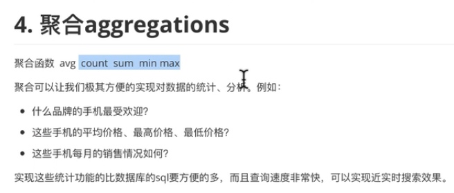

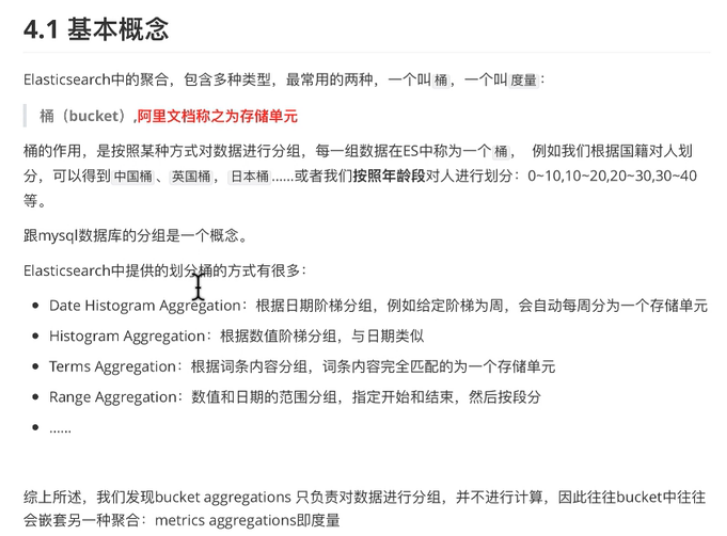

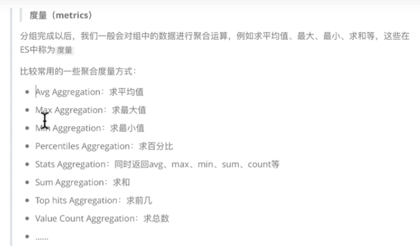


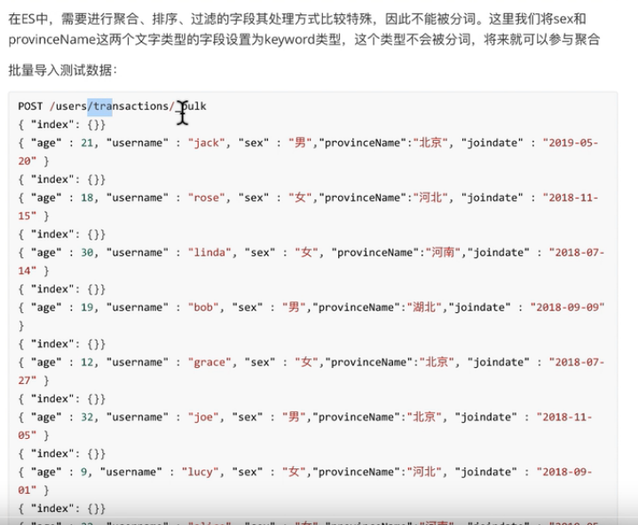

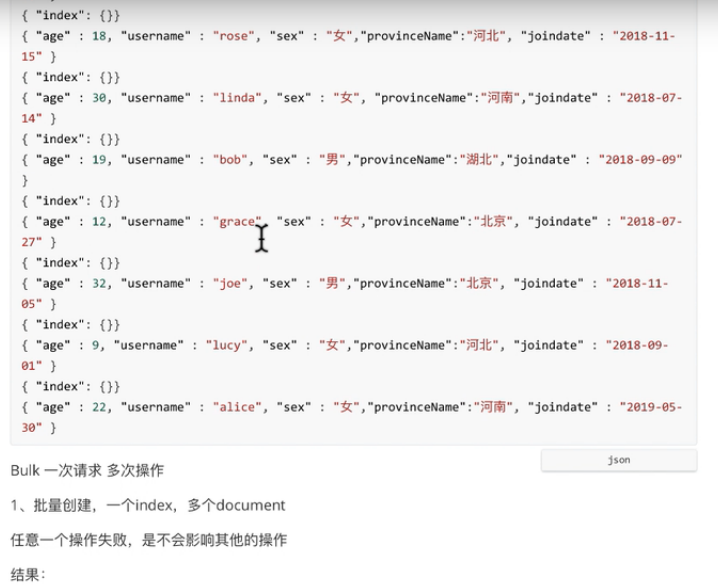

```shell script
# 创建索引
PUT /users
{
  "settings": {
    "number_of_shards": 1,
    "number_of_replicas": 0
  }
}

# 查看索引user的映射
GET /users/_mapping

# 添加映射
POST /users/_mapping/transactions?include_type_name=true
{
  "properties": {
      "username": {
        "type": "text"
      },
      "sex": {
        "type": "keyword"
      },
      "provinceName": {
        "type": "keyword"
      },
      "joindata": {
        "type": "date"
      }
  }
}
```

# 批量插入数据

```shell script
POST /users/transactions/_bulk
{"index": {}}
{"age": 21, "username":"jack", "sex": "男","provinceName":"北京","joindate": "2019-05-20"}
{"index": {}}
{"age": 18, "username":"rose", "sex": "女","provinceName":"河北","joindate": "2018-11-15"}
{"index": {}}
{"age": 30, "username":"linda", "sex": "女","provinceName":"河南","joindate": "2018-07-14"}
{"index": {}}
{"age": 19, "username":"bob", "sex": "男","provinceName":"湖北","joindate": "2018-09-09"}
{"index": {}}
{"age": 12, "username":"grace", "sex": "女","provinceName":"北京","joindate": "2018-07-27"}
{"index": {}}
{"age": 32, "username":"joe", "sex": "男","provinceName":"北京","joindate": "2018-11-05"}
{"index": {}}
{"age": 9, "username":"lucy", "sex": "女","provinceName":"河北","joindate": "2018-09-1"}
{"index": {}}
{"age": 22, "username":"alice", "sex": "女","provinceName":"河南","joindate": "2019-05-30"}
```

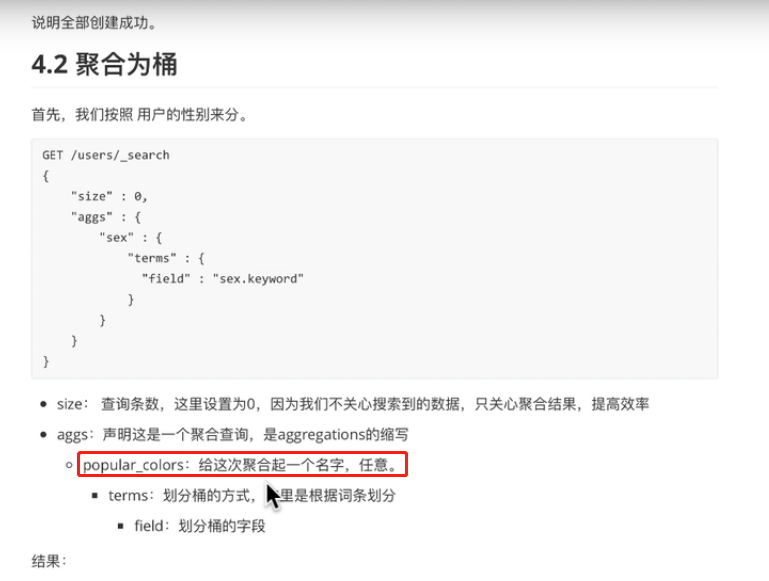

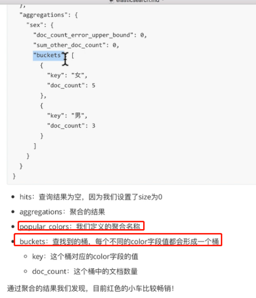

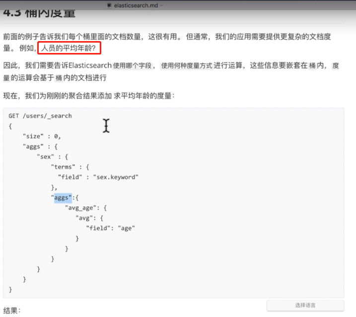


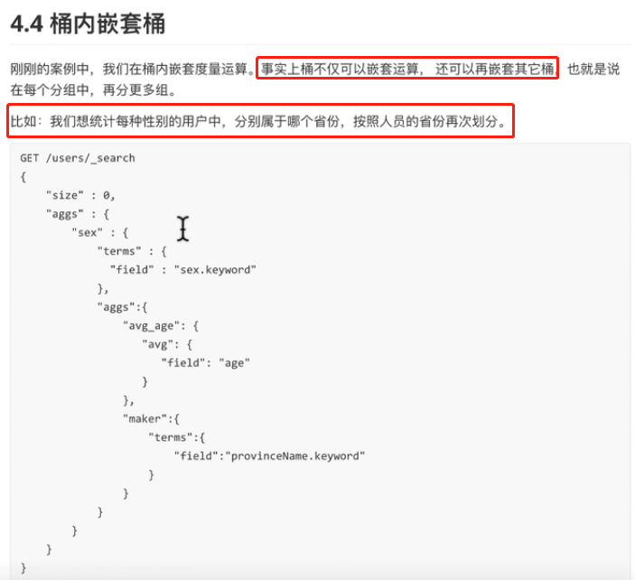


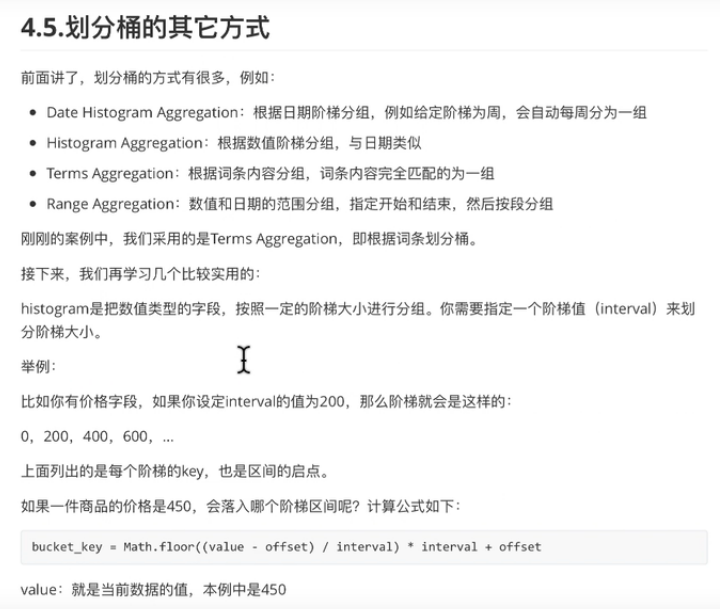


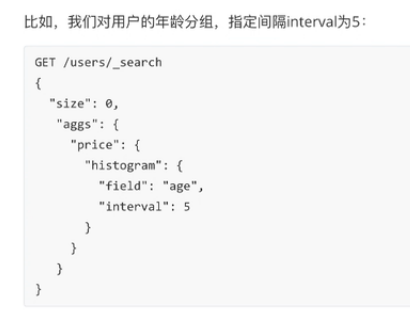


```shell script
# 按性别分组
GET /users/_search
{
  "size":0,
  "aggs":{
   "GroupBySex":{
     "terms": {
       "field": "sex"
     }
   } 
  }
}

# 按性别分组后,看每组的平均年龄
GET /users/_search
{
  "size":0,
  "aggs":{
   "GroupBySex":{
     "terms": {
       "field": "sex"
     },
     "aggs": {
       "avg_age": {
         "avg": {
           "field": "age"
         }
       }
     }
   } 
  }
}

# 按性别分组后,看每组的平均年龄,然后还可以在每个组中按省份再进行分组
GET /users/_search
{
  "size":0,
  "aggs":{
   "GroupBySex":{
     "terms": {
       "field": "sex"
     },
     "aggs": {
       "avg_age": {
         "avg": {
           "field": "age"
         }
       },
        "marker": {
          "terms": {
            "field": "provinceName"
          }
       }
     }
   } 
  }
}

# 根据年龄的间隔分组,间隔为5
GET /users/_search
{
  "size": 0,
  "aggs": {
    "aggs_name": {
      "histogram": {
        "field": "age",
        "interval": 5
      }
    }
  }
}

# 根据年龄的间隔分组,间隔为2,其中0的不显示了,因为我们设置了最小文档数量为1,大于等于1的才会显示出来
GET /users/_search
{
  "size": 0,
  "aggs": {
    "aggs_name": {
      "histogram": {
        "field": "age",
        "interval": 2,
        "min_doc_count": 1
      }
    }
  }
}
```