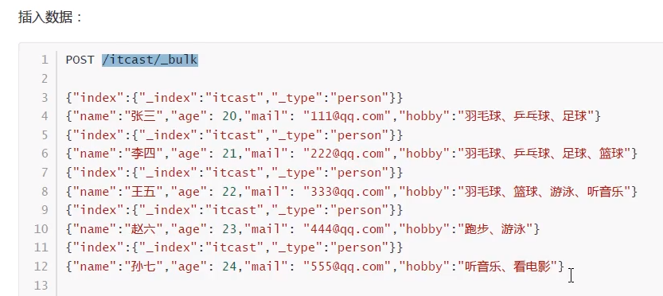
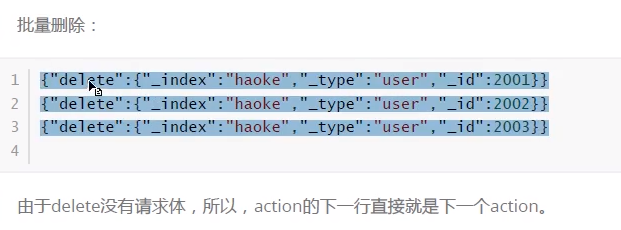
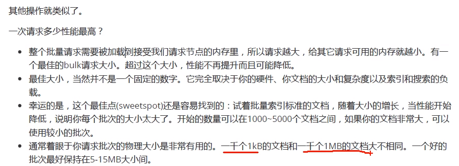

# 批量查询

```shell script
# 批量查询(把_id为5和4的查询出来)
POST /qf/tb_items/_mget
{
  "ids": ["5", "4"]
}
```

# 批量操作

```shell script
# 完整的创建索引
POST /school/person
{
  "settings": {
    "number_of_shards": 3,
		"number_of_replicas": 2
  },
  "mappings": {
    "properties": {
        "name": {
          "type": "text"
        },
        "age": {
          "type": "integer"
        },
        "mail": {
          "type": "text"
        },
        "hobby": {
          "type": "keyword"
        }
      }
  }
}
```




```shell script
POST /school/_bulk
{"index": {"_index": "school", "_type": "person"}}
{"name": "张三", "age": 27, "mail": "aaa@qq.com", "hobby": "打篮球"}
{"index": {"_index": "school", "_type": "person"}}
{"name": "李四", "age": 28, "mail": "bbb@qq.com", "hobby": "打游戏"}

# 或者
POST /school/person/_bulk
{"index":{}}
{"name": "王五", "age": 29, "mail": "accc@qq.com", "hobby": "打篮球"}
```





