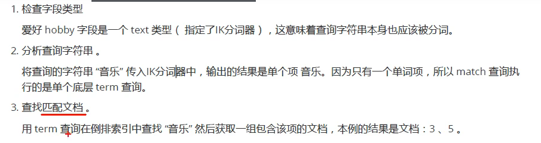
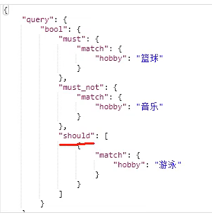
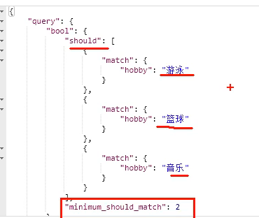
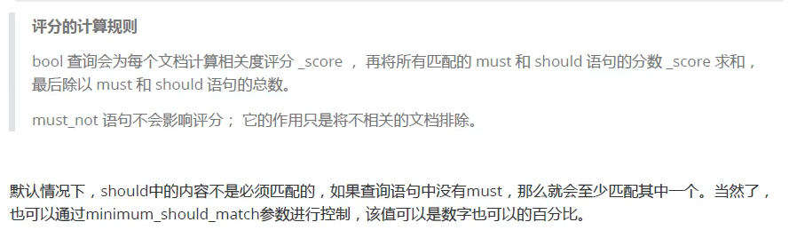
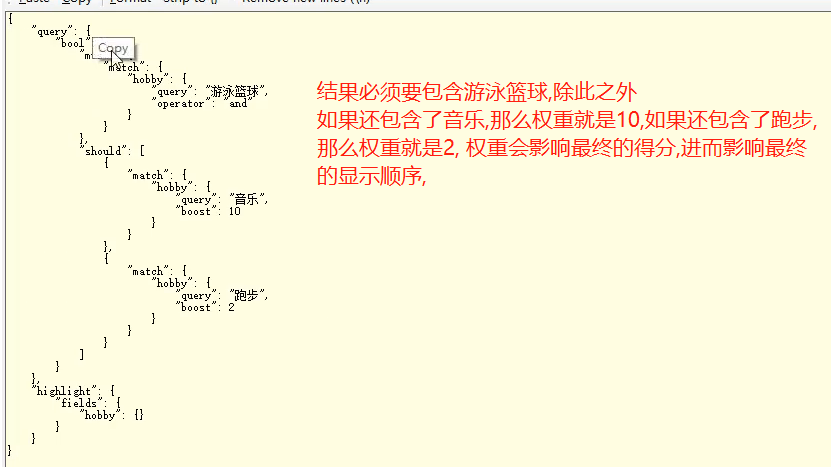

# 全文搜索


# 构造数据

```shell script
DELETE /school/

POST /school/person
{
  "settings": {
    "number_of_shards": 1,
		"number_of_replicas": 0
  },
  "mappings": {
    "properties": {
        "name": {
          "type": "text"
        },
        "age": {
          "type": "integer"
        },
        "mail": {
          "type": "keyword"
        },
        "hobby": {
          "type": "text",
          "analyzer": "ik_max_word"
        }
      }
  }
}

POST /school/_bulk
{"index": {"_index": "school", "_type": "person"}}
{"name": "张三", "age": 27, "mail": "aaa@qq.com", "hobby": "打篮球"}
{"index": {"_index": "school", "_type": "person"}}
{"name": "李四", "age": 28, "mail": "bbb@qq.com", "hobby": "打游戏"}

# 或者
POST /school/person/_bulk
{"index":{}}
{"name": "王五", "age": 29, "mail": "accc@qq.com", "hobby": "打篮球"}
```

# 单个词的搜索




```shell script
# 查询爱好中包含打球的
POST /school/_search
{
  "query": {
    "match": {
      "hobby": "打球"
    }
  },
  "highlight": {
    "fields": {
      "hobby": {}
    }
  }
}
```

# 多词搜索

```shell script
POST /school/_search
{
  "query": {
    "match": {
      "hobby": "篮球 游戏"
    }
  },
  "highlight": {
    "fields": {
      "hobby": {}
    }
  }
}
# 结果不是我们想要的,因为没有加and,所以默认是or的关系
# 也就是结果默认是包含篮球 or 游戏的
```


```shell script
# 改进
POST /school/_search
{
  "query": {
    "match": {
      "hobby": {
        "query": "篮球 打",
        "operator": "and"
      }
    }
  },
  "highlight": {
    "fields": {
      "hobby": {}
    }
  }
}
# 这样结果符合预期
```


```shell script
POST /school/_search
{
  "query": {
    "match": {
      "hobby": {
        "query": "篮球 打",
        "minimum_should_match": "30%"
      }
    }
  },
  "highlight": {
    "fields": {
      "hobby": {}
    }
  }
}
```


# 组合搜索









# 权重


