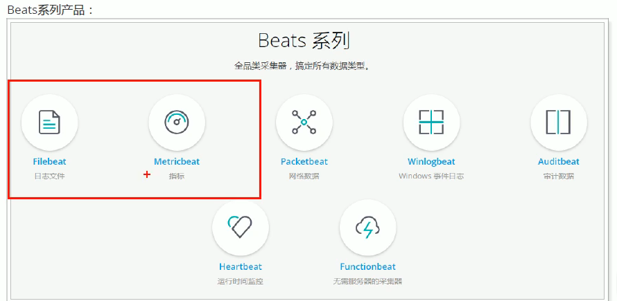
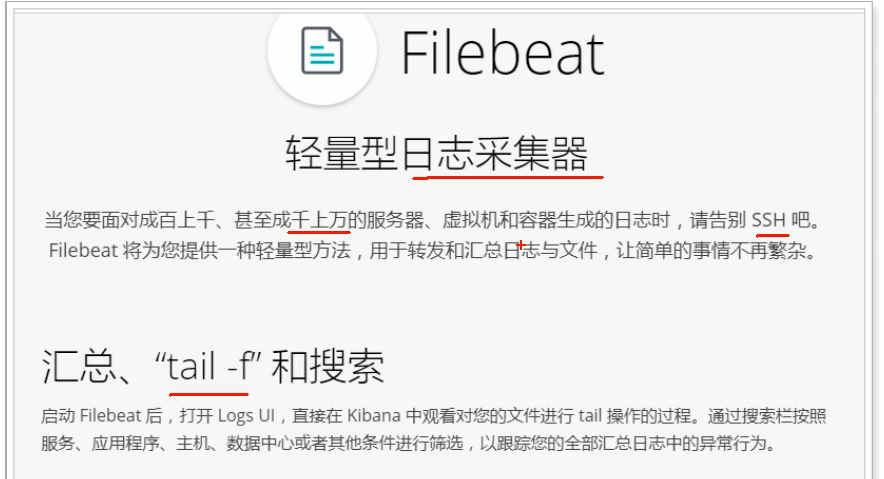
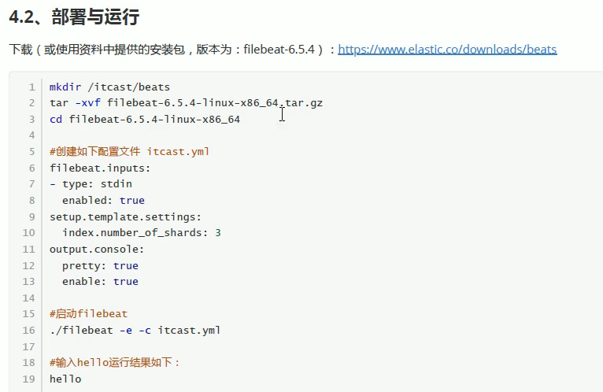
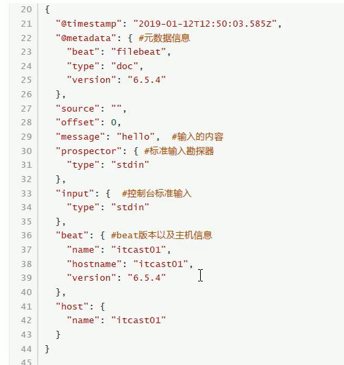

[Filebeat安装](https://www.elastic.co/guide/en/beats/filebeat/current/filebeat-installation.html)
    




```yaml
filebeat.inputs:
# 输入来自: 标准的输入stdin
- type: stdin
  enabled: true
setup.template.settings:
  index.number_of_shards: 1
# 输出到控制台
output.console:
  pretty: true
  enable: true
```


