# 读取文件


```yaml
filebeat.inputs:
- type: log
  enabled: true
  paths:
    - /learn/beats/logs/*.log
setup.template.settings:
  index.number_of_shards: 1
output.console:
  pretty: true
  enable: true
```

# Filebeat添加自定义字段


```yaml
filebeat.inputs:
- type: log
  enabled: true
  paths:
    - /learn/beats/logs/*.log
  tags: ["web"]
  fields:
    from: from-fields-xzj
  fields_under_root: true
setup.template.settings:
  index.number_of_shards: 1
output.console:
  pretty: true
  enable: true
```

# Filebeat输出到es中

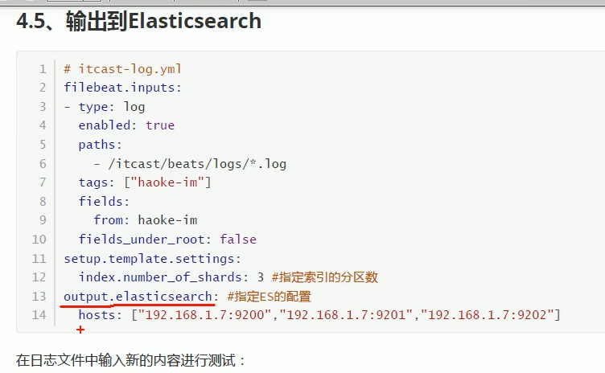

```yaml
filebeat.inputs:
- type: log
  enabled: true
  paths:
    - /learn/beats/logs/*.log
  tags: ["web"]
  fields:
    from: from-fields-xzj
  fields_under_root: true
setup.template.settings:
  index.number_of_shards: 1
output.elasticsearch:
  hosts: ["192.168.32.128:9200"]
```

# Filebeat工作原理

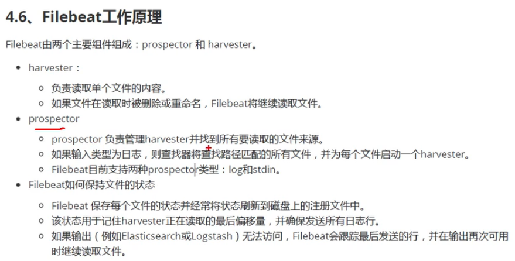

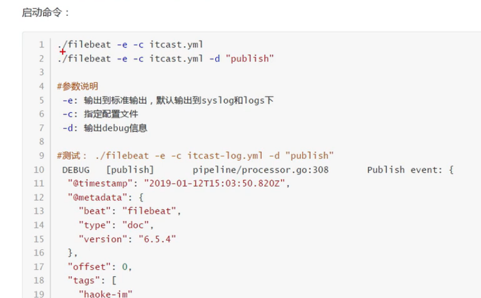

# Filebeat读取nginx日志

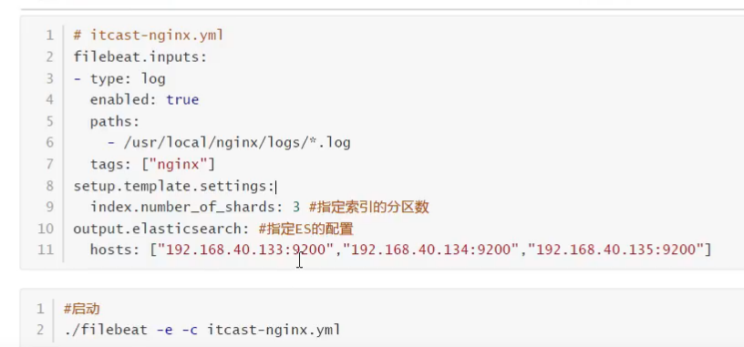

```yaml
filebeat.inputs:
- type: log
  enabled: true
  paths:
    - /usr/local/nginx/logs/*.log
  tags: ["nginx"]
  fields:
    from: nginx-fields-xzj
  fields_under_root: true
setup.template.settings:
  index.number_of_shards: 1
output.elasticsearch:
  hosts: ["192.168.32.128:9200"]
```

# Filebeat的nginx Module

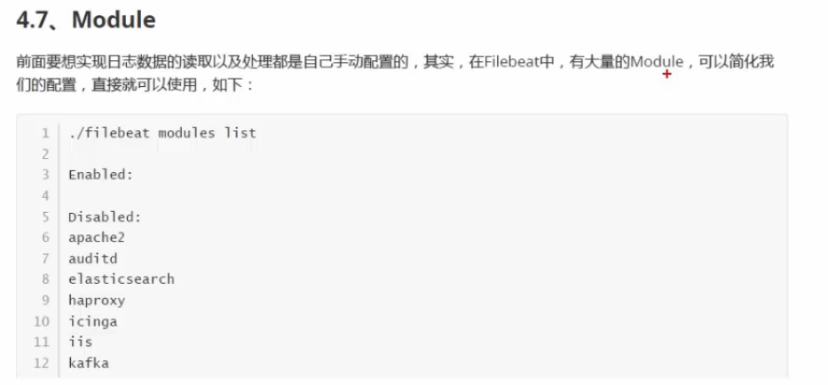
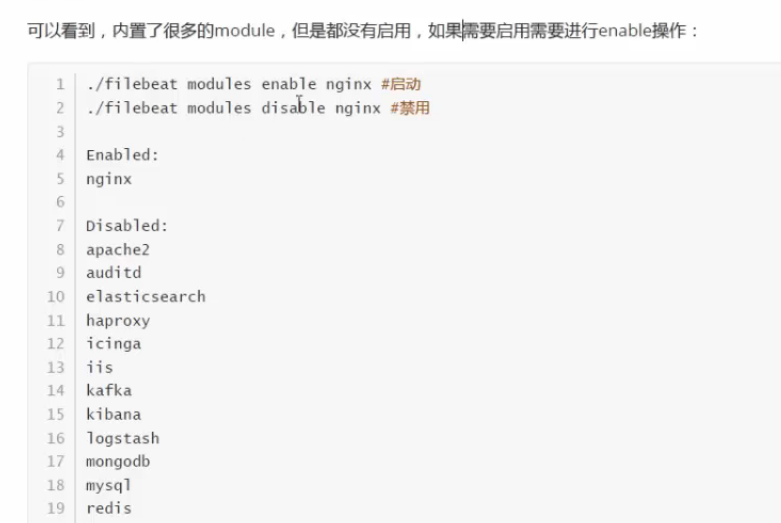

```yaml
# cd /usr/local/filebeat/modules.d
# vim nginx.yml

# Module: nginx
- module: nginx
  # Access logs
  access:
    enabled: true
    var.paths: ["/usr/local/nginx/logs/access.log*"]

  # Error logs
  error:
    enabled: true
    var.paths: ["/usr/local/nginx/logs/error.log*"]
```

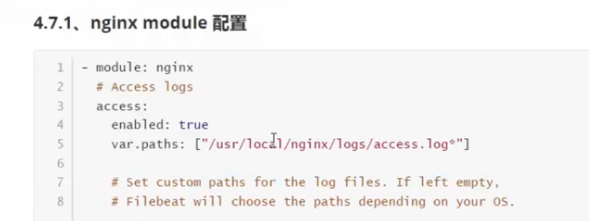
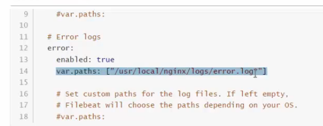

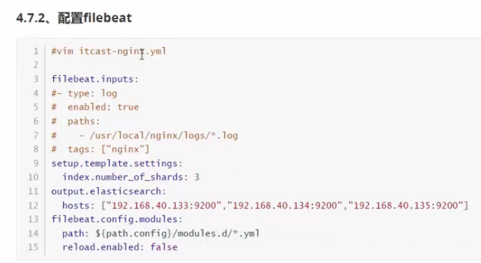

```yaml

filebeat.inputs:
#- type: log 
#  enabled: true
#  paths:
#    - /usr/local/nginx/logs/*.log
#  tags: ["nginx"]
#  fields: 
#    from: nginx-fields-xzj
#  fields_under_root: true
setup.template.settings:
  index.number_of_shards: 1
output.elasticsearch:
  hosts: ["192.168.32.128:9200"]
filebeat.config.modules:
  path: ${path.config}/modules.d/*.yml
  reload.enabled: false
```

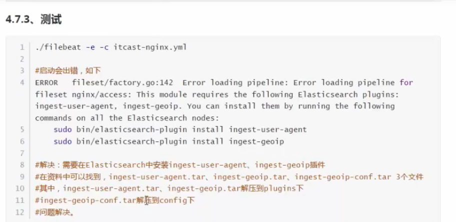
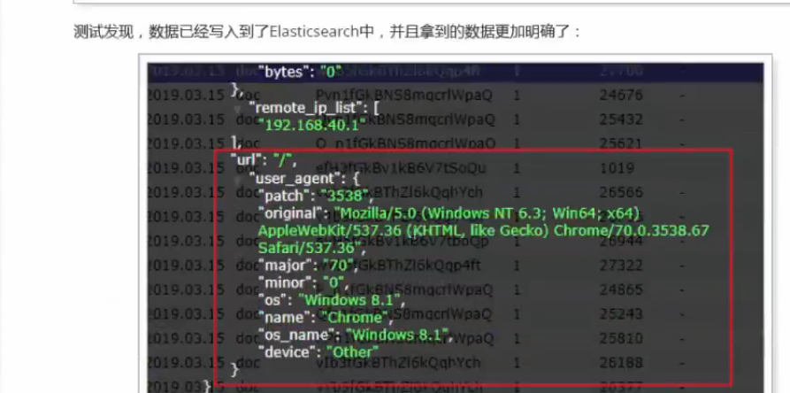