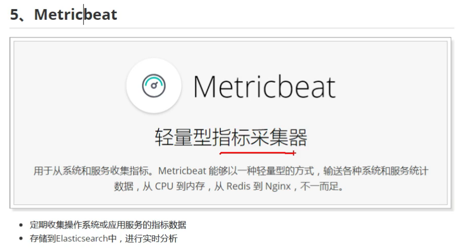
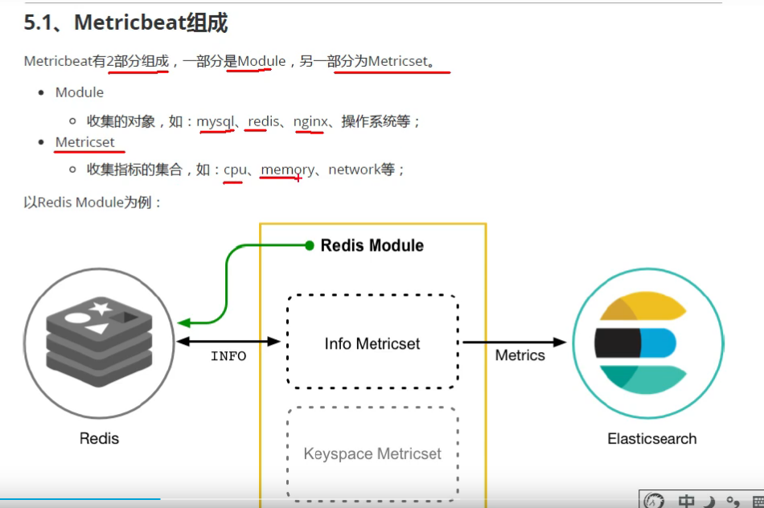
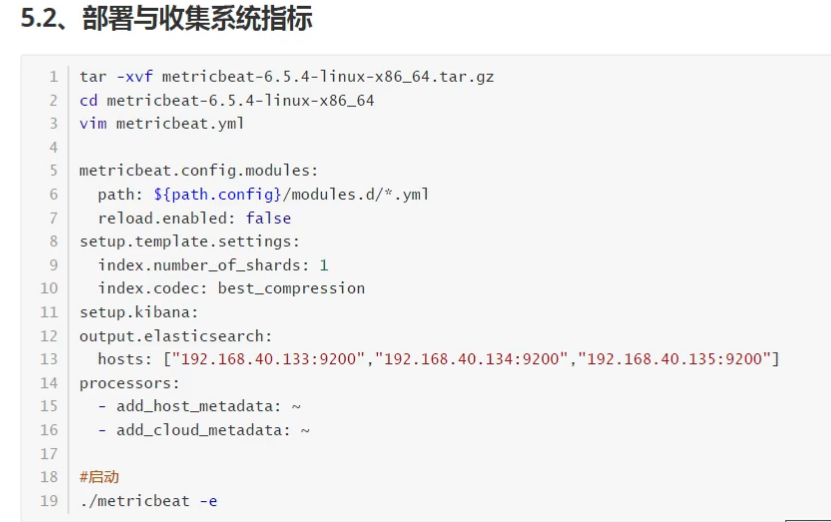
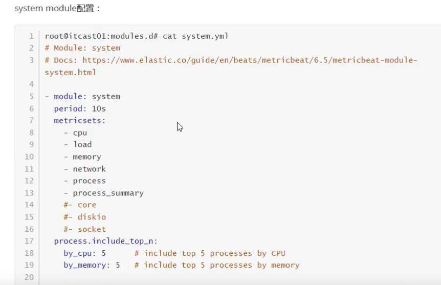
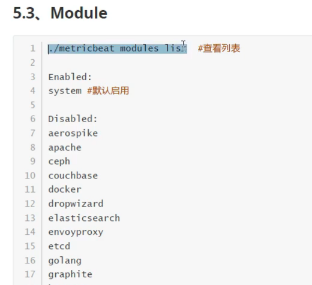
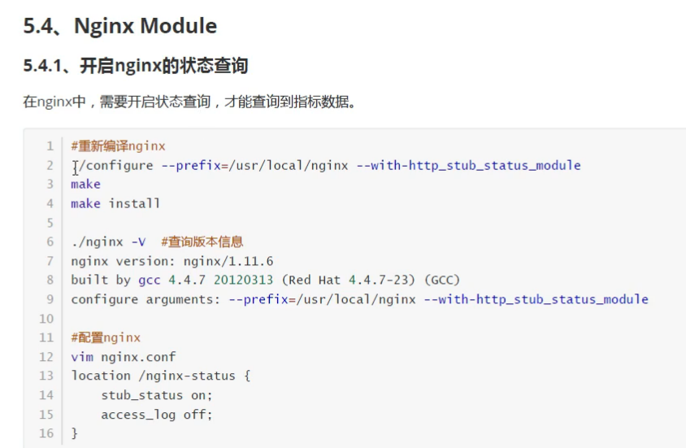
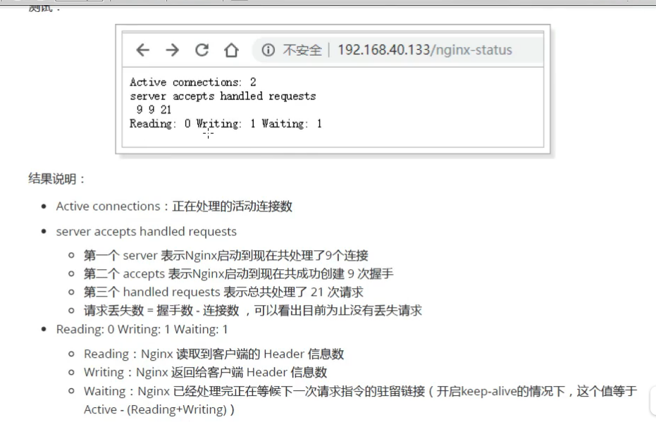
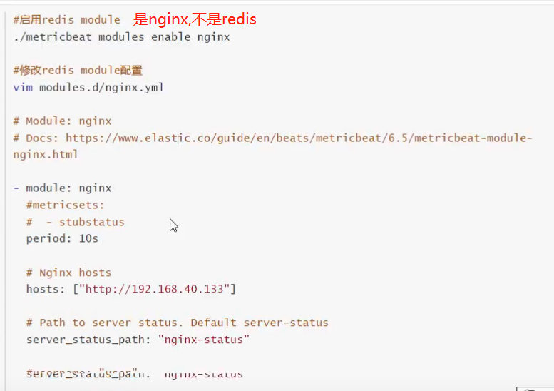
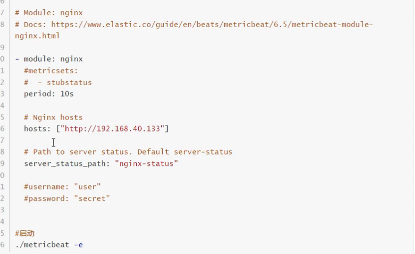

[下载安装](https://www.elastic.co/downloads/beats/metricbeat)





```shell script
./metricbeat modules list

./configure --prefix=/usr/local/nginx --with-http_stub_status_module
make && make install

./nginx -V
vim conf/nginx.conf

location /nginx-status {
        stub_status on;
        access_log off;
}

./nginx -s reload
./nginx -s quit
./nginx -c nginx.conf

# 访问
http://192.168.32.128/nginx-status
```





```shell script
./metricbeat modules enable nginx
```







