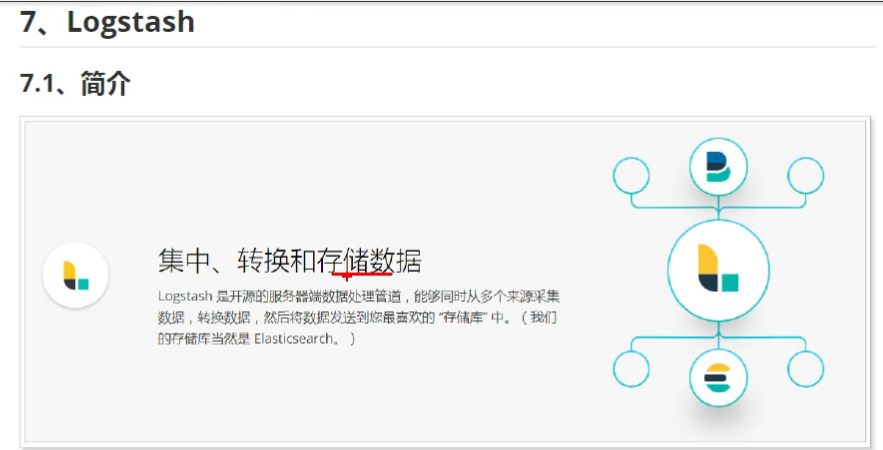
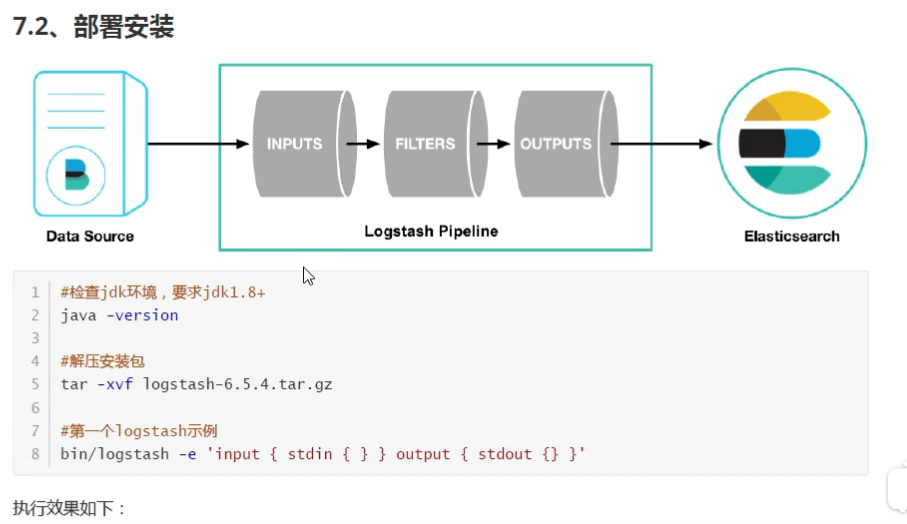
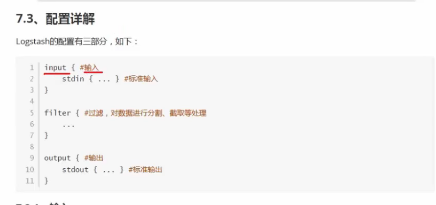
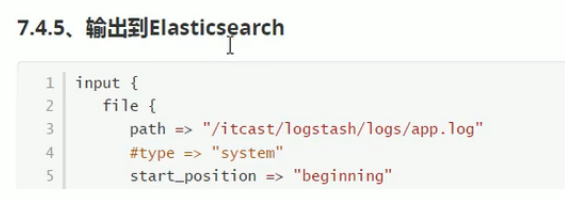
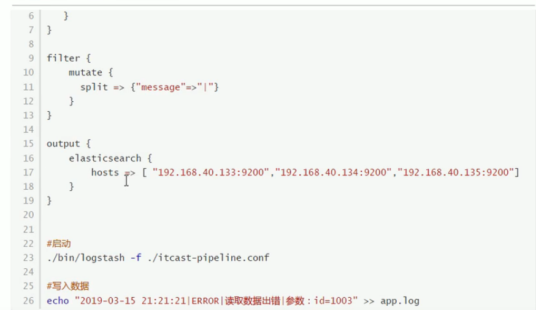

```shell script
bin/logstash -e 'input { stdin {} } output { stdout {} }'
```




# 通过Logstash读取自定义日志


```shell script
# 创建
touch /learn/logstash/logs/app.log
```

```shell script
input {
  file {
    path => "/learn/logstash/logs/app.log"
    start_position => "beginning"
  }
}

filter {
  mutate {
    split => {"message"=>"|"}
  }
}

output {
  stdout { codec => rubydebug}
}
```


```shell script
./bin/logstash -f xzj.conf

echo "2019-03-15 21:21:21|ERROR|读取数据错误|参数: id=1004" >> app.log
```

# 输出到es中



```shell script
input {
  file {
    path => "/learn/logstash/logs/app.log"
    start_position => "beginning"
  }
}

filter {
  mutate {
    split => {"message"=>"|"}
  }
}

output {
  elasticsearch {
    hosts => ["192.168.32.128:9200"]
  }
}
```



```shell script
./bin/logstash -f xzj.conf

echo "2019-03-15 21:21:21|ERROR|读取数据错误|参数: id=1004" >> app.log
```