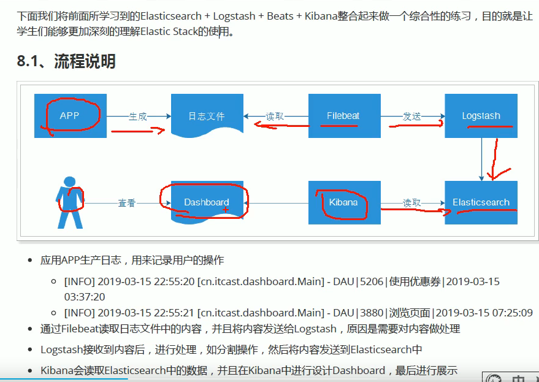

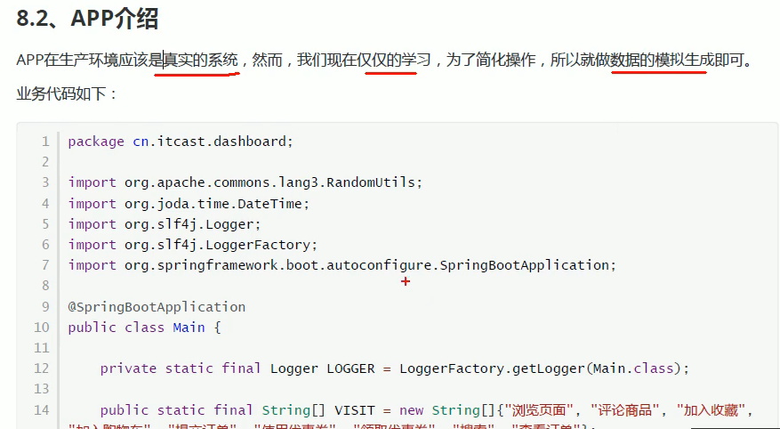

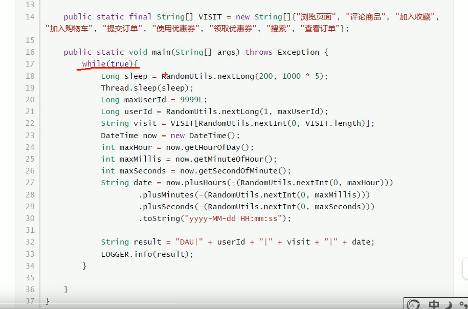

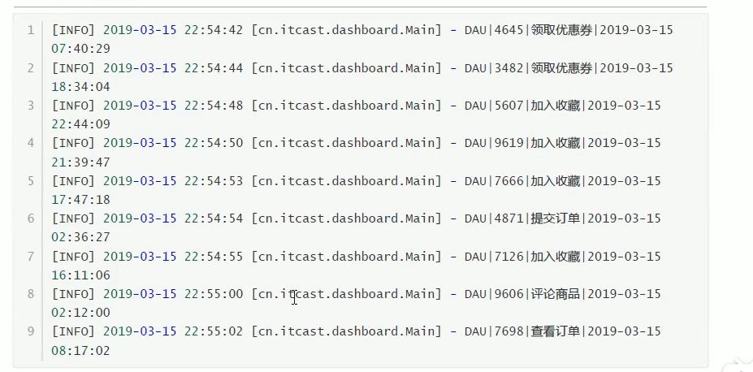

    代码: logging-example


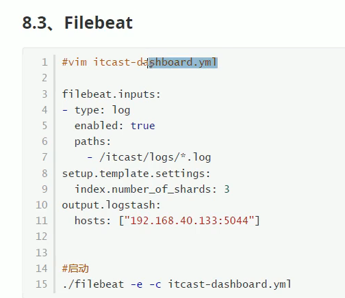

```yaml
# filebeat会把/app/log/my-log.log中的内容发送到logstash: 192.168.32.128:5044
filebeat.inputs:
- type: log
  enabled: true
  paths:
    - /app/log/my-log.log
setup.template.settings:
  index.number_of_shards: 1
# 注意不是输出到es,而是输出到logstash
output.logstash:
  hosts: ["192.168.32.128:5044"]
```


    logstash的配置文件

```shell script
# logstash的端口
input {
  beats {
    port => "5044"
  }
}

# 以|为分隔符
filter {
  mutate {
    split => {"message"=>"|"}
  }

# 分割之后,给每个字段命名
  mutate {
    add_field => {
      "userId" => "%{[message][1]}"
      "visit" => "%{[message][2]}"
      "date" => "%{[message][3]}"
    }
  }

# 分割之后,可以把每个字段对应的值转化成我们预定义的类型,方便后续处理
  mutate {
    convert => {
      "userId" => "integer"
      "visit" => "string"
      "date" => "string"
    }
  }
}

# 输出到控制台,下面正式的是输出到es
output {
  stdout { codec => rubydebug }
}
```

    正式的配置文件

```shell script
input {
  beats {
    port => "5044"
  }
}

filter {
  mutate {
    split => {"message"=>"|"}
  }

  mutate {
    add_field => {
      "userId" => "%{[message][1]}"
      "visit" => "%{[message][2]}"
      "date" => "%{[message][3]}"
    }
  }

  mutate {
    convert => {
      "userId" => "integer"
      "visit" => "string"
      "date" => "string"
    }
  }
}

output {
  elasticsearch {
    hosts => ["192.168.32.128:9200"]
  }
}
```

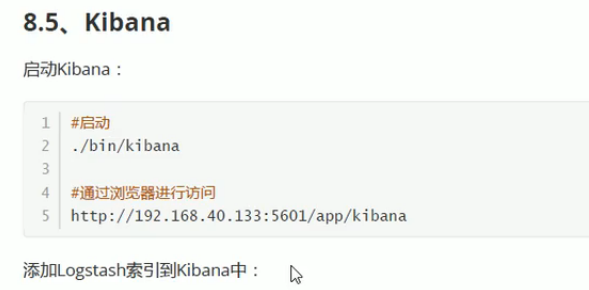


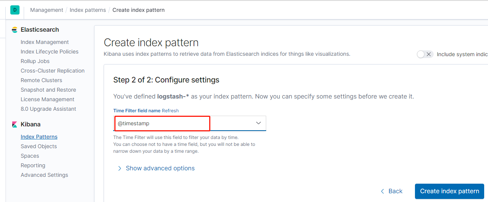


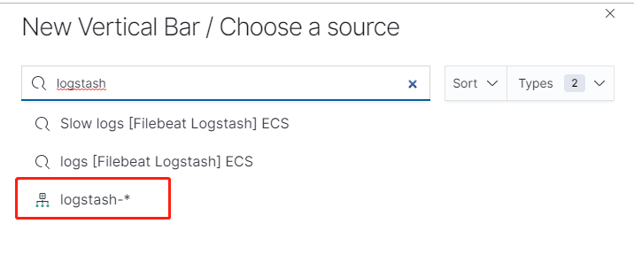

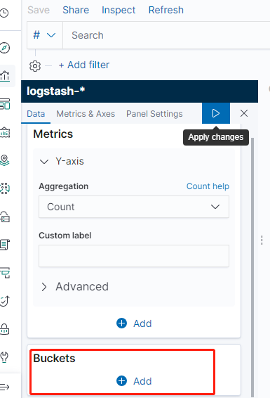

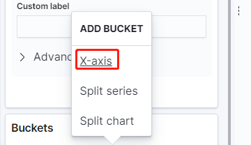


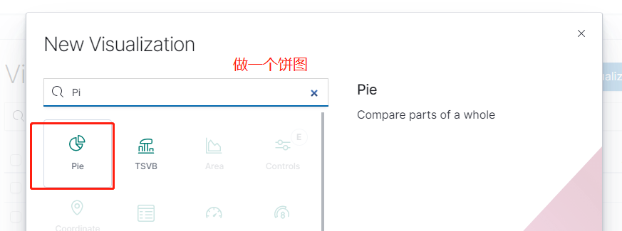

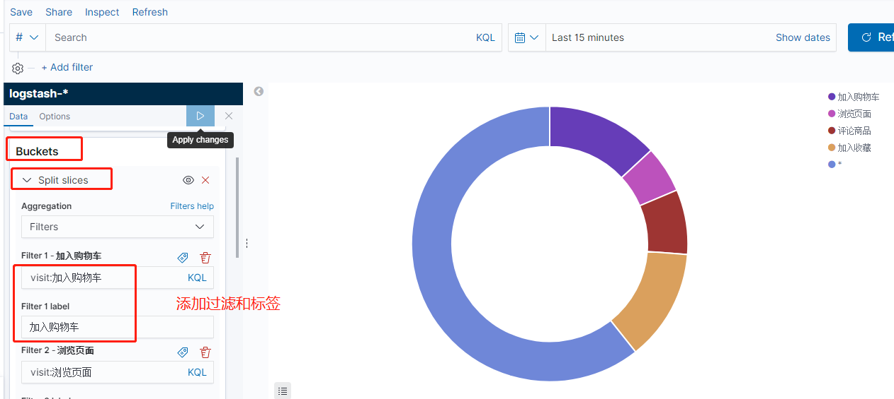

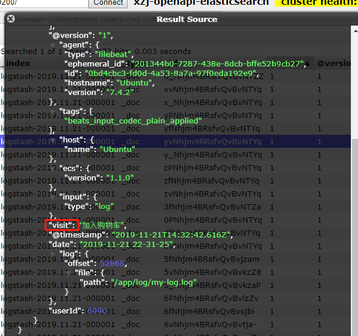

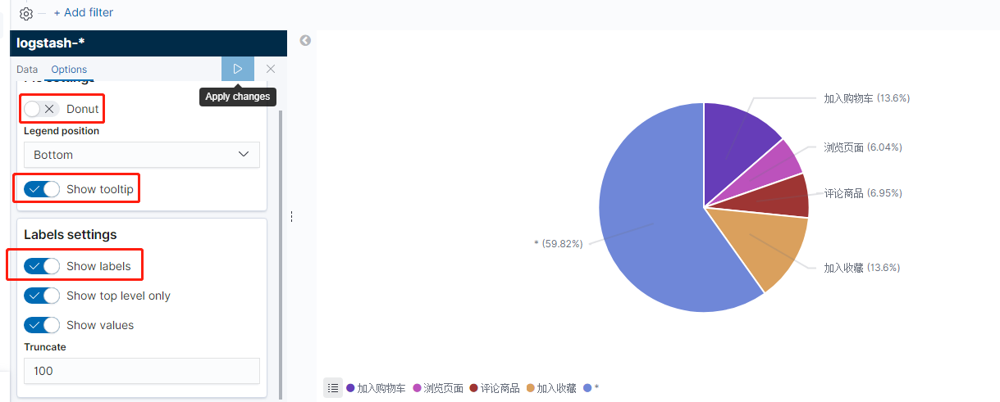


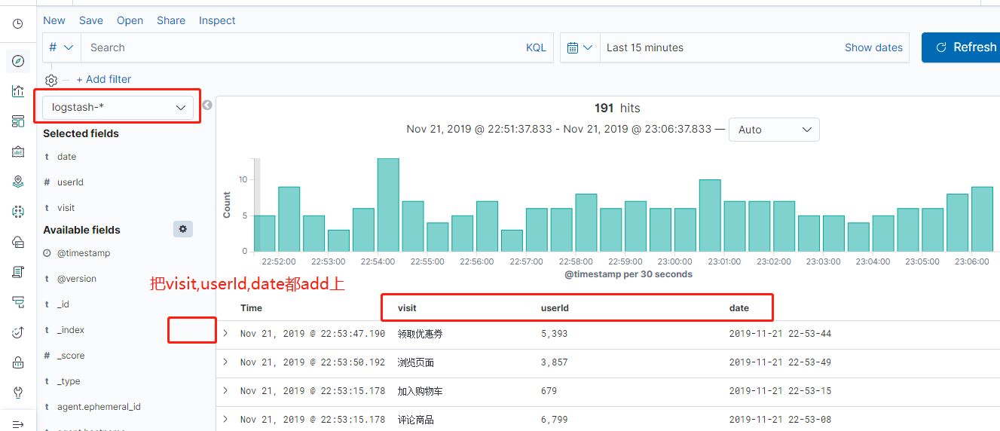


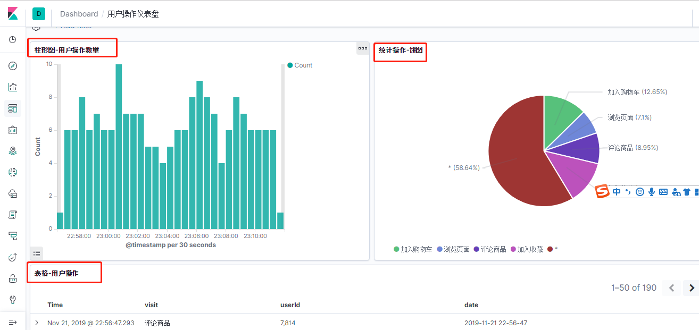

# 参考

- [视频](https://www.bilibili.com/video/av67957955?p=64)