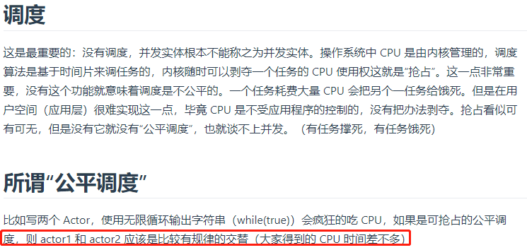
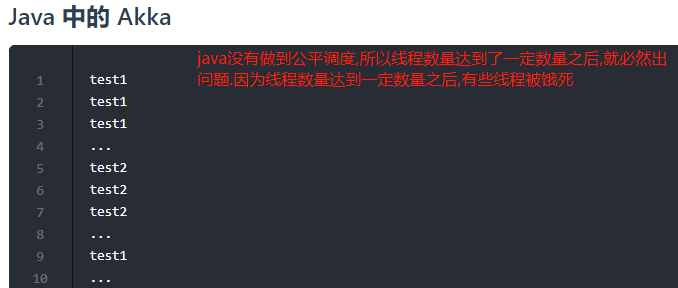
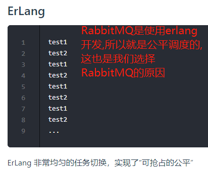
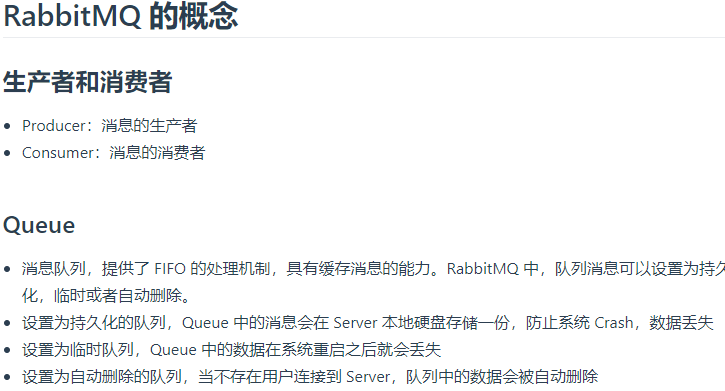
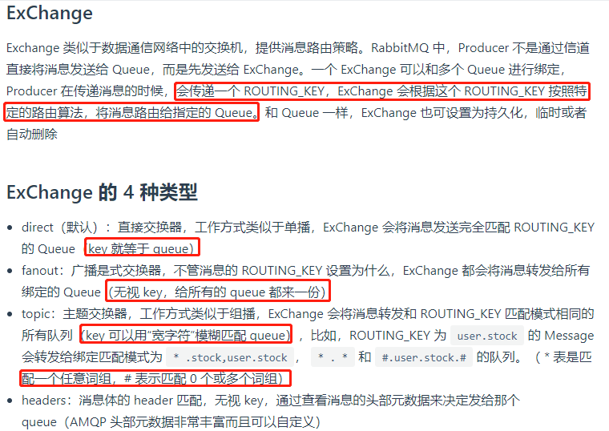
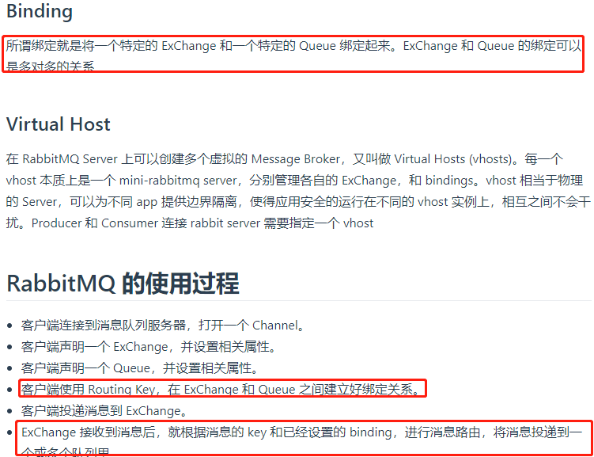

# 为什么选择RabbitMQ

>rabbitmq是一个公平调度的模型.

# 架构模型

>消息队列服务有三个概念： 发消息者、队列、收消息者，RabbitMQ在在发消息者和 队列之间, 加入了交换器 (Exchange). 这样发消息者和队列就没有直接联系, 我们向 RabbitMQ 发送消息，实际上是把消息发到交换器了, 交换器根据相关路由规则再把消息再给队列,在队列上监听的消费者就可以进行消费了.见示意图.

队列(Queue):消息队列，用来保存消息直到发送给消费者。它是消息的容器，也是消息的终点。一个消息可投入一个或多个队列。消息一直在队列里面，等待消费者连接到这个队列将其取走。

交换机(Exchange):用于转发消息，但是它不会做存储，如果没有Queue绑定到Exchange的话，它会直接丢弃掉Producer发送过来的消息。 `这里有一个比较重要的概念：路由键。消息到交换机的时候，交互机会转发到对应的队列中，那么究竟转发到哪个队列，就要根据该路由键。`

绑定(Binding)：也就是交换机需要和队列相绑定，是多对多的关系。一个绑定就是基于路由键将交换器和消息队列连接起来的路由规则.

### 交换机(Exchange)

>交换机的功能主要是接收消息并且转发到绑定的队列，交换机不存储消息，在启用ack模式后，交换机找不到队列会返回错误。交换机有四种类型：Direct, topic, Headers and Fanout

**Direct Exchange**

>消息中的路由键（routing key）如果和 Binding中的 binding key 一致， 交换器就将消息发到对应的队列中。路由键与队列名完全匹配，如果一个队列绑定到交换机要求路由键为“dog”，则只转发 routing key 标记为“dog”的消息，不会转发“dog.puppy”，也不会转发“dog.guard”等等。它是完全匹配、单播的模式。Direct Exchange是RabbitMQ默认的模式，也是最简单的模式，根据key全文匹配去寻找队列。

X 到队列 Q1 就有一个 binding key，名字为 orange； X 到队列 Q2 就有 2 个 binding key，名字为 black 和 green。当消息中的 路由键 和 这个 binding key 对应上的时候，那么就知道了该消息去到哪一个队列中。

>为什么 X 到 Q2 要有 black，green，2个 binding key呢，一个不就行了吗？ - 这个主要是因为可能又有 Q3，而Q3只接受 black 的信息，而Q2不仅接受black 的信息，还接受 green 的信息。

**Topic Exchange(按规则转发消息,最灵活)**

转发消息主要是根据通配符。将路由键和某个模式进行匹配，`此时队列需要绑定到一个模式上`,它将路由键和绑定键的字符串切分成单词，这些单词之间用点隔开.

* 路由键必须是一串字符，用.隔开，比如说 agreements.us
* 路由模式必须包含一个 星号\*，主要用于匹配路由键指定位置的一个单词，比如说，一个路由模式是这样子：agreements..b.，那么就只能匹配路由键是这样子的：第一个单词是 agreements，第四个单词是 b。 井号\#就表示相当于一个或者多个单词，例如一个匹配模式是agreements.eu.berlin.#，那么，以agreements.eu.berlin开头的路由键都是可以的。 具体代码发送的时候还是一样，第一个参数表示交换机，第二个参数表示routing key，第三个参数即消息。如下：
`rabbitTemplate.convertAndSend("testTopicExchange","key1.a.c.key2", " this is  RabbitMQ!");`
* topic 和 direct 类似, 只是匹配上支持了”模式”, 在”点分”的 routing_key 形式中, 可以使用两个通配符:其中\*号表示一个词，\#号表示零个或多个词.

**Headers Exchange(设置header attribute参数类型的交换机)**

相较于direct和topic固定地使用routing_key,headers匹配AMQP消息的header 而不是路由键，除此外headers交换器和 direct 交换器完全一致，但性能差很多，目前几乎用不到了

**Fanout Exchange(转发消息到所有绑定队列)**

每个发送到 fanout 交换器中的消息，他不会去匹配路由键(routing key)，直接把消息投递到所有绑定到 fanout 交换器中的队列上，它就像一个广播站一样，它会向所有收听广播的用户发送消息。
对应到系统上，它允许你针对一个消息作不同操作，比如用户上传了一张新的图片，系统要同时对这个事件进行不同的操作，比如删除旧的图片缓存、增加积分奖励等等。这样就大大降低了系统之间的耦合度了。

