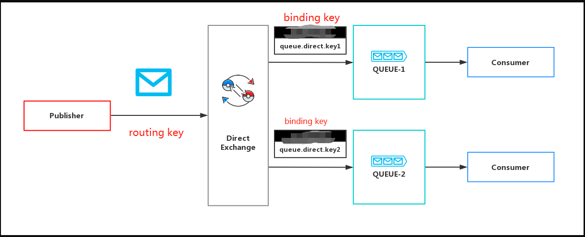

# 为什么选择RabbitMQ

>rabbitmq是一个公平调度的模型.

# 架构模型

>消息队列服务有三个概念： 发消息者、队列、收消息者，RabbitMQ在在发消息者和 队列之间, 加入了交换器 (Exchange). 这样发消息者和队列就没有直接联系, 我们向 RabbitMQ 发送消息，实际上是把消息发到交换器了, 交换器根据相关路由规则再把消息再给队列,在队列上监听的消费者就可以进行消费了

队列(Queue):消息队列，用来保存消息直到发送给消费者。它是消息的容器，也是消息的终点。一个消息可投入一个或多个队列。消息一直在队列里面，等待消费者连接到这个队列将其取走。

**多个消费者可以订阅同一个队列**，这时队列中的消息会被平均分摊（Round-Robin，即轮询）给多个消费者进行处理，而不是每个消费者都收到所有的消息并处理，这样避免的消息被重复消费。

交换机(Exchange):用于转发消息，但是它不会做存储，如果没有Queue绑定到Exchange的话，它会直接丢弃掉Producer发送过来的消息。 `这里有一个比较重要的概念：路由键。消息到交换机的时候，交互机会转发到对应的队列中，那么究竟转发到哪个队列，就要根据该路由键。`

绑定(Binding)：也就是交换机需要和队列相绑定，是多对多的关系。一个绑定就是基于路由键将交换器和消息队列连接起来的路由规则.

# Exchange细分

---
    TopicExchange: 按规则转发消息,最灵活
    
    *（星号）：可以（只能）匹配一个单词
    #（井号）：可以匹配多个单词（或者零个）
---

---
    
    DirectExchange:
    
    消息中的路由键（routing key）如果和 Binding中的 binding key 一致， 交换器就将消息发到对应的队列中。
    
    Direct Exchange是RabbitMQ默认的模式，也是最简单的模式
---

---
    fanout 类型的Exchange 会把所有发送到该Exchange的消息路由到所有与这个Exchange绑定的Queue中，
    不需要做任何判断操作，所以 fanout 类型是所有的交换机类型里面速度最快的。fanout 类型常用来广播消息。
---

---
    headers Exchange用的比较少
    
    headers 类型的交换器不依赖于路由键的匹配规则来路由消息，而是根据发送的消息内容中的 headers 属性进行匹配.
    
    headers 类型的交换器性能会很差，而且也不实用，基本上不会看到它的存在
---