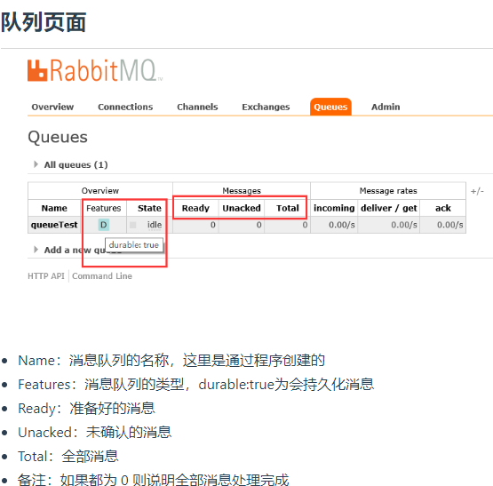

# 基于 Docker 来安装 RabbitMQ

docker-compose.yml

```yaml
version: '3.1'
services:
  rabbitmq:
    restart: always
    # 使用的是有管理界面的image
    image: rabbitmq:management
    container_name: rabbitmq
    ports:
      - 5672:5672
      - 15672:15672
    environment:
      TZ: Asia/Shanghai
      RABBITMQ_DEFAULT_USER: rabbit
      RABBITMQ_DEFAULT_PASS: 123456
    volumes:
      - ./data:/var/lib/rabbitmq
```

# Install Spring RabbitMQ Server On Windows

1. 安装Erland:http://www.erlang.org/download.html
2. 安装RabbitMQ:https://www.rabbitmq.com/install-windows.html
3. RabbitMQ Server安装完成之后，会自动的注册为服务(services.msc中可以看到)，并以默认配置启动起来
4. Set the following SYSTEM variable if missing：`RABBITMQ_HOME=C:\Program Files (x86)\RabbitMQ Server\rabbitmq_server-3.2.3`

# Rabbit Web管理

## Windows下

1. cd 到${RABBITMQ_HOME}/sbin
2. 安装插件:`.\rabbitmq-plugins.bat enable rabbitmq_management`以开启Web管理插件，就可以通过浏览器来进行管理了.
3. 从cmd->services.msc->重新启动Rabbit MQ Server
4. 打开浏览器并访问http://localhost:15672/,并使用默认用户guest登录，密码也为guest
5. 通过RabbitMQ面板，可以看到Connection和Channels中包含当前连接的条目。
6. add a new queue
7. Add a new exchange
8. click Bindings,将exchange Bindings to queue



## Linux下

```shell
yum install rabbitmq-server

# 启动 RabbitMQ：
/sbin/rabbitmq-server
# 守护线程开启
$ /sbin/rabbitmq-server -detached
# 重启节点
$ /sbin/rabbitmqctl reset

# 停止 RabbitMQ：
/sbin/rabbitmqctl stop
/sbin//rabbitmqctl stop_app // 停止应用
/sbin/rabbitmqctl -n rabbit@server.example.com stop  // 停止特定节点

#由于RabbitmMQ是用Erlang写的，Erlang有节点的概念，也就是在一个Erlang 节点上，可以运行很多个Erlang应用。stop 命令是使得整个Erlang节点停止工作，而stop_app 则是使得当前应用停止工作，不会影响其它应用的正常运行。

# 查看 RabbitMQ 状态：
$ /sbin/rabbitmqctl status
# 查看绑定：
$ /sbin/rabbitmqctl list_bindings
# 查看交换器：
$ /sbin/rabbitmqctl list_exchanges
# 查看已声明的队列：
$ /sbin/rabbitmqctl list_queues
# 配置文件
$ sudo vim /etc/rabbitmq/rabbitmq.config // 配置文件位置
```

# RabbitMQ集群原理与部署

>在项目中想要 RabbitMQ 变得更加健壮，就要使得其变成高可用，所以我们要搭建一个 RabbitMQ 集群，这样你可以从任何一台 RabbitMQ 故障中得以幸免，并且应用程序能够持续运行而不会发生阻塞。而 RabbitMQ 本身是基于 Erlang 编写的，Erlang 天生支持分布式（通过同步 Erlang 集群各节点的 cookie 来实现），因此不需要像 ActiveMQ、Kafka 那样通过 ZooKeeper 分别来实现 HA 方案和保存集群的元数据.
