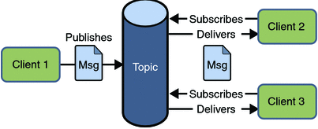

# JMS（JAVA Message Service）

JMS是java消息服务，通过JMS进行异步的消息传输。**JMS API是JavaEE规范**，(JMS API是一组通用接口，不包含任何实现)

JMS API仅用于"基于Java的应用程序中"，不支持其他语言,跨语言支持的比较差.ActiveMQ 就是基于 JMS 规范实现的（ActiveMQ 性能差，如果没有历史原因，不推荐使用）

# JMS的优点

1. 各个应用之间松耦合.
2. 异步：JMS Sender发送消息后继续自己的工作。它不用等到JMS Receiver接受消息后才能工作.
3. 可靠：JMS确保有且仅将消息传递到目标系统一次.
4. 互操作性：JMS API允许其他Java平台语言(如Scala和Groovy）之间的互操作性

# JMS支持两种消息传递模型

- 点到点: 一条消息只能被一个消费者使用，未被消费的消息在队列中保留直到被消费或超时
- 发布/订阅: 发布者发布一条消息，该消息通过topic传递给这个topic的所有订阅者，**在一条消息广播之后才订阅的用户则是收不到该条消息的**.

## 点对点的消息模型特点(Point-to-Point Messaging Model)

---
    1. 我们可以将`任意数量的JMS发送者`和`任意数量的JMS接收者`配置到特定队列。 但是，任何消息都应该发送给一个且只有一个Receiver。
    2. 如果发送者-2向接收者-2发送消息，则仅接收者-2接收该消息并将ACK(Acknowledgement-确认）发送回发送者-2。
    3. 即P2P模型可以具有多个发送方和多个接收方，但是每个消息由一个且仅一个接收方消费。
---

## 发布/订阅消息模型(Publish/Subscribe Messaging Model:)

1. 耐用的消息传递模型(Durable Messaging Model):
耐用模型也称为持久(Persistent)消息传递模型。在此模型中，消息存储在JMS服务器中的某种存储中，直到它们正确地传递到目标。
2. 非持久性消息传递模型(Non-Durable Messaging Model):
非耐用模型也称为非持久消息传递模型。 在此模型中，消息不存储在JMS服务器中。

3. JMS Publisher创建消息并将消息发布到主题。
4. JMS订阅者订阅感兴趣的主题并使用所有消息。
5. 发布/订阅消息模型具有时序依赖性。 这意味着JMS订阅者只有在订阅该主题后才能使用"发布到主题的消息"。 在订阅之前发布的任何消息或在其处于非活动状态时发布的任何消息都无法发送给该消费者。
6. 与P2P模型不同，在此模型中，Destination不存储消息。

>就像P2P模型一样，Pub/Sub模型也包含很多可能的架构:

* 一个发布者和许多订阅者
* 许多发布者和一个订阅者
* 许多发布者和许多订阅者

### Differences between P2P and Pub/Sub Messaging Model:

S.NO.	POINT-TO-POINT MESSAGING MODEL	PUBLISH/SUBSCRIBE MESSAGING MODEL
1.	每条消息都传递给一个且只有一个JMS接收器   每条消息都会传递给多个消费者
2.	P2P模型没有时序依赖性.			Pub/Sub model 有时序依赖性.
3.	JMS Receiver收到消息后会向JMS Sender发送确认。 	不需要确认。

### JMS Administered Objects and JMS Message

#### JMS Message

JMS客户端使用JMS消息在系统之间交换信息。 此JMS消息的类型为javax.jms.Message。

> 此JMS消息分为3部分：

1. Message Header
2. Message Properties(Optional)
3. Message Body(Optional)

##### Message Properties

此部分是可选的。 这些属性是由应用程序设置或读取的自定义键值对。 这些对于支持过滤消息很有用。 我们将在Messaging Filtering Advanced JMS Concepts部分详细讨论它。

##### Message Body

此部分是可选的。 它包含从JMS Sender发送到JMS Receiver的实际消息。

> 它支持以下消息格式：

1. TextMessage
2. ObjectMessage
3. BytesMessage
4. StreamMessage
5. MapMessage

下表描述了这些JMS消息类型：https://cdn.journaldev.com/wp-content/uploads/2015/11/jms_message_types.png

### JMS和AMQP之间的区别

3. 消息结构:JMS消息分为3个部分：Header, Properties, and Body.
AMQP消息分为4个部分：Header, Properties, Body, and Footer.
4. 消息类型:JMS API支持5种类型的消息作为Body部分的一部分，但AMQP仅支持一种类型的消息 - 二进制（字节）消息(Binary (bytes) message.)