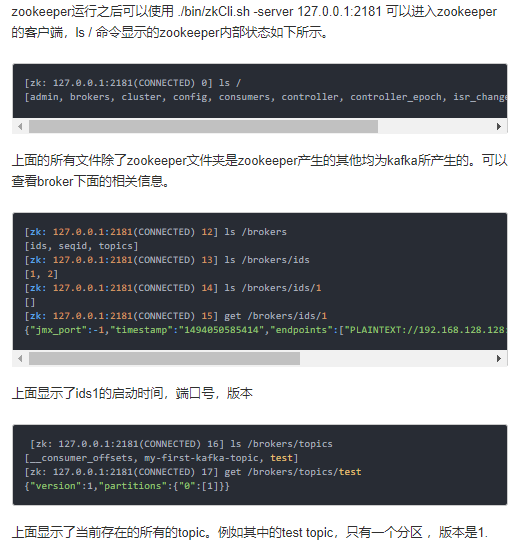

# 安装 

1. cd /opt/ && wget http://us.mirrors.quenda.co/apache/kafka/2.2.0/kafka_2.12-2.2.0.tgz
2. tar -xzf kafka_2.12-2.2.0.tgz && cd kafka_2.12-2.2.0
3. 启动kafka之前要先启动zookeeper,因为kafka集群使用到了zookeeper，因此需要先安装好zookeeper。你可以通过kafka自带的一个脚本来快速的安装一个单节点的zookeeper实例.如果自己已经单独安装了zookeeper，就跳过此步.(This step is optional.)
4. bin/zookeeper-server-start.sh config/zookeeper.properties
5. 启动kafka,kafka服务器默认监听9092端口: `bin/kafka-server-start.sh [-daemon] config/server.properties`, server.properties的配置路径是一个强制的参数，-daemon表示以后台进程运行，否则ssh客户端退出后，就会停止服务.(通过看port/jps看是否启动成功)

## kafka启动时可能会遇到的问题

1. 在启动kafka服务时可能会出现error='Cannot allocate memory' (errno=12) 
原因在于kafka默认启动设置为当剩余内存在1G以上时才能成功启动。为避免启动kafka时机器剩余内存不足1G而导致Kafka Broker无法启动的情况，修改bin/kafka-server-start.sh文件：`export KAFKA_HEAP_OPTS="-Xmx256M -Xms128M"`
2. kafka在启动的时候可能会遇到java.net.UnknownHostException，解决方法:
https://my.oschina.net/fenghen/blog/629151.可以通过改/etc/sysconfig/network和/etc/hosts解决，但是需要重启，或者
通过临时的hostname localhost解决

# 使用单机Kafka

1. Create一个名字为“test”的Topic，这个topic只有一个partition，并且备份因子也设置为1：`bin/kafka-topics.sh --create --zookeeper localhost:2181 --replication-factor 1 --partitions 1 --topic test`
2. 查看kafka中目前存在的topic: `bin/kafka-topics.sh --list --zookeeper localhost:2181`
3. 除了我们通过手工的方式创建Topic，当producer发布一个消息到某个指定的Topic，但是这个Topic并不存在时，就自动创建。
4. kafka自带了一个producer命令客户端，可以从本地文件中读取内容，或者也可以从命令行读取内容，并将这些内容以消息的形式发送到kafka集群中。在默认情况下，每一个行会被当做成一个独立的消息,首先我们要运行发布消息的脚本，然后在命令中输入要发送的消息的内容：`bin/kafka-console-producer.sh --broker-list localhost:9092 --topic test`
4. 然后输入: This is a message然后回车, 再输入: This is another message
5. Start a consumer,对于consumer，kafka同样也携带了一个命令行客户端，会将获取到内容在命令中进行输出：`bin/kafka-console-consumer.sh --bootstrap-server localhost:9092 --topic test --from-beginning`,你将会看到在producer终端输入的内容，很快就会在consumer的终端窗口上显示出来。(注意以上生产者和消费者的端口要一样.)



# Kafka伪集群的搭建

**Setting up a multi-broker cluster**

到目前为止，我们都是在`一个单节点上运行broker`，这并没有什么意思。对于kafka来说，一个单独的broker意味着`kafka集群中只有一个节点`。要想增加kafka集群中的节点数量，只需要多启动几个broker实例即可。为了有更好的理解，现在我们在一台机器上同时启动三个broker实例。

>首先，我们需要建立好其他2个broker的配置文件：

```shell
cp config/server.properties config/server-1.properties
cp config/server.properties config/server-2.properties
```

>修改配置文件,如下：

```properties
config/server-1.properties:

broker.id=1
listeners=PLAINTEXT://:9093
log.dir=/tmp/kafka-logs-1

config/server-2.properties:

broker.id=2
listeners=PLAINTEXT://:9094
log.dir=/tmp/kafka-logs-2
```

>broker.id属性是每一个节点唯一的并且是永久的名字在kafka集群中。我们只需要重新指定port和log目录，因为我们是在同一台机器上运行多个实例。如果不进行修改的话，consumer只能获取到一个instance实例的信息，或者是相互之间的数据会被影响。目前我们已经有zookeeper和一个节点在运行了，现在我们只需要再启动2个节点即可：

```shell
bin/kafka-server-start.sh -daemon config/server-1.properties

# 注意内存不足导致无法启动
bin/kafka-server-start.sh -daemon config/server-2.properties
```

>现在我们创建一个新的topic，备份因子设置为3：

```shell
bin/kafka-topics.sh --create --bootstrap-server localhost:2181 --replication-factor 3 --partitions 1 --topic  my-replicated-topic
```

>查看集群状态：

```shell
bin/kafka-topics.sh --describe --zookeeper localhost:2181
```

>现在我们已经有了集群，并且创建了一个3个备份因子的topic，但是到底是哪一个broker在为这个topic提供服务呢(因为我们只有一个分区，所以肯定同时只有一个broker在处理这个topic)？

```shell
bin/kafka-topics.sh --describe --zookeeper localhost:2181 --topic my-replicated-topic

Topic:my-replicated-topic       PartitionCount:1        ReplicationFactor:3     Configs:
Topic: my-replicated-topic      Partition: 0    Leader: 1       Replicas: 1,2,0 Isr: 1,2,0

# 现在我们的案例中，1号节点(broker id是1)是leader，即使用server-1.properties启动的那个进程。
```

>输出内容的解释:

1. 第一行是所有分区的概要信息，之后的每一行表示每一个partition的信息。因为目前我们只有一个partition，因此关于partition的信息只有一行
2. leader节点(broker的id)负责给定partition的所有读写请求。如果一个topic有多个partitions，每个节点将成为随机选择的分区部分的领导者。
3. replicas 表示某个partition在哪几个broker上存在备份。不管这个节点是不是”leader“，甚至这个节点挂了，也会列出。
4. isr 是replicas的一个子集，它只列出当前还存活着的，并且备份了该partition的节点。

>现在我们向新建的topic中发送一些message：

```shell
bin/kafka-console-producer.sh --broker-list localhost:9092 --topic my-replicated-topic
```

```
my test message 1
my test message 2
```

>现在开始消费：

```shell
bin/kafka-console-consumer.sh --bootstrap-server localhost:2181 --from-beginning --topic my-replicated-topic

# 这个消费端口有疑问，网上都是2181
```

>现在我们来测试我们容错性，因为broker1目前是leader，所以我们要将其kill

```shell
ps | grep server-1.properties

7564  ttys002    0:15.91 /System/Library/Frameworks/JavaVM.framework/Versions/1.6/Home/bin/java...

kill -9 7564
```

>现在再执行命令：

```shell
bin/kafka-topics.sh --describe --zookeeper localhost:2181 --topic my-replicated-topic

Topic:my-replicated-topic       PartitionCount:1        ReplicationFactor:3     Configs:
Topic: my-replicated-topic      Partition: 0    Leader: 2       Replicas: 1,2,0 Isr: 2,0
```

>我们可以看到，leader节点已经变成了broker 2.要注意的是，在Isr中，已经没有了1号节点。leader的选举也是从ISR中进行的。
此时，我们依然可以消费新消息：

```shell
bin/kafka-console-consumer.sh --zookeeper localhost:2181 --from-beginning --topic my-replicated-topic
```

**使用Kafka Connect导入导出数据**

>通过命令行来发布和接受消息，是一个很好的起步，但是有时我们的数据可能有其他来源，或者我们想将kafka的数据导出到其他系统中。对于很多系统来说，我们可以使用Kafka Connect，自己编写代码来实现导入导出的操作。

"Kafka Connect"是Kafka自带的一个可以往Kafka集群中导入或者导出数据的工具。它是connectors的扩展工具，我们可以实现自定义的逻辑，从而和外部系统进行交互。在这个快速入门的章节，我们将会介绍如何基于一些简单的connectors使用Kafka Connect来往kafka中的一个topic中导入一个文件中的信息，并且将kafka中一个topic的信息，导入一个文件中。首先我们需要创建一些测试数据：

> echo -e "foo\nbar" > test.txt

接下来我们要以standalone模式运行两个conncetors。我们提供三个配置文件作为参数，第一个总是kafka连接进程的配置文件，内容包括：需要连接的kafka的brokers以及序列化文件的格式等。剩下的配置文件分别指定connector，包括唯一的connector名称，需要实例化的connector的全路径，以及其他的connector需要使用到的配置信息。

> bin/connect-standalone.sh config/connect-standalone.properties \
config/connect-file-source.properties config/connect-file-sink.properties

[可以参考](https://zhuanlan.zhihu.com/p/67145969)