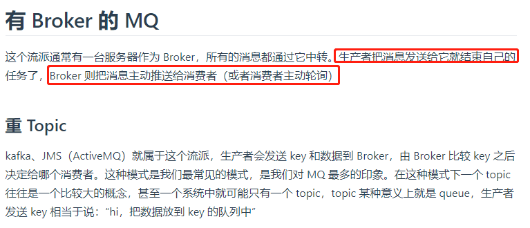
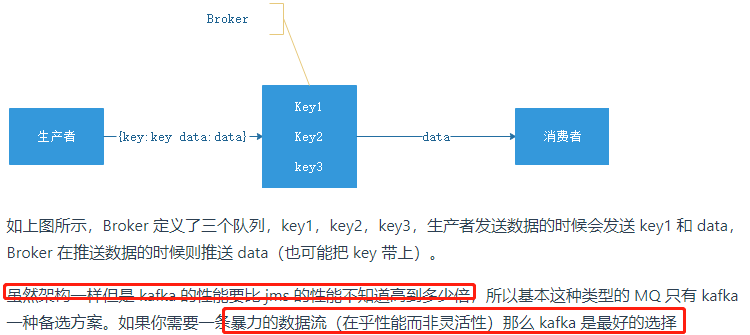
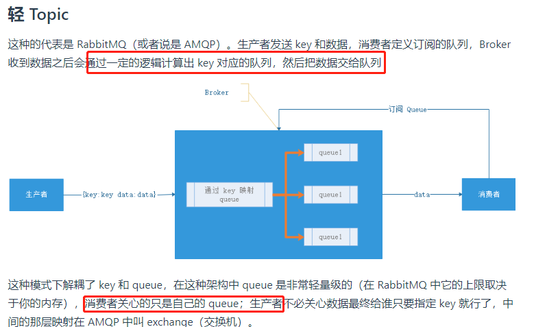
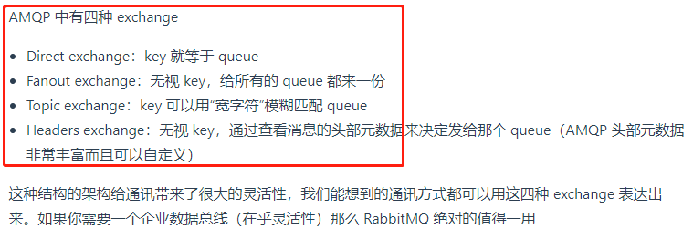
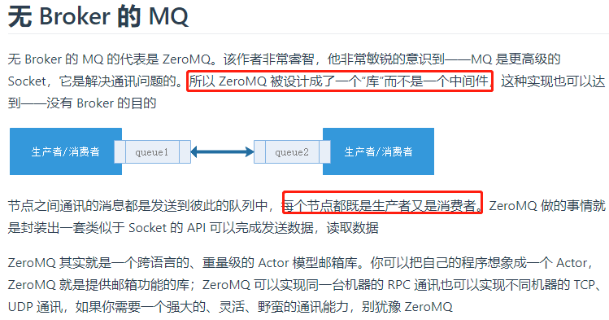

# 消息传递模型

- 点对点: 消息生产者向消息队列中发送了一个消息之后，一条消息只能被一个消费者使用，未被消费的消息在队列中保留直到被消费或超时
- 发布/订阅: 消息生产者向频道发送一个消息之后，多个消费者可以从该频道订阅到这条消息并消费。

# 为什么要使用消息队列?

微服务之间,服务与服务之间的调用方式有rest或者rpc,虽然rest/rpc都非常流行 ,但是它们都是同步的,会造成阻塞,因此部分基于微服务的架构可能会选择消息队列.

# 消息队列分类

- 有 Broker 的 MQ
- 无 Broker 的 MQ

# 消息队列的好处

## 应用解耦

如果模块之间不直接进行调用，模块之间耦合度就会很低，那么修改一个模块或者新增一个模块对其它模块的影响会很小，从而实现可扩展性。

## 流量削锋

在高并发的场景下，如果短时间有大量的请求到达会压垮服务器。

可以将请求发送到消息队列中，服务器按照其处理能力从消息队列中pull消息进行处理。

---
    举例：在电子商务一些秒杀、促销活动中，合理使用消息队列可以有效抵御促销活动刚开始大量订单涌入对系统的冲击。

    因为**用户请求数据写入消息队列之后就立即返回给用户了(减少响应所需时间)，但是请求数据在后续的业务校验、写数据库等操作中可能失败**。因此使用消息队列进行异步处理之后，需要**适当修改业务流程进行配合**，比如**用户在提交订单之后，订单数据写入消息队列，不能立即返回用户订单提交成功，需要在消息队列的订单消费者进程真正处理完该订单之后，甚至出库后，再通过电子邮件或短信通知用户订单成功**，以免交易纠纷。这就类似我们平时手机订火车票和电影票
---

## 异步处理

发送者将消息发送给消息队列之后，就可以立即返回进行其它操作,发送者该干啥就干啥,剩余的就不用管了。消息接收者从消息队列中拿到消息之后异步处理.

在注册流程中通常需要发送验证邮件来确保注册用户身份的合法性，可以使用消息队列使发送验证邮件的操作异步处理，用户在填写完注册信息之后就可以完成注册，而将发送验证邮件这一消息发送到消息队列中.

>只有在业务流程允许异步处理的情况下才能这么做.

# 使用消息队列带来的一些问题(缺点/弊端)

- **系统可用性降低：** 系统可用性在某种程度上降低，为什么这样说呢？在加入MQ之前，你不用考虑MQ挂掉的情况，但是，引入MQ之后你就需要去考虑了！
- **系统复杂性提高：** 加入MQ之后，你需要保证消息没有被重复消费、处理消息丢失的情况、保证消息传递的顺序性等等问题！
- **一致性问题：** 我上面讲了消息队列可以实现异步，消息队列带来的异步确实可以提高系统响应速度。但是，万一消息的真正消费者并没有正确消费消息怎么办？这样就会导致数据不一致的情况了!

# MQ的可靠性

## 发送端的可靠性

发送端完成操作后一定能将消息成功发送到消息队列中。

实现方法：

- 在本地数据库建一张消息表，将消息数据与业务数据保存在同一数据库实例里，这样就可以利用本地数据库的事务机制。事务提交成功后，将消息表中的消息转移到消息队列中，若转移消息成功则删除消息表中的数据，否则继续重传。

**另外为了避免消息队列服务器宕机造成消息丢失，会将成功发送到消息队列的消息存储在消息生产者服务器上，等消息真正被消费者服务器处理后才删除消息。在消息队列服务器宕机后，生产者服务器会选择分布式消息队列服务器集群中的其他服务器发布消息。**   

## 接收端的可靠性

接收端能够从消息队列成功消费一次消息。

两种实现方法：

- 保证接收端处理消息的业务逻辑具有幂等性：只要具有幂等性，那么消费多少次消息，最后处理的结果都是一样的。
- 保证消息具有唯一编号，并使用一张日志表来记录已经消费的消息编号。
