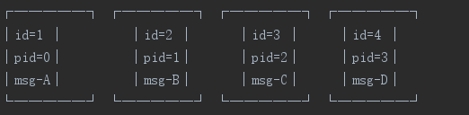
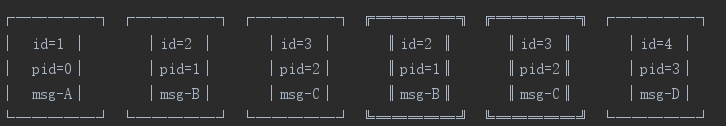
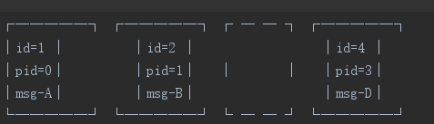
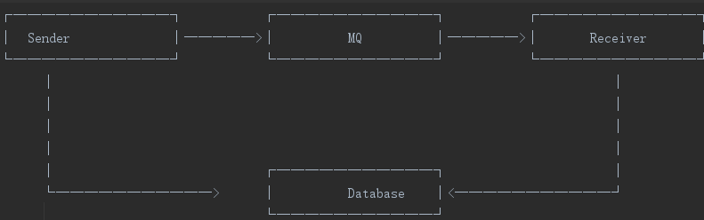

## 交易系统的消息服务如何保证100%可靠

分布式应用中，消息系统被大量使用，主要原因有：

1. 逻辑解耦: 发送方和接收方，功能模块化，一个只管发，一个只管收，简化了处理逻辑
2. 适配动态流量: 如果`发送方`发送速度快于`接收方`的接收速度，消息系统就可以暂时将无法处理的消息缓存起来，`让接收方慢慢处理`
,没有消息系统时，`发送方就不得不配合接收方降低处理速度，从而拖慢了整个系统的性能。`

### 那么消息系统能保证消息100%可靠到达吗？ 

    答案是否定的!

### 消息系统不能保证消息100%可靠到达的原因?

因为`消息系统是网络调用`，只要涉及到网络，就不可能100%可靠.就存在丢消息的可能性.仅仅依靠消息服务是无法保证的，我们必须在设计上做出`更多的容错和自动恢复的机制`，来保证100%的可靠性。

### 消息系统的消息传输模式有哪些?

那么消息系统如何尽可能保证`消息的可靠达到`呢？一般来说，消息系统可以实现3种消息传输模式：

* At least once: 消息保证至少发送成功一次，也就是可能会重复发送；
* At most once: 消息只保证最多发送一次，那就是要么成功，要么失败.(这种肯定不行)
* Exactly once: 消息保证发送成功且仅发送成功一次，这种理想情况不存在，也没有任何基于网络的消息系统能实现这种模式

>大部分消息系统都按照At least once来设计。但是并不是说消息系统就能保证所有消息能100%可靠达到，只要是网络，就存在丢消息的可能性。

### 如何利用非100%消息可靠到达的消息系统，如何保证100%的可靠性？

    如果涉及到交易系统这类`绝对不能丢消息的应用`，怎么才能保证100%不丢消息，并`保证所有消息处理一次且仅处理一次？`
    非事务型消息系统，如ActiveMQ、RabbitMQ、Kafka等，不保证100%可靠性。涉及到交易系统的订单消息，
    如果一个都不能丢，通过非100%可靠的消息系统，如何保证100%的可靠性？

>解决方法需要从发送方和接收方同时考虑:

    考虑接收方处理消息的逻辑，首先要保证接收方能处理`重复消息`，因此需要对`每个订单的消息进行编号`，也就是给每个消息标记一个递增的ID（只需要递增，不一定要求连续），这样，接收方维护一个当前ID，凡是收到比当前ID小的消息，直接丢弃。

>但是，如果一个消息序列例如A-B-C-D在发送过程中丢掉了某个消息，变成了A-B-D，接收方如何能检测出丢失？

    除了给每个消息附上一个唯一递增ID外，只需要发送方同时给每个消息附加上前一条消息的ID，就可以形成一个微型“区块链”，利用这个链表，接收方很容易识别出漏掉的消息。

    如果接收方识别出消息遗漏，它应该怎么从该错误恢复呢？方法也很简单，只需`向接收方暴露数据库接口`，让接收方自己从数据库中根据ID读取漏掉的消息，就相当于接收方总是能有序且无遗漏地处理所有消息。

假设正常的消息流如下所示：

>由于接收方可以根据递增ID去重，因此，重复发送消息可以被正常处理：

>如果消息出现丢失：

>那么，接收方只需要根据当前ID去数据库查询，直到读取到最新的ID为止：

整个过程中，极少量消息丢失不会对系统的可用性造成影响，这样就极大地减少了系统的运维成本和线上排错成本。

最后，无论是发送方还是接收方，为了提高收发消息的效率，应该总是使用批处理的方式。测试显示一次收发一条消息和一次收发10条消息时间上并无明细差异，而发送方采用batch落库+batch发送可以显著地提高TPS，当然，这需要消息服务器支持batch模式。