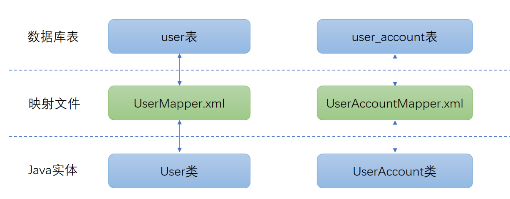

# mybatis快速入门

> 示例项目: QuickStart

### 基于XML的使用方式

    mybatis的xml配置文件分为2类：

1. 全局配置文件：主要是进行一些全局配置，通常命名为mybatis-config.xml。
例如前面提到mybatis在操作数据库时需要依赖`数据源`(DataSource)获取数据库连接，
DataSource应该是全局唯一的，此时就应该在mybatis-config.xml中编写。
当然，mybatis-config.xml中还会包含一些mybatis其他全局属性的配置。
2. 映射文件：通常我们会针对一个表，就建立一个映射文件，因此映射文件可能会有多个。
映射文件的命名习惯如下："类名+Mapper.xml"。例如这里要操作的User类，
其映射文件名字就应该是UserMapper.xml，表示其是User类的映射文件。
而如果还有一个UserAccount类的话，其映射文件名称则应该为UserAccountMapper.xml

下图表示了完整映射关系： 



    可以看到数据库表和Java实体类，本身都是独立的，我们`映射文件来`建立`数据库表字段`
    和`Java类属性`之间的映射关系。

## SqlSessionFactory和SqlSession介绍

在使用mybatis时，我们需要先创建一个SqlSessionFactory对象(在ibatis为SqlMapClient)，然后通过SqlSessionFactory来创建SqlSession，通过SqlSession提供的api去执行sql。

### SqlSessionFactory

是创建SqlSession实例的工厂类。SqlSessionFactory，可以认为是在数据源(DataSource)的基础上做的一层封装，`因此在整个程序中，最好只保存一个SqlSessionFactory实例(因为只使用了一个数据源DataSource,即一个数据源对应一个SqlSessionFactory)`。

在使用一个DataSource的时候，我们可以通过Datasouce的getConnection方法来获取Connection对象，而在mybatis中，我们通过SqlSessionFactory的openSession方法来获取SqlSession对象来操作数据库。

```java
// mybatis提供了一个SqlSessionFactoryBuilder对象，用于读取mybatis配置文件，
// 创建SqlSessionFactory实例
String resource = "mybatis-config.xml";
// Resources是mybatis提供的一个工具类，用于读取classpath下的资源配置文件。
InputStream inputStream = Resources.getResourceAsStream(resource);
SqlSessionFactory sqlSessionFactory =new SqlSessionFactoryBuilder().build(inputStream);
```

#### SqlSession

SqlSession可以认为是在数据库连接(Connection)的基础上做的一层封装。提供我们操作数据库的API，一个SqlSession实例从创建到销毁整个过程中执行的所有sql，都是通过同一个Connection对象进行(一个SqlSession对应一个Connection)。

需要注意的是，SqlSession 的实例不是线程安全的，因此我们不应该使用多个线程来操作同一个Sqlsession对象。最佳实践是：每次需要操作数据库时，都创建一个新的SqlSession实例，使用完成之后，将其关闭:

```
SqlSession session = sqlSessionFactory.openSession();
try {
  // do work
} finally {
  session.close();
}
```

>源码分析: org.mybatis.core.SourceAnalyze.SqlSession

### 基于SqlSession

>源码: org.mybatis.test.QuickStartBasedSqlSession

### 基于Mapper接口

>源码: org.mybatis.test.QuickStartBasedMapper

### 基于注解的映射配置

>源码: org.mybatis.core.annotation.mapper.UserMapper

## 总结

本节总共介绍了2种mybatis的使用方式:

1. 通过xml映射文件，配置`<insert>、<update>、<delete>、<select>`元素

	* 又细分为直接操作SqlSession 

	* Mapper接口：通过SqlSession获得Mapper接口的动态代理，接口的全路径要与xml映射文件namespace属性值相匹配，接口中的方法名与映射文件中配置的`<insert>、<update>、<delete>、<select>`元素id属性值相匹配。

2. 通过注解映射，在Mapper接口的相应方法上添加@Insert、@Update、@Delete、@Select注解。

> 总的来说，直接操作SqlSession是最基础的使用方式，也最能帮助我们了解mybatis内部的核心工作流程，其他都是在这个基础上的封装。从笔者的工作经验来看，目前还是`xml映射文件+Mapper接口`的方式使用的最多。`对于基于注解的方式，笔者并不建议，因为经常会出现在一些xml映射文件中支持的功能，使用注解的方式就不支持了。`
