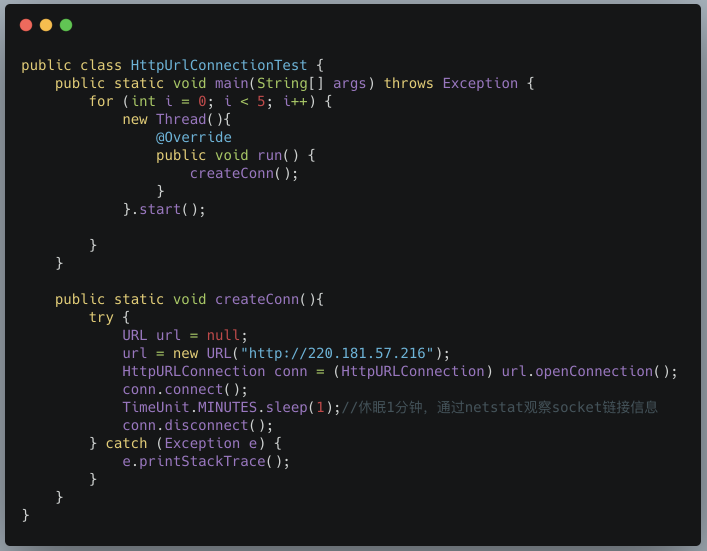
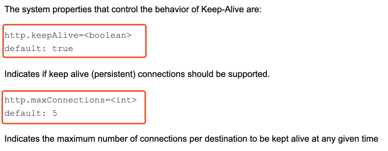
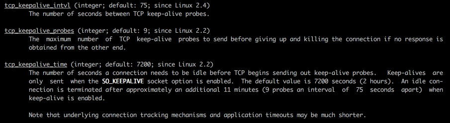

# tcp的keep-alive与http keep-alive机制的区别

## 概述

HTTP协议中有keep-alive的概念，TCP协议中也有keep-alive的概念。二者的作用是不同的。本文将详细的介绍http中的keep-alive，介绍tomcat在server端是如何对keep-alive进行处理，以及jdk对http协议中keep-alive的支持。同时会详细介绍tcp中的keep-alive机制以及应用层的心跳。

### HTTP协议中的keep-alive

#### 1.1为什么HTTP是短连接

    众所周知，HTTP是短连接，client向server发送一个request，得到response后，连接就关闭。之所以这样设计使用，
    主要是考虑到实际情况。例如，用户通过浏览器访问一个web站点上的某个网页，当网页内容加载完毕之后，
    用户可能需要花费几分钟甚至更多的时间来浏览网页内容，此时完全没有必要继续维持底层连。
    当用户需要访问其他网页时，再创建新的连接即可。

     因此，HTTP连接的寿命通常都很短。这样做的好处是，可以极大的减轻服务端的压力.
     一个站点能支撑的最大并发连接数也是有限的，面对这么多客户端浏览器，不可能长期维持所有连接。
     每个客户端取得自己所需的内容后，即关闭连接，更加合理。

#### 1.2为什么要引入keep-alive

    通常一个网页可能会有很多组成部分，除了文本内容，还会有诸如：js、css、图片等静态资源，
    有时还会异步发起AJAX请求。只有所有的资源都加载完毕后，我们才能看到网页完整的内容。然而，
    一个网页中，可能引入了几十个js、css文件，上百张图片，如果每请求一个资源(js/css等)，就创建一个连接，
    然后关闭，代价实在太大了。

    基于此背景，我们希望连接能够在短时间内得到复用，在加载同一个网页中的内容时，尽量的复用连接，
    这就是HTTP协议中keep-alive属性的作用。

* HTTP 1.0中默认是关闭的，需要在http头加入"Connection: Keep-Alive"，才能启用Keep-Alive；
* http 1.1中默认启用Keep-Alive，如果加入"Connection: close "，才关闭。

#### 1.3server端如何处理keep-alive

    对于客户端来说，不论是浏览器，还是手机App，或者我们直接在Java代码中使用HttpUrlConnection，
    只是负责在请求头中设置Keep-Alive。而具体的连接复用时间的长短，通常是由web服务器控制的。

    这里有个典型的误解，经常听到一些同学会说，通过设置http的keep-alive来保证长连接。通常我们所说的长连接，
    指的是一个连接创建后，除非出现异常情况，否则从应用启动到关闭期间，连接一直是建立的。
    例如在RPC框架，如dubbo，服务的消费者在启动后，就会一直维护服务提供者的底层TCP连接。

>在HTTP协议中，Keep-Alive属性保持连接的时间长短是由服务端决定的，通常配置都是在几十秒左右。 
例如，在tomcat中，我们可以server.xml中配置以下属性：


说明如下:

* maxKeepAliveRequests：一个连接上，最多可以发起多少次请求，默认100，超过这个次数后会关闭。
* keepAliveTimeout：底层socket连接最多保持多长时间，默认60秒，超过这个时间连接会被关闭。

>当然，这不是所有内容，在一些异常情况下，keepalive也会失效。tomcat会根据http响应的状态码，
判断是否需要丢弃连接(笔者这里看的是tomcat 9.0.19的源码)。

org.apache.coyote.http11.Http11Processor#statusDropsConnection


另外，值得一提的是，Tomcat 7版本支持三种运行模式：NIO、BIO、APR，且默认在BIO模式下运行。由于每个请求都要创建一个线程来处理，线程开销较大，因此针对BIO，额外提供了一个disableKeepAlivePercentage参数，根据工作线程池中繁忙线程数动态的对keep-alive进行开启或者关闭：

**由于Tomcat 8版本之后，废弃了BIO，默认在NIO模式下运行，对应的也取消了这个参数。**

>Anyway，我们知道了，在HTTP协议中keep-alive的连接复用机制主要是由服务端来控制的，笔者也不认为其实真正意义上的长连接。

#### 1.4JDK对keep-alive的支持

前文讲解了HTTP协议中，以tomcat为例说明了server端是如何处理keep-alive的。但这并不意味着在client端，
除了设置keep-alive请求头之外，就什么也不用考虑了。

    在客户端，我们可以通过HttpUrlConnection来进行网络请求。当我们创建一个HttpUrlConnection对象时，
    其底层实际上会创建一个对应的Socket对象。我们要复用的不是HttpUrlConnection，而是底层的Socket。

    下面这个案例，演示了同时创建5个HttpUrlConnection，然后通过netstat命令观察socket连接信息



       运行这段代码，然后通过netstat命令观察tcp的socket连接信息


       可以看到，当我们创建5个HttpUrlConnection后，底层的确创建了对应数量的TCP socket连接。 
       其中，192.168.1.3是本机ip，220.181.57.216是服务端ip。

       当然，我们的重点是Java如何帮我们实现底层socket链接的复用。JDK对keep-alive的支持是透明的，
       keepAlive默认就是开启的。我们需要做的是，学会正确的使用姿势。

[参考](https://docs.oracle.com/javase/8/docs/technotes/guides/net/http-keepalive.html)

    When the application finishes reading the response body or when the application calls close() 
    on the InputStream returned by URLConnection.getInputStream(), 
    the JDK's HTTP protocol handler will try to clean up the connection and if successful, 
    put the connection into a connection cache for reuse by future HTTP requests.
    
>这段话的含义是：当应用完成了响应体的读取,或当应用调用了`由URLConnection.getInputStream()`返回的InputStream的close()方法后,
JDK http协议处理器会将这个连接放到一个连接缓存中，以便之后的HTTP请求进行复用。翻译成代码，当发送一次请求，得到响应之后，不是调用HttpURLConnection.disconnect方法关闭，
这回导致底层的socket连接被关闭。而是应该调用InputStream的close方法关闭输入流。

```java
InputStream in=HttpURLConnection.getInputStream();
//处理
in.close()
// 这里并不打算提供完整的代码，官方已经给出的了代码示例，可参考上述链接。在实际开发中，
// 通常是一些第三方sdk，如http-client、ok-http、RestTemplate等。
```

>需要说明的是，只要我们的使用姿势正确。JDK对keep-alive的支持对于我们来说是透明的，
不过jdk也提供了相关系统属性配置来控制keep-alive的默认行为，如下：



说明：

* http.keepAlive：默认值为true。也就说是，即使我们不显示指定keep-alive，HttpUrlConnection也会自动帮我们加上。
* http.maxConnections：的默认值是5。表示对于同一个目标IP地址，进行KeepAlive的连接数量。举例来说，你针对同一个IP同时创建了10个HttpUrlConnection，对应底层10个socket，但是JDK底层只会对其中5个进行KeepAlive，多余的连接在请求完成后，会关闭底层socket连接。(Indicates the maximum number of connections per destination to be kept alive at any given time-指示在任何时间keep-alive到每个目标的最大连接数)
* HTTP header that influences connection persistence is(影响连接持久性的HTTP标头是：):`Connection: close`,

>If the "Connection" header is specified with the value "close" in either the request or the response header fields, it indicates that the connection should not be considered 'persistent' after the current request/response is complete.

The current implementation doesn't buffer the response body. Which means that the application has to finish reading the response body or call close() to abandon the rest of the response body, in order for that connection to be reused.

当前实现不会缓冲响应主体。 这意味着应用程序必须完成读取响应主体或调用close（）以放弃响应主体的其余部分，以便重用该连接。 

    最后，尽管你可能不直接使用HttpUrlConnection，习惯于使用http-client、ok-http或者其他第三方类库。但是了解JDK原生对keep-alive的支持，也是很重要的。首先，你在看第三方类库的源码时，可能就利用到了这些特性。另外，也许你可以干翻面试官。

### TCP协议中的keep-alive

首先介绍一下HTTP协议中keep-alive与TCP中keep-alive的区别：

* HTTP协议(四层)的Keep-Alive意图在于连接复用，希望可以短时间内在同一个连接上进行多次请求/响应。举个例子，你搞了一个好项目，想让马云爸爸投资，马爸爸说，"我很忙，最多给你3分钟”，你需要在这三分钟内把所有的事情都说完。核心在于：时间要短，速度要快。

* TCP协议(七层)的KeepAlive机制意图在于保活、心跳，检测连接错误。当一个TCP连接两端长时间没有数据传输时(通常默认配置是2小时)，发送keep-alive探针，探测链接是否存活。例如，我和厮大聊天，开了语音，之后我们各自做自己的事，一边聊天，有一段时间双方都没有讲话，然后一方开口说话，首先问一句，"老哥，你还在吗？”，巴拉巴拉..。又过了一会，再问，"老哥，你还在吗？”。核心在于：虽然频率低，但是持久。

    
    回到TCP keep-alive探针，对于一方发起的keepalive探针，另一方必须响应。响应可能是以下三种形式之一：

* 对方回应了ACK。说明一切OK。如果接下来2小时还没有数据传输，那么还会继续发送keepalive探针，以确保连接存活。
* 对方回复RST，表示这个连接已经不存在。例如一方服务宕机后重启，此时接收到探针，因为不存在对应的连接。
* 没有回复。说明socket已经被关闭了。

    用man命令，可以查看linux的tcp的参数：man 7 tcp

其中keep-alive相关的配置参数有三个：



其中：

* tcp_keepalive_intvl：keepalive探测包的发送间隔，默认为75秒
* tcp_keepalive_probes：如果对方不予应答，探测包的最大发送次数，默认为9次。即连续9次发送，都没有应答的话，则关闭连接。
* tcp_keepalive_time：连接的最大空闲(idle)时间，默认为7200秒，即2个小时。需要注意的是，这2个小时，指的是只有keepalive探测包，如果期间存在其他数据传输，则重新计时。

>这些的默认配置值在/proc/sys/net/ipv4 目录下可以找到，文件中的值，就是默认值，可以直接用cat来查看文件的内容:

```shell
ls /proc/sys/net/ipv4 | grep tcp_keepalive
tcp_keepalive_intvl
tcp_keepalive_probes
tcp_keepalive_time
```

>可以通过sysctl命令来查看和修改：

```shell
# 查询
cat /proc/sys/net/ipv4/tcp_keepalive_time
# 修改
sysctl net.ipv4.tcp_keepalive_time=3600
```

    可以看到，TCP中的SO_KEEPALIVE是一个开关选项，默认关闭，需要在应用程序需要代码中显式的开启。当开启之后，在通信双方没有数据传输时，操作系统底层会定时发送keepalive探测包，以保证连接的存活。

```java
// 一些编程语言支持在代码层面覆盖默认的配置。在使用Java 中，我们可以通过Socket设置keepAlive为true：
Socket socket=new Socket();
socket.setKeepAlive(true);//开启keep alive
socket.connect(new InetSocketAddress("127.0.0.1",8080));
```

然而，tcp的keep-alive机制，说实话，有一些鸡肋：

1. keepalive只能检测连接是否存活，不能检测连接是否可用。例如，某一方发生了死锁，无法在连接上进行任何读写操作，但是操作系统仍然可以响应网络层keepalive包。
2. TCP keepalive 机制依赖于操作系统的实现,灵活性不够，默认关闭，且默认的 keepalive 心跳时间是 两个小时, 时间较长。
3. 代理(如socks proxy)、或者负载均衡器，会让tcp keep-alive失效

>基于此，我们需要加上应用层的心跳。应用层的心跳的作用，取决于你想干啥。笔者理解：

        从服务端的角度来说，主要是为了资源管理和监控。例如大家都知道，访问mysql时，如果连接8小时没有请求，
        服务端就会主动断开连接。这是为了节省连接资源，mysql服务端有一个配置项max_connections，
        限制最大连接数。如果一个应用建立了连接，又不执行SQL，典型的属于占着茅坑不拉屎，mysql就要把这个连接回收。
        还可以对连接信息进行监控，例如mysql 中我们可以执行"show processlist”，查看当前有哪些客户端建立了连接。

       从客户端的角度来说， 主要是为了保证连接可用。很多RPC框架，在调用方没有请求发送时，也会定时的发送心跳sql，
       保证连接可用。例如，很多数据库连接池，都会支持配置一个心跳sql，定时发送到mysql，以保证连接存活。

        Netty中也提供了IdleSateHandler，来支持心跳机制。笔者的建议是，如果仅仅只是配置了IdleSateHandler，
        保证连接可用。有精力的话，server端也加上一个连接监控信息可视化的功能。