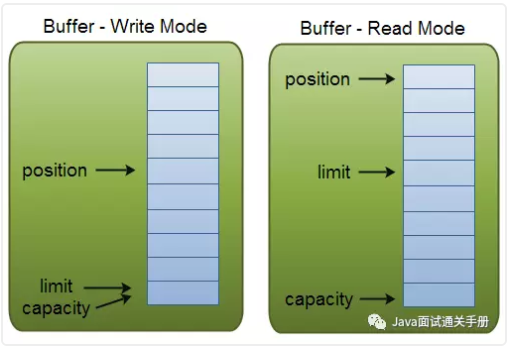

# NIO Buffer概述

我们以`java.nio.Buffer类`开始我们对java.nio包的浏览历程。这些类是java.nio的构造基础。

Java NIO Buffers用于和NIO Channel交互。Buffer本质上就是一块内存区。这块内存被NIO Buffer管理，并提供一系列的方法用于更简单的操作这块内存。`尽管缓冲区作用于它们存储的原始数据类型，但缓冲区十分倾向于处理字节。`

缓冲区Buffer的工作与通道Channel紧密联系。通道是 I/O 传输发生时通过的入口，而缓冲区是这些数据传输的来源或目标。
对于离开缓冲区的传输，您想传递出去的数据被置于一个缓冲区，被传送到通道。对于传回缓冲区的传输，
一个通道将数据放置在您所提供的缓冲区中。

## java.nio.Buffer

Buffer类有很多子类， Buffer类定义`所有缓冲区类型`共有的操作(也就是抽象基类).关于这么多Buffer类型，我们只关注ByteBuffer，因为在NIO网络编程中，通道直接从ByteBuffer中读取数据。不过好处在于，不同的Buffer实现类，api都是相似的，当我们学会了ByteBuffer，其他的类型的Buffer自然而言也就会了。


```java
// 见: Netty下的NIO_Example中的org.netty.core.source.Buffer看Buffer常用的方法
public abstract class Buffer {}

// 在Java NIO中使用的核心缓冲区如下（覆盖了通过I/O发送的基本数据类型：byte, char、short, int, long, float, double ，long）：
// ByteBuffer,CharBuffer,ShortBuffer,IntBuffer,FloatBuffer,DoubleBuffer,LongBuffer

// Buffer类内部持有一个数组，Buffer类相比一个简单数组的优点是它将数据的数据内容和信息包含在一个单一的对象中，有7种类型的Buffer(内部持有的数组的类型不同):ByteBuffer,CharBuffer,ShortBuffer IntBuffer，DoubleBuffer, LongBuffer， FloatBuffer（没有boolean类型的缓冲区）.把这些Buffer类通用的操作API抽离出来，就是抽象的Buffer
```
 
## 缓冲区(Buffer)基础

Buffer类定义了所有的缓冲区都具有四个属性来提供关于其所包含的数据元素的信息。

1. 容量（ Capacity）:缓冲区能够容纳的数据元素的最大数量，可以理解为数组的长度。 
这一容量在缓冲区创建时被设定，并且永远不能被改变。
2. 上界（ Limit）:缓冲区的第一个不能被读或写的元素的索引。或者说，缓冲区中现存元素的计数。
3. 位置（ Position）:下一个要被读或写的位置的索引。默认初始化时这个位置position为0,position最大可以到capacity-1.
,Buffer类提供了get( )和 put( )函数来读取或存入数据，position位置会自动进行相应的更新
4. 标记（ Mark）:一个备忘位置。调用 mark( )来设定 mark = postion。调用 reset( )设定 position = mark。
标记在设定前是未定义的(undefined)。

>这四个属性之间总是遵循以下关系：0 <= mark <= position <= limit <= capacity

## 利用Buffer读写数据，通常遵循四个步骤：

1. 把数据写入buffer；
2. 调用flip；
3. 从Buffer中读取数据；
4. 调用buffer.clear()或者buffer.compact()。

---
    position和limit的具体含义取决于当前buffer的模式。capacity在两种模式下都表示容量。
    
    在写模式，limit的含义是我们所能写入的最大数据量，它等同于buffer的容量。
    
    一旦切换到读模式，limit则代表我们所能读取的最大数据量，他的值等同于写模式下position的位置。
    换句话说，您可以读取与写入数量相同的字节数。



---

>当写入数据到buffer中时，buffer会记录已经写入的数据大小。当需要读数据时，通过 flip() 方法把buffer从写模式调整为读模式(position会归零)；在读模式下，可以读取所有已经写入的数据。

>当读取完数据后，需要清空buffer，以满足后续写入操作。清空buffer有两种方式：调用 clear() 或 compact() 方法。clear会清空整个buffer，compact则只清空已读取的数据，未被读取的数据会被移动到buffer的开始位置，写入位置则紧跟着未读数据之后。

### 直接缓冲区(direct byte buffer)

`直接字节缓冲区通常是 I/O 操作最好的选择。`在设计方面，它们支持 JVM 可用的最高效I/O 机制。
非直接字节缓冲区可以被传递给通道，但是这样可能导致性能损耗。通常非直接缓冲不可能成为一个本地 I/O 操作的目标。
如果您向一个通道中传递一个非直接 ByteBuffer 对象用于写入，通道可能会在每次调用中隐含地进行下面的操作.

1. 创建一个临时的直接 ByteBuffer 对象。
2. 将非直接缓冲区的内容复制到临时缓冲中。
3. 使用临时缓冲区执行低层次 I/O 操作。
4. 临时缓冲区对象离开作用域，并最终成为被回收的无用数据。

这可能导致缓冲区在每个 I/O 上复制并产生大量对象，而这种事都是我们极力避免的。
不过，依靠工具，事情可以不这么糟糕。运行时间可能会缓存并重新使用直接缓冲区或者执行其他一些聪明的技巧来提高吞吐量。
如果您仅仅为一次使用而创建了一个缓冲区，区别并不是很明显。另一方面，如果您将在一段高性能脚本中重复使用缓冲区，
分配直接缓冲区并重新使用它们会使您游刃有余。

直接缓冲区是 I/O 的最佳选择，但可能比创建非直接缓冲区要花费更高的成本。直接缓冲区使用的内存是通过调用本地操作系统方面的代码分配的，
绕过了标准 JVM 堆栈。建立和销毁直接缓冲区会明显比具有堆栈的缓冲区更加破费，这取决于主操作系统以及 JVM 实现。
直接缓冲区的内存区域不受无用存储单元收集支配，因为它们位于标准 JVM 堆栈之外。

使用直接缓冲区或非直接缓冲区的性能权衡会因JVM，操作系统，以及代码设计而产生巨大差异。通过分配堆栈外的内存，
您可以使您的应用程序依赖于JVM未涉及的其它力量。当加入其他的移动部分时，确定您正在达到想要的效果。
`我以一条旧的软件行业格言建议您：先使其工作，再加快其运行。不要一开始就过多担心优化问题；首先要注重正确性。` 
JVM实现可能会执行缓冲区缓存或其他的优化， 这会在不需要您参与许多不必要工作的情况下为您提供所需的性能。

`直接 ByteBuffer 是通过调用具有所需容量的 ByteBuffer.allocateDirect()函数产生的`，
就像我们之前所涉及的 allocate()函数一样。`注意用一个 wrap()函数所创建的被包装的缓冲区总是非直接的`

所有的缓冲区都提供了一个叫做 isDirect()的 boolean 函数，来测试特定缓冲区是否为直接缓冲区。
虽然 ByteBuffer 是唯一可以被直接分配的类型，但如果基础缓冲区是一个直接 ByteBuffer，对于非字节视图缓冲区， isDirect()可以是 true。

回顾我们之前讲解UNIX 五种IO模型中的读取数据的过程，读取数据总是需要通过内核空间传递到用户空间，
而往外写数据总是要通过用户空间到内核空间。`JVM堆栈属于用户空间。 而我们这里提到的直接缓冲区，
就是内核空间的内存。内核空间的内存在java中是通过Unsafe这个类来调用的。`

而Netty中所提到的零拷贝(通常是指计算机在网络上发送文件时，不需要将文件内容拷贝到用户空间而直接在内核空间中传输到网络的方式)，
无非就是使用了这里的直接缓冲区。没有什么神奇的。

### 内存映射缓冲区

内存映射文件 I/O 是一种读和写文件数据的方法，它可以比常规的基于流或者基于通道的 I/O 快得多。

映射缓冲区是带有存储在文件，通过内存映射来存取数据元素的字节缓冲区。映射缓冲区通常是直接存取内存的，只能通过 FileChannel 类创建。映射缓冲区的用法和直接缓冲区类似，但是 MappedByteBuffer 对象可以处理独立于
文件存取形式的的许多特定字符。

>MappedByteBuffer在大文件处理方面性能比较高，如果你在做一个文件存储服务器，可以考虑使用MappedByteBuffer。


下面代码行将文件的前 1024 个字节映射到内存中，map() 方法返回一个 MappedByteBuffer，它是 ByteBuffer 的子类。因此，可以像使用其他任何 ByteBuffer 一样使用新映射的缓冲区，操作系统会在需要时负责执行映射。

```java
MappedByteBuffer mbb = fc.map(FileChannel.MapMode.READ_WRITE, 0, 1024);
```


### 直接缓冲区和非直接缓冲区

1. 非直接缓冲区：通过allocate()方法分配缓冲区，将缓冲区建立用户空间内存中
2. 直接缓冲区：通过allocateDirect()方法分配直接缓冲区，将缓冲区建立在内核空间中。可以提高效率。