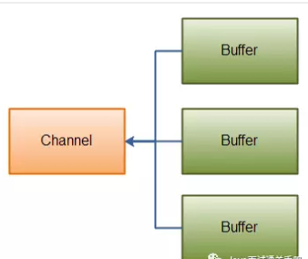

# Scatter / Gather

Channel 提供了一种被称为 Scatter/Gather 的新功能，也称为本地矢量 I/O。正确使用 Scatter / Gather可以明显提高性能。

大多数现代操作系统都支持本地矢量I/O（native vectored I/O）操作。当您在一个通道上请求一个Scatter/Gather操作时，该请求会被翻译为适当的本地调用来直接填充或抽取缓冲区，减少或避免了缓冲区拷贝和系统调用；

Scatter/Gather应该使用直接的ByteBuffers以从本地I/O获取最大性能优势。

Scatter/Gather功能是通道(Channel)提供的 并不是Buffer。

Scatter: 从一个Channel读取的信息分散到N个缓冲区中(Buufer).

Gather: 将N个Buffer里面内容按照顺序发送到一个Channel.

Scattering Reads

"scattering read"是把数据从单个Channel写入到多个buffer,如下图所示：


```java
ByteBuffer header = ByteBuffer.allocate(128);
ByteBuffer body = ByteBuffer.allocate(1024);

ByteBuffer[] bufferArray = {header, body};

channel.read(bufferArray);

// read()方法内部会负责把数据按顺序写进传入的buffer数组内。一个buffer写满后，接着写到下一个buffer中。
//   举个例子，假如通道中有200个字节数据，那么header会被写入128个字节数据，body会被写入72个字节数据；
//   注意：
//   无论是scatter还是gather操作，都是按照buffer在数组中的顺序来依次读取或写入的；
```

# Gathering Writes

"gathering write"把多个buffer的数据写入到同一个channel中，下面是示意图：



```java
ByteBuffer header = ByteBuffer.allocate(128);
ByteBuffer body = ByteBuffer.allocate(1024);

ByteBuffer[] bufferArray = {header, body};

channel.write(bufferArray);

// write()方法内部会负责把数据按顺序写入到channel中。
// 注意：
// 并不是所有数据都写入到通道，写入的数据要根据position和limit的值来判断，只有position和limit之间的数据才会被写入；
// 举个例子，假如以上header缓冲区中有128个字节数据，但此时position=0，limit=58；那么只有下标索引为0-57的数据才会被写入到通道中。
```
