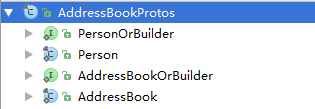

# Protocol Buffer编解码

Google 的 protobuf 在业界非常流行,很多商业项目选择 protobuf 作为编码解码框架,这里我们首先介绍一下` Protobuf 的优点：`

1. 在 Google 内长期使用,产品成熟度高;
2. 跨语言,支持多种语言,包括 c++,Java, 和 Python;
3. 编码后的消息更小,更加有利于存储和传输;
4. 编码的性能非常高;
5. 支持不同协议版本的向前兼容;
6 支持定义可选和必选字段;

## 本节主要分为两部分，第一部分介绍protocolbuf的基本使用，第二部分讲解如何在netty中使用protocolBuf

## 一、Protobuf基本使用

ProtocolBuf使用主要包括三个步骤：

1. 在.proto文件中定义消息的格式
2. 使用protocol buffer编译器根据.proto文件生成java类
3. 使用Java protocol buffer api读写消息

### 1.1、定义.proto文件

proto是protocol的简写，因此定义proto文件实际上就是定义服务端与客户端通信协议。ProtocolBuffer提供了工具可以自动根据这个文件生成相应的java类，我们将在后面介绍。

举例来说，假设我们有一个提供查询个人联系方式的Server，当接受到Client查询某个人联系方式的请求时，将相关信息返回。那么我们就可以定义一个类似以下的addressbook.proto文件。

```
// 可以看到.proto文件的语法与C++或者java很类似。让我们来看看文件中的每一个部分都做了什么。

// .proto文件以一个package声明开始，这用于阻止不同项目间的文件命名冲突。在java中，这个package用于指定生成的Java类的所属的包。
package tutorial;

// 在package声明之后的两个option： java_package和 java_outer_classname是java独有的。

// 在指定了java_package之后，生成的java类的包名则由java_package指定。
// 不过即使指定java_package，我们依旧也应该声明package，来防止可能的根据这个文件生成非java源码的造成命名冲突的可能。
option java_package = "com.example.tutorial";

// java_outer_classname 说明应该生成一个类，将.proto文件中定义的所有message生成的类，包含进此类中。
// 如果没有显示的指定这个option，默认将会按照.proto文件的名称按照驼峰命名的法则生成这个类。
// 例如my_proto.proto生成的类名为MyProto。在我们的案例中，生成的是AddressBookProtos.java。
option java_outer_classname = "AddressBookProtos";

// 我们为每个希望序列化的数据结构定义一个message。上例中，
// 在addressbook.proto文件中直接定义了两个message：AddressBook message和Person message。

// 一个message是一系列不同类型的字段的集合。一些常见的简单数据类型都可以用来定义message中字段的类型，
// 包括： bool, int32, float, double, 和 string。
   
// 你也可以在一个message中使用其他的message作为字段。可以看到，AddressBook message中引用了Person message， 
// Person message中引用了 PhoneNumber message。

message AddressBook {
    repeated Person person = 1;
}

// 生成java类之后，将会在最外层类AddressBookProtos中定义两个内部类AddressBook和Person。
// 你甚至可以在一个message内，嵌套定义其他的message。如你所见，PhoneNumber 定义在 Person中，那么生成的java类中，
// PhoneNumber类将会定义在Person类中。
message Person {
    // 字段修饰符：required、optional、repeated, 对于message中定义的每一个字段，
    // 都必须添加required、optional、repeated其中之一作为修饰符。
    required string name = 1;
    required int32 id = 2;
    optional string email = 3;
 
    // enum: 你也可以定义 enum 类型，如果你希望某个字段有一些预定义的值，
    // 例如下面指定了电话类型(PhoneType)必须是： MOBILE,HOME, or WORK中的一种。
    enum PhoneType {
        MOBILE = 0;
        HOME = 1;
        WORK = 2;
    }
 
    message PhoneNumber {
        required string number = 1;
        optional PhoneType type = 2 [default = HOME];
    }
 
    repeated PhoneNumber phone = 4;
}
```

---
    required：表明这个字段的值必须提供。当我们在构建一个message实例的时候，如果使用required修饰的字段没有提供值，protobuf会认为这个message不能初始化，将会抛出一个 UninitializedMessageException。尝试去解析一个没有被初始化的message，将会抛出 IOException。除了这两个特性，required字段与optional字段其他特性都是相同的。
    
    optional：表明这个字段的值可以设置，也可以不设置。如果一个optional的字段没有设置值，一个默认值将会被使用(如果提供了默认值的话)。对于简单的数据类型，你可以指定自己的默认值，就像我们在案例中指定电话类型的type字段一样，否则，将会使用系统提供的默认值：数字类型默认值为0，字符串类型默认值是空串，布尔类型默认值是false。对于内嵌的message，默认值总是其默认实例或者称之为原型，也就是没有显示指定任何字段的值(可以理解为刚创建的一个java对象，没有对其进行任何设置)。
    
    repeated：这个字段可以被重复多次(包含0)。在生成java代码时，对于repeat修饰的字段，将用一个List来表示。
    
    注意：对于required注释的使用要慎重，考虑到不同版本的兼容问题。如果一开始设置某个字段为required，后来又想修改。这就可能会导致老版本的不兼容。一些Google的工程师的总结：optional或者repeated通常是更好的选择，但这不是绝对的。
---

#### tag说明

>在addressbook.proto文件中，我们可以发现每个字段都有类似于 " = 1", " = 2"这样的标记，在protobuf中称之为tag。注意这不是给字段赋予默认值，默认值的赋予是使用DEFAULT关键字，例如上例中给PhoneType字段设置了默认值。

`tag的作用是表示在生成的java类中，这些字段的出现在类中先后顺序，tag必须是唯一的，不能重复。`对于Protocol Buffer而言，tag值为1到15的字段在编码时可以得到优化，只需要占用一个字节，tag范围是16-2047的字段在编码时将占用两个bytes。而Protocol Buffer可以支持的字段数量则为2的29次方减一。有鉴于此，我们在设计消息结构时，可以尽可能考虑让repeated类型的字段标签位于1到15之间，这样便可以有效的节省编码后的字节数量。

>要查看.proto文件的完整语法，请参考 。不要尝试去查找类似于java中的类继承这样的功能，protobuf不提供此类功能。

### 1.2、根据.proto文件生成java类

现在我们已经有了.proto文件，下一步是根据这个文件生成类。每一个message都会生成一个对应的类，并且最终都包含在java_outer_classname 指定的类中。

>如果你还没有安装protobuf编译器，要先下载,如果你使用的是Windows操作系统，可以下载:

protoc命令的用法如下：`protoc -I=$SRC_DIR --java_out=$DST_DIR $SRC_DIR/addressbook.proto`

>$SRC_DIR是.proto文件所在目录，如果都不提供的话，默认就生成在当前目录 ， $DST_DIR是生成的java类存储目录。

最简单的情况，直接输入: `protoc --java_out=.  addressbook.proto`, 生成的文件位于：com/example/tutorial/AddressBookProtos.java

现在我们来看一下protobuf为我们生成的类`AddressBookProtos.java`。在这个类中，包含了我们在`addressbook.proto` 文件中指定的message生成的类。每一个类都有一个自己的 Builder ，我们可以用这些builder来创建这些类的实例。



这些根据message生成的类和对应的builder都拥有访问message中每个字段的方法。messages类只拥有getters方法，而对应的builder同时拥有getters和setters方法。

以下是生成的Person类字段的访问方法(实现被省略了)：

```java
// required string name = 1;
public boolean hasName();
public String getName();
 
// required int32 id = 2;
public boolean hasId();
public int getId();
 
// optional string email = 3;
public boolean hasEmail();
public String getEmail();
 
// repeated .tutorial.Person.PhoneNumber phone = 4;
public List<PhoneNumber> getPhoneList();
public int getPhoneCount();
public PhoneNumber getPhone(int index);
```

如你所见，protobuf为message中的每个字段生成了Java-Bean风格的getters，同时，针对每个字段还有一个has方法，如果这个字段的值被设置了，就会返回true，否则返回false。

而 Person.Builder类拥有同样的getter方法和has方法外，还有额外的setter方法，和clear方法，可以修改字段的值。

```
// required string name = 1;
public boolean hasName();
public java.lang.String getName();
public Builder setName(String value);
public Builder clearName();
 
// required int32 id = 2;
public boolean hasId();
public int getId();
public Builder setId(int value);
public Builder clearId();
 
// optional string email = 3;
public boolean hasEmail();
public String getEmail();
public Builder setEmail(String value);
public Builder clearEmail();
 
// repeated .tutorial.Person.PhoneNumber phone = 4;
public List<PhoneNumber> getPhoneList();
public int getPhoneCount();
public PhoneNumber getPhone(int index);
public Builder setPhone(int index, PhoneNumber value);
public Builder addPhone(PhoneNumber value);
public Builder addAllPhone(Iterable<PhoneNumber> value);
public Builder clearPhone();
```

当我们想修改一个字段的值的时候，就调用set方法，如果要移除这个字段的值，就调用clear方法。

对于repeated注释的字段还有额外的方法--`count方法`(这是list.size()的便捷方法)，针对list索引位置的get和set方法，添加一个元素到list的add方法，以及批量添加元素的addAll方法。

注意这个字段的访问方法使用的也是驼峰命名的法则，这个是protobuf自动做的工作，以使得生成的代码更加符合java语言的变成风格。`在proto文件中，对于多个单词组成的字段名，我们应该始终使用小写+下划线的方式，以使得生成代码风格良好的代码`。阅读 style guide查看更多的细节。

>在Person类中，还生成了Java 5中引入的枚举， PhoneType ：

```java
public static enum PhoneType {
  MOBILE(0, 0),
  HOME(1, 1),
  WORK(2, 2),
  ;
  ...
}
```

而PhoneNumber，如你所想，是Person类的一个嵌套类。

### 1.3、使用Java protocol buffer api读写消息

protobuf根据.proto文件中message生成的类，都是不可变的( immutable)。一旦这样的一个对象被构建了，就不可以被修改(因为没有提供setter方法)。要构建类实例，我们必须首先创建Builder，然后为每个字段设置值，最后调用build方法来构建实例。

```java
// 为了方便开发，builder方法是基于链式风格设计的，以下是一个构建Person实例的案例：

Person john =
  Person.newBuilder()
    .setId(1234)
    .setName("John Doe")
    .setEmail("jdoe@example.com")
    .addPhone(
      Person.PhoneNumber.newBuilder()
        .setNumber("555-4321")
        .setType(Person.PhoneType.HOME))
    .build();
```

标准的message生成类方法

每个message生成类和对应的Builder都有一些其他方法来帮助我们检查和操作这个类，包括：

- isInitialized()：检查所有的required字段是否都被设置
- toString()：返回可以阅读的message信息，以便于调试
- mergeFrom(Message other)：只有builder拥有这个方法，合并其他的message中的内容到这个字段中。如果字段是required或者option，其他的message中内容会覆写原始message字段中的内容，如果字段是repeated，其他message中的字段会添加这个字段中。
- clear()：只有builder具有这个方法，清空message中所有字段的值到初始状态。


