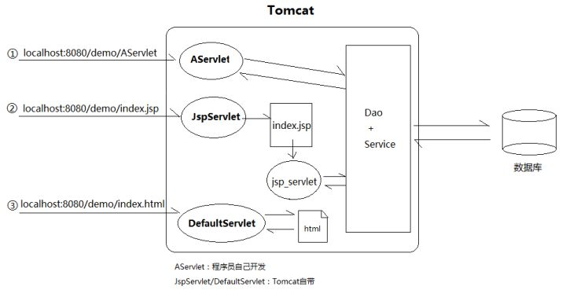
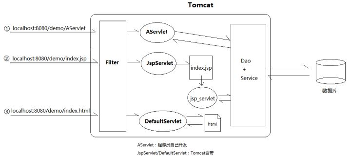

# Filter

Filter可用于在request被发送到servlet之前进行拦截,进行一些预处理，并在servlet执行完成之后,将响应发送回客户端之前,可用于拦截响应,对响应做处理

## 过滤器Filter的使用场景

1. 将请求参数记录到日志文件
2. 希望用户登录后才能访问一些页面,也就是资源请求的身份验证
4. 压缩发送给客户端的响应数据
5. 通过添加一些cookie，headers信息等来改变响应

## 为什么需要Filter

有一个需求：我们做了一个web应用，希望用户登录后才能访问一些页面.

如果你学过JSP，可能立马就想到了答案：在JSP中做登录判断。未登录用户重定向到login.jsp。

```jsp
<%
    // 从Session中获取用户信息
    Object user = session.getAttribute("user");
    // 如果user==null，说明用户尚未登录，引导到login.jsp登录
    if (user == null) {
        response.sendRedirect(request.getContextPath() + "/login.jsp");
        return;
    }
%>
```

但是JSP本质还是个Servlet(每个jsp文件都会生成对象的java文件,例如hello.jsp会在$CATALINA_HOME/work下生成叫hello_jsp.java的文件,然后编译成hello_jsp.class的class文件)。如果是HTML页面/js/css/图片等静态资源怎么办？我们是没法在HTML里写Java代码的。

我们分析一下。不管这个问题最终要以什么形式解决，都肯定要写Java代码。因为我肯定要去查询Session或者数据库用户信息。既然要写Java代码，要和页面请求打交道的话，只能是Servlet。我们已经了解过，类似HTML这样的静态资源是由DefaultServlet负责读取的。



DefaultServlet是Tomcat写的类，我们无法修改它的源码，然后把Session判断等代码加进去。

我们只能把这样的验证用户信息的代码单独摘出来，放在一个新的对象中，而且必须设定一种机制，可以强制所有对Servlet/JSP/html/css等的请求，都要先经过它。这，就是Filter。



>Filter先于AOP(方法内部)执行.

## Filter源码

servlet容器管理Filter的生命周期.

```java
public interface Filter {

	/**
	* 当容器初始化Filter时，这个方法被调用。此方法在过滤器的生命周期中只调用一次
	*/
	void init(FilterConfig paramFilterConfig) 

	/**
	* 这个方法每次由容器在将过滤器应用于资源时调用。
	* FilterChain用于调用链中的下一个过滤器。这是责任链模式的一个很好的例子。
	*/
	doFilter(ServletRequest paramServletRequest, ServletResponse paramServletResponse, FilterChain paramFilterChain)
	
	/**
	* 当容器卸载Filter实例时，它会调用destroy(）方法,我们可以关闭过滤器打开的资源。
	* 此方法在过滤器的生命周期中仅调用一次。
	*/
	void destroy() 
}
```

## WebFilter注释

在Servlet 3.0中引入了@WebFilter，我们可以使用这个注释声明一个过滤器.

> Struts 2使用Servlet Filter拦截客户端请求并将它们转发到适当的类,这些动作类称为Struts 2 Interceptor