# Servlet（下）

## ServletContext是什么

Servlet上下文,每个Web应用程序只有`一个上下文`对象,ServletContext对象的创建是在服务器启动时完成的,ServletContext对象的销毁是在服务器关闭时完成的

ServletContext可供Web应用程序中的所有servlet使用,使用<context-param>元素在web.xml中定义参数,然后可以通过ServletContext获取> 

每一个动态web工程，都应该在WEB-INF下创建一个web.xml，它代表当前整个应用。Tomcat会根据这个配置文件创建ServletContext对象.

ServletContext直接关系到SpringIOC容器的初始化（ContextLoaderListener）

## ServletContext的作用?

ServletContext对象的作用是在整个Web应用的动态资源（Servlet/JSP）之间共享数据。例如在A Servlet中向ServletContext对象通过setAttribute()设置了一个属性，然后在B Servlet中就可以通过getAttribute()获取这个属性.

## JavaWeb中的共享数据对象

这种用来装载共享数据的对象，在JavaWeb中共有4个，而且更习惯被成为“域对象”：

1. ServletContext域（Servlet间共享数据）
2. Session域（一次会话间共享数据，也可以理解为多次请求间共享数据）
3. Request域（同一次请求共享数据）
4. Page域（JSP页面内共享数据）

>它们都可以看做是map，都有getAttribute()/setAttribute()方法。

## 如何获取ServletContext

GenericServlet在init方法中，将Tomcat传入的ServletConfig对象的作用域由局部变量（方法内使用）提升到成员变量。并且GenericServlet有一个getServletContext()：


也就是说ServletConfig对象可以得到ServletContext对象。但是这并不意味这ServletConfig对象包含着ServletContext对象，而是ServletConfig维系着ServletContext的引用。

其实这也很好理解：servletConfig是servletContext的一部分，就像servletConfig是servletContext的儿子。你问它ServletConfig的父亲是谁，它当然能告诉你

另外，Session域和Request域也可以得到ServletContext

- session.getServletContext();
- request.getServletContext();

还有个冷门的,在ServletContextListener中讲过,ServletContextEvent:

```java
public interface ServletContextListener extends EventListener {
    public void contextInitialized ( ServletContextEvent sce );
    public void contextDestroyed ( ServletContextEvent sce );
}
```

所以，获取ServletContext的方法共5种（page域这里不考虑，JSP太少用了）：

1. ServletConfig#getServletContext();
2. GenericServlet#getServletContext();
3. HttpSession#getServletContext();
4. HttpServletRequest#getServletContext();
5. ServletContextEvent#getServletContext();

# Filter拦截方式之：REQUEST/FORWARD/INCLUDE/ERROR

在很多人眼里，Filter只能拦截Request：这样的理解还是太片面了。其实配置Filter时可以设置4种拦截方式：
                                     
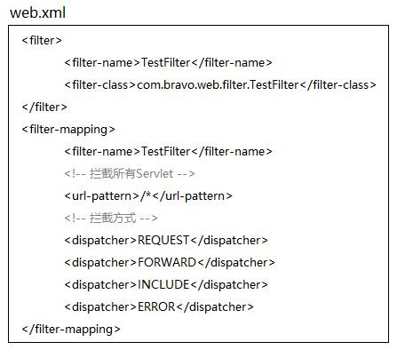

Filter可以通过配置url-pattern拦截指定的url请求,还可以配置具体的ServletNames拦截对指定的Servlet的请求,
这些拦截对应的默认的dispatcher是REQUEST,也就是客户端对刚刚指定的无论是url还是servlet的请求.

但是dispatcher还可以配置为其他的值(可以配置多个,是一个数组),例如FORWARD,INCLUDE,ERROR,如果配置为FORWARD,指的是拦截对指定的url和servlet的转发,其中FORWARD用的最多的场景就是转发给JSP，然后模板输出HTML。

# 重定向（Redirect）和REQUEST/FORWARD/INCLUDE/ERROR的区别?

>重定向会导致浏览器发送2次请求，FORWARD们是服务器内部的1次请求.REQUEST/FORWARD/INCLUDE/ERROR只引发客户端的1次请求,因为FORWARD/INCLUDE等请求的分发是服务器内部的流程，不涉及浏览器

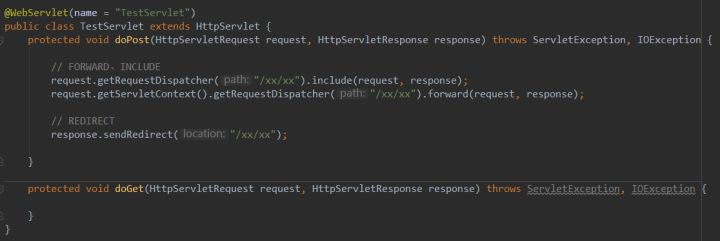

通过Request或者ServletContext都可以得到分发器Dispatcher，但由于ServletContext代表整个应用，我更倾向于认为：ServletContext拥有分发器，Request是找它借的。
  
分发器是干嘛的？分发请求：REQUEST/FORWARD/INCLUDE/ERROR。默认的dispatcher是REQUEST是浏览器发起的，而ERROR是发生了错误引发的.FORWARD/INCLUDE这些都是内部引发的.如果在web.xml中配置Filter时4种拦截方式全配上，那么服务器内部的分发跳转都会被过滤。

这些都是可配置的，默认只拦截REQUEST，也就是浏览器来的那一次。

# Servlet映射规则

这所谓的映射器，其实就是Tomcat中一个叫Mapper的类。

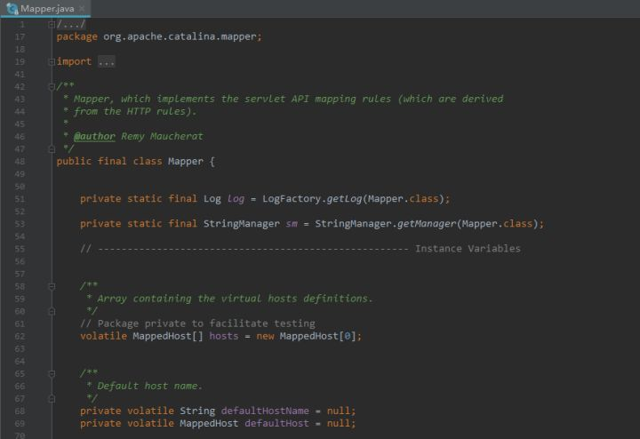

它里面有个internalMapWrapper方法：

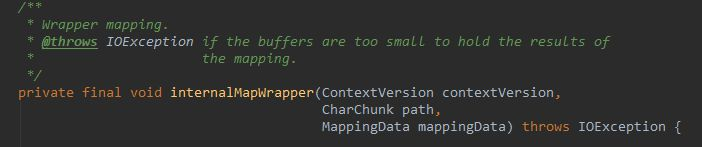

定义了7种映射规则：

1.精确匹配 2.前缀匹配: 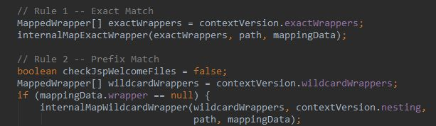

3.扩展名匹配: 

4.5.6 欢迎列表资源匹配: 

7.如果上面都不匹配，则交给DefaultServlet，就是简单地用IO流读取静态资源并响应给浏览器。如果资源找不到，报404错误

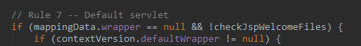

>简单来说就是：

1. 对于静态资源，Tomcat最后会交由一个叫做DefaultServlet的类来处理
2. 对于Servlet ，Tomcat最后会交由一个叫做 InvokerServlet的类来处理
3. 对于JSP，Tomcat最后会交由一个叫做JspServlet的类来处理

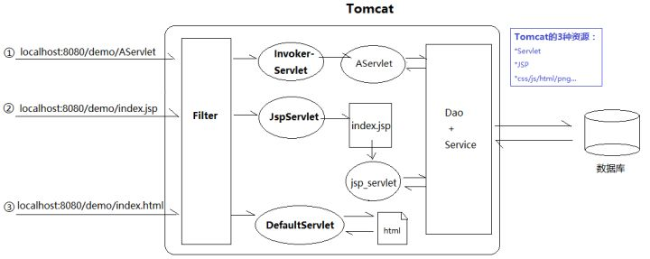

# 自定义DispatcherServlet

web.xml: 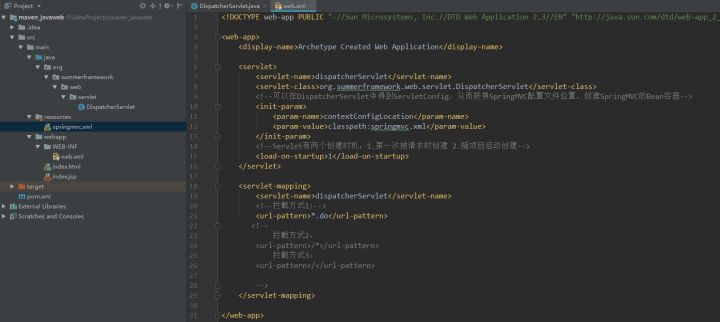

DispatcherServlet: 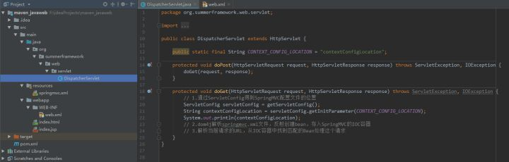

>知道了映射器的映射规则后，我们来分析下上图中三种拦截方式会发生什么。

但在此之前，我必须再次强调，我从没说我现在写的是SpringMVC的DispatcherServlet，这是我自己自定义的一个普通Servlet，恰好名字叫DispatcherServlet而已。所以，下面的内容，请当做一个普通Servlet的映射分析。

>*.do：拦截.do结尾, 各个Servlet和谐相处，没问题. 

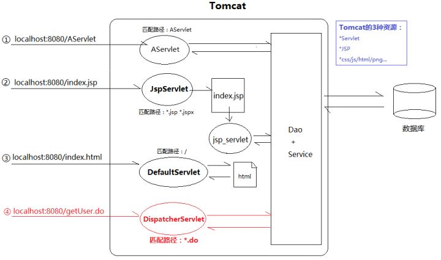

>/*：拦截所有

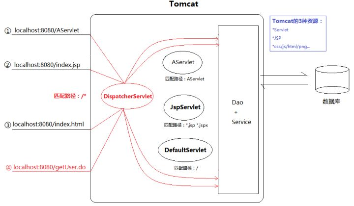

拦截localhost:8080

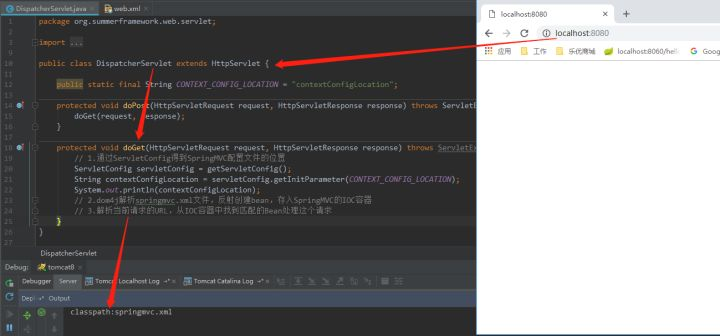

拦截localhost:8080/index.html

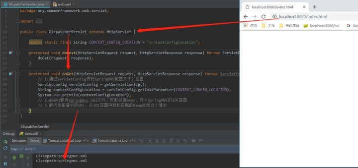

拦截localhost:8080/index.jsp

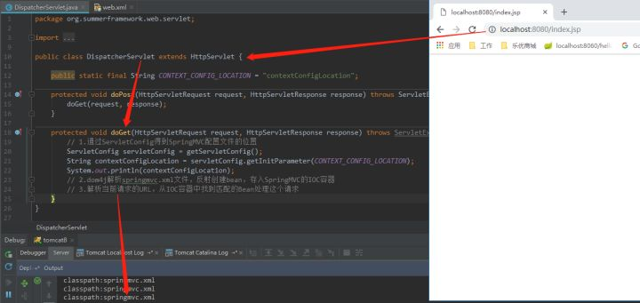

>也就是说，/*这种配置，相当于把DefaultServlet、JspServlet以及我们自己写的其他Servlet都“短路”了，也就是说DefaultServlet、JspServlet以及我们自己写的其他Servlet都失效了。这会导致两个问题：

- JSP无法被编译成Servlet输出HTML片段（JspServlet短路）
- HTML/CSS/JS/PNG等资源无法获取（DefaultServlet短路）

>/：拦截所有，但不包括JSP

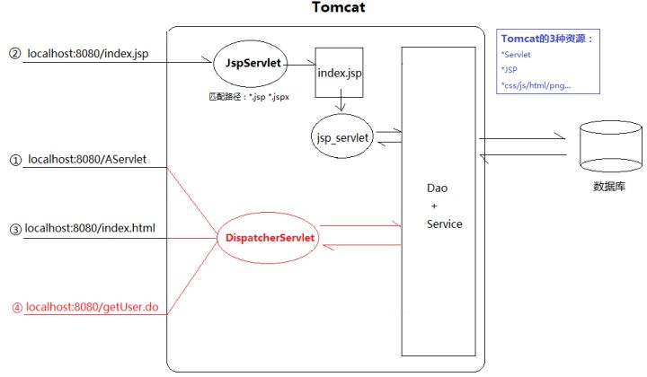

拦截localhost:8080

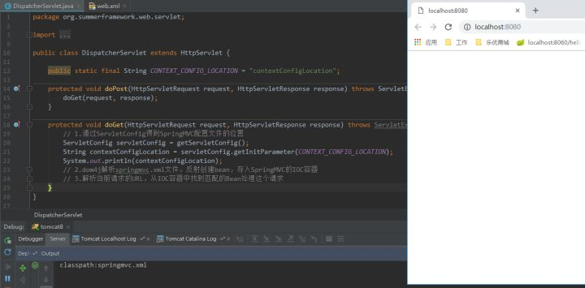

拦截localhost:8080/index.html

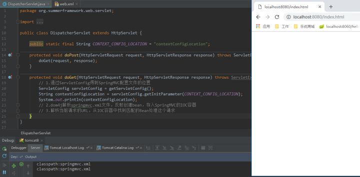

不拦截JSP

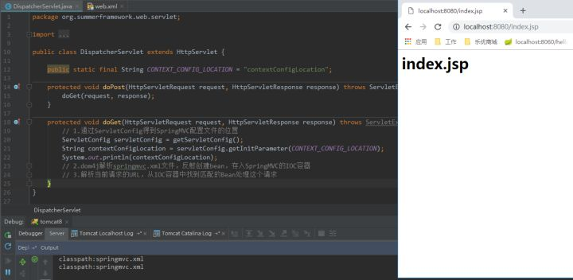

>虽然JSP不拦截了，但是DefaultServlet还是不起作用。而DispatcherServlet把本属于DefaultServlet的工作也抢过来，却又不会处理（IO读取静态资源返回）。怎么办？

## DispatcherServlet与SpringMVC

SpringMVC的核心控制器叫DispatcherServlet，映射原理和我们上面山寨版的一样，因为本质还是个Servlet。但SpringMVC提供了一个标签，解决上面/无法读取静态资源的问题：

```xml
<!-- 静态资源处理  css js imgs -->
<mvc:resources location="/resources/**" mapping="/resources"/>
```

DispatcherServlet确实是一个Servlet，但它只是入口，SpringMVC要比想象的庞大。

# conf/web.xml与应用的web.xml

conf/web.xml指的是Tomcat全局配置web.xml。它里面配置了两个Servlet：也就是JspServlet和DefaultServlet。

我们可以按Java中“继承”的思维理解conf/web.xml,相当于每个应用默认都配置了JSPServlet和DefaultServlet处理JSP和静态资源。

>如果我们在应用的web.xml中为DispatcherServlet配置/，会和DefaultServlet产生路径冲突，从而覆盖DefaultServlet。此时，所有对静态资源的请求，映射器都会分发给我们自己写的DispatcherServlet处理。遗憾的是，它只写了业务代码，并不能IO读取并返回静态资源。JspServlet的映射路径没有被覆盖，所以动态资源照常响应。

>如果我们在应用的web.xml中为DispatcherServlet配置/*，虽然JspServlet和DefaultServlet拦截路径还是.jsp和/，没有被覆盖，但无奈的是在到达它们之前，请求已经被DispatcherServlet抢去，所以最终不仅无法处理JSP，也无法处理静态资源。
