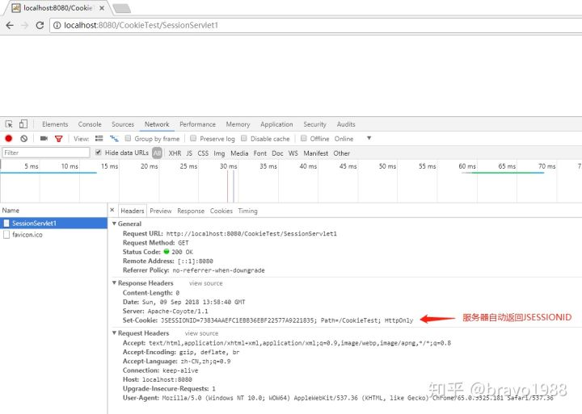
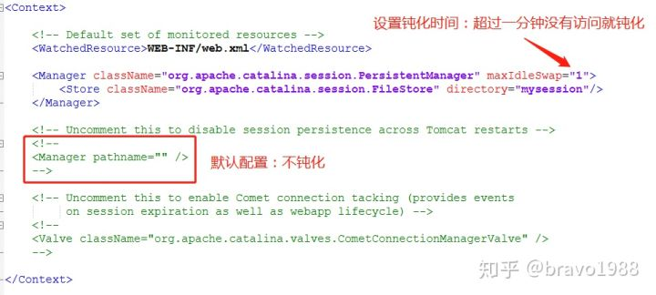
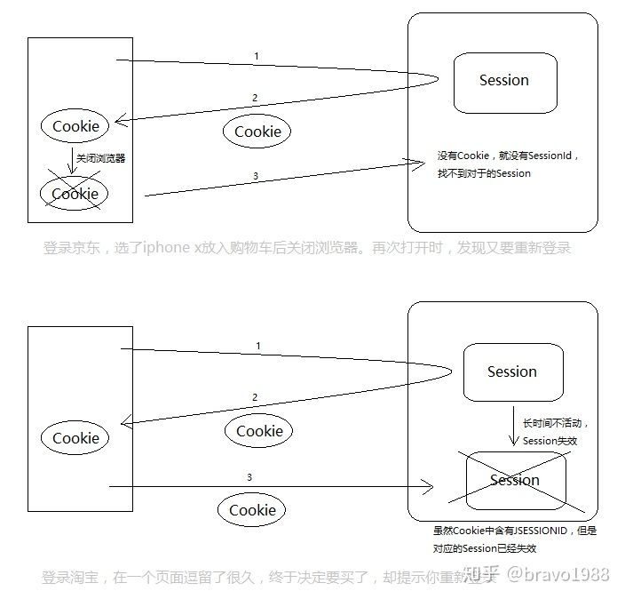

# Session

## 有了Cookie，为什么还需要Session？

有可能是出于安全性和传输效率的考虑。首先，Cookie是存在客户端的，如果保存了敏感信息(为了区别用户需要保存用户的个人信息)，会被其他用户看到。其次，如果信息太多保存在cookie，可能影响传输效率。

相比较Cookie存在客户端，Session则是服务端的东西。

这回，我们不再把"name=xzj;time=6pm;table=99"这样的数据作为Cookie放在请求头/响应头里传来传去了，而是只给客户端传一个JSESSIONID（也是一个Cookie）！此时，真正的数据存在服务器端的Session中，Cookie中只是存了Session的id，即JSESSIONID。下次访问该网站时，把JSESSIONID带上，即可在服务器端找到对应的Session，也相当于“带去”了用户信息。

>HttpSession使用“JSESSIONID”这个cookie来跟踪用户会话。


同样的，既然返回的JSESSIONID也是一个Cookie，那么也分为会话Cookie和持久性Cookie，可以通过设置MaxAge更改


>另外要注意的是，Session有个默认最大不活动时间：30分钟（可在配置文件中修改数值）。也就是说，创建Session并返回JSESSIONID给客户端后，如果30分钟内你没有再次访问，即使你下次再带着JSESSIONID来，服务端也找不到对应ID的Session了，因为它已经被销毁。此时你必须重新登录。

其实，只要你在服务器端创建了Session，即使不写addCookie("JSESSIONID", id)，JSESSIONID仍会被作为Cookie返回。注意，这次我没有addCookie()，只是简单打印，用于和响应信息作对比

.jpg)

结果服务器自动默认new一个Cookie，将刚才创建的Session的JSESSIONID返回。默认是会话Cookie，浏览器关闭就消失！



# Session序列化(自己可以通过关闭和重启服务器验证)

所谓Session序列化，其实是一个默认行为。它存在的意义在于：比如现在有成千上万个用户在线，用户登录信息都在各自的Session中。当服务器不得不重启时，为了不让当前保存在服务器的Session丢失，服务器会将当前内存中的Session序列化到磁盘中，等重启完毕，又重新读取回内存。这些操作浏览器端用户根本感知不到，因为session还在，他不用重新登录。

以Tomcat为例，服务器的Session都会被保存在work目录的对应项目下。比如：${CATALINA_HOME}\work\Catalina\localhost\CookieTest

>关闭服务器时，当前内存中的session会被序列化在磁盘中，变成一个叫SESSIONS.ser的文件,当服务器重启时，该SESSIONS.ser文件又会被重新读取，该过程称为反序列化。读取后文件会从磁盘消失。

# Session的钝化和活化

自从改用Session后，由于Session都存在服务器端，当在线用户过多时，会导致Session猛增，无形中加大了服务器的内存负担。于是，服务器有个机制：如果一个Session长时间无人访问，为了减少内存占用，会被钝化到磁盘上。

也就是说，Session序列化不仅仅是服务器关闭时才发生，当一个Session长时间不活动，也是有可能被序列化到磁盘中。当该Session再次被访问时，才会被反序列化。这就是Session的钝化和活化。

可以在Tomcat的conf目录下的context.xml中配置（对所有项目生效）会保存到`${CATALINA_HOME}\work\Catalina\localhost\CookieTest下.`(tomcat默认是不钝化session的)



与服务器关闭时Session的序列化不同的是：

1. 每个Session单独一个文件，而不是所有session都保存到一个文件: SESSIONS.ser。
2. 即使Session活化回到内存，磁盘的文件也不消失

## 还有个问题需要解决：Session被序列化了，存在Session中的值怎么办？

比如我之前有这么一步操作：

```java
HttpSession session= request.getSession();
session.setAttribute("user", new User("aaaa", 26));
```

此时Session中有一个User对象，那么User对象去哪了？答案是，User从内存中消失，无法随Session一起序列化到磁盘。如果希望Session中的对象也一起序列化到磁盘，该User对象必须实现序列化接口java.io.Serializable。

# 分布式项目的Session共享

最后回答开头的问题：

之所以服务器能“知道”浏览器关了，是因为下次再来的时候，并没有带来上次给它的cookie。你无法证明你还是你。其实不一定是浏览器关了，也可能是清缓存了。总之，会话已经结束。

