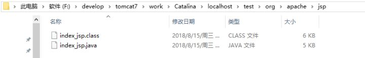
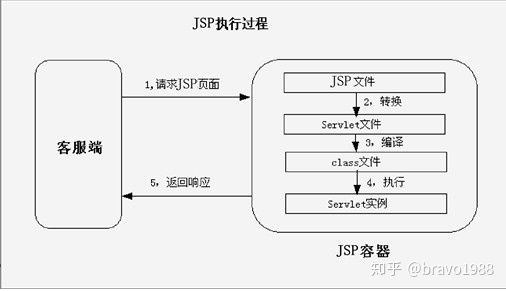
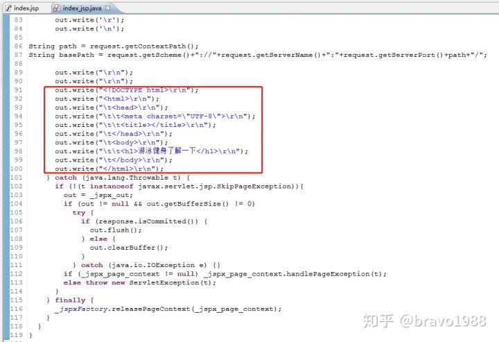
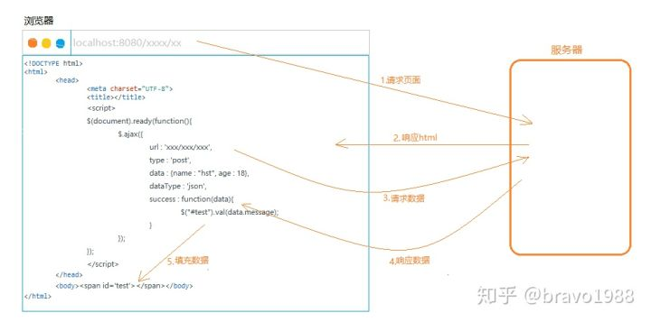
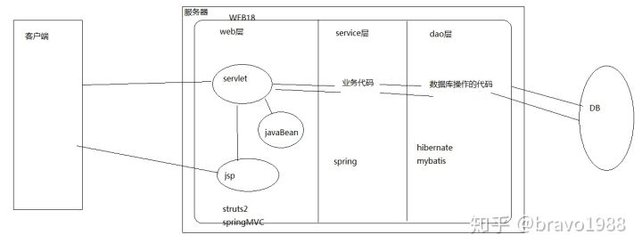
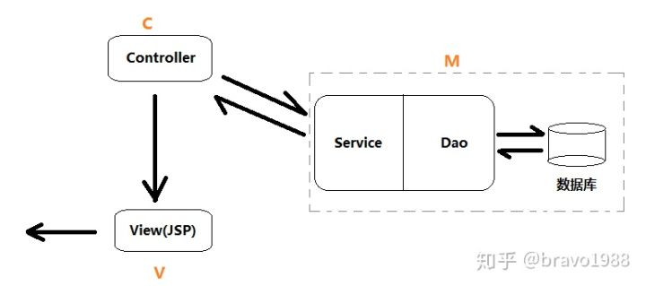

# 早期没有JSP的时候

>把html语句拿出来在Servlet里拼接好再输出,要想拼接数据并完整输出一个html页面，没个几百上千行out.println()是不可能的.


我们的主要目的就是希望在最终输出的html的代码中动态嵌入后台数据罢了.

# JSP(Java Server Pages-Java服务器页面)

所以诞生了jsp,我们可以直接在JSP文件里写HTML代码,HTML/CSS/JS等的写法和HTML文件中的写法是一模一样的。但它毕竟不是HTML，而且本质差了十万八千里。

当请求JSP时，服务器内部会经历一次动态资源（JSP）到静态资源（HTML）的转化，服务器会帮我们把JSP中的HTML片段和数据拼接成静态资源响应给浏览器。也就是说JSP是运行在服务器端，但最终发给客户端的都已经是转换好的HTML静态页面（在响应体里）。

>即：JSP = HTML + Java片段

所谓的“JSP和HTML相似”只是JSP给我们的表面印象。实际上，JSP和HTML差远了。JSP本质是一个Java类（Servlet），是在服务器混的，只不过它输出结果是HTML。

## 当浏览器请求JSP的时候会发生什么

1. WEB容器接收到以.jsp为扩展名的URL的访问请求时，它将把该请求交给JSP引擎去处理。Tomcat中的JSP引擎就是一个Servlet程序($CATALINA_HOME/conf/web.xml中的org.apache.jasper.servlet.JspServlet)，它负责解释和执行JSP页面。
2. 每个JSP 页面在第一次被访问时，JSP引擎将它翻译成一个Servlet源程序，接着再把这个Servlet源程序编译成class类文件，然后再由WEB容器像调用普通Servlet程序一样的方式来装载和解释执行这个由JSP页面翻译成的Servlet程序。 
3. 例如,如果请求hello.jsp会被JSP引擎转化成一个hello_jsp.java,然后通过jdk编译成hello_jsp.class,这个hello_jsp.java就是一个Servlet
4. 存放位置:Tomcat把为JSP页面创建的Servlet源文件和class类文件放置在“$CATALINA\work\Catalina\<主机名>\<应用程序名>\”目录中，例如hello.jsp,Tomcat将JSP页面翻译成的Servlet的包名为org.apache.jsp.hello_jsp.java





>原本，我们需要把美工的HTML代码一行行复制到Servlet中，然后拼接数据，最后向客户端响应拼接好的HTML页面。后来我们嫌麻烦，搞了JSP，就可以不用一行行复制HTML代码了，而是在JSP中直接写HTML代码和Java代码，之后JSP引擎把jsp页面编译成一个Servlet，通过Java代码获取后台数据后拼接到HTML片段中，最终通过out.println()输出。

---




    也就是说，虽然我们不用像上古时期一样手动拼接html语句到Servlet了，
    但是JSP转换后的Java类其实还是在out.println()输出。和我们手动拼接是一样的结果。

    而index_jsp.java这个类继承了HttpJspBase，而HttpJspBase间接实现了Servlet接口。
    所以可以说，index.jsp被翻译后的Java类也是一个Servlet，所以JSP本质也是一个Servlet。

    JSP的EL表达式是在服务器端起作用,而不是浏览器端.
---

# JSP与AJAX+HTML

其实请求、响应这么一来一回，无非要的就两样东西：数据+HTML骨架。

1. 服务器端可以组装好数据再发给浏览器(JSP)
2. 先发送html骨架,然后浏览器通过ajax请求自己组装数据(ajax+html)

>JSP是服务器端的，它的局限性在于数据必须在返回给客户端之前就“装载”完毕。不然HTML都已经发出去了，你就没办法跑到浏览器里把数据给它安上。而有了AJAX，就可以实现先发送html骨架、然后在浏览器组装了。



>初学者朋友是不是听说JSP被淘汰了，犹豫要不要学？别闹了，不学JSP你都没法学其他的模板技术。而且，你可能觉得很新奇的freemarker，其实学过JSP的话，要上手只要几小时。

再强调一点，虽然我们在浏览器地址栏输入localhost:8080/xxx/xxx.jsp，就显示出了当前页面，但那不是JSP页面，而是HTML页面。服务器并没有直接把JSP文件从服务端扔到客户端！JSP是Java Server Page，是服务器端的东西。服务器的东西永远不可能直接在浏览器运行。浏览器只能接受静态页面。

# MVC模式与JAVAEE三层架构



MVC模式不是是JavaEE独有的。MVC是web开发都有的一种模式，比如PHP开发web时也有MVC模式。而JavaEE三层架构则是JavaEE的：Controller/Service/Dao。分层开发是为了使代码逻辑更加清晰，也起到了一定的解耦合作用。



# JSP具体语法规则

### JSP隐式对象

隐式对象指那些由系统提供，可以在JSP页面直接使用的对象：

对象          所属类型
request     javax.servlet.http.HttpServletRequest
response    javax.servlet.http.HttpServletResponse
out         javax.servlet.jsp.JspWriter
session     javax.servlet.http.HttpSession
application javax.servlet.ServletContext
config      javax.servlet.ServletConfig
pageContext javax.servlet.jsp.PageContext
page        javax.servlet.jsp.HttpJspPage
exception   java.lang.Throwable

### 保存数据的“范围”

PageContext对象提供了一个有趣的方法：

`public abstract void setAttribute(String name, Object value, int scope)`

有4种scope取值：

* PAGE_SCOPE
* REQUEST_SCOPE
* SESSION_SCOPE
* APPLICATION_SCOPE

```jsp
<%
//product is a Java object
pageContext.setAttribute("product", product,PageContext.REQUEST_SCOPE);
%>
```

### 内置对象示例

access: http://localhost:8080/implicitObjects.jsp

示例中用到的内置对象: request, response, session, config, application

### 设置输出编码

在默认情况下，JSP编译器会将JSP页面的内容类型设为text/html。如果要使
用不同的类型，则需要通过调用response.setContentType()或者使用页面指
令来设置内容类型.

`response.setContentType("text/json");`

### 页面指令

```jsp
<%@ page attribute1="value1" attribute2="value2" ... %>
```

指令属性名 说明
import    定义一个或多个本页面中将被导入和使用的java类型。
session   值为True，本页面加入会话管理；值为False则相反。
buffer    以KB为单位，定义隐式对象out的缓冲大小。必须以KB后缀结尾。默认大小为8KB或更大(取决于JSP容器）。该值可以为none，这意味着没有缓冲，所有数据将直接写入PrintWriter。
autoFlush 默认值为True。若值为True，则当输出缓冲满时会自写入输出流。而值为False，则仅当调用隐式对象的flush方法时，才会写入输出流。因此，若缓冲溢出，则会抛出异常。
isThreadSafe 定义该页面的线程安全级别
info      返回调用容器生成的Servlet类的getServletInfo方法的结果

指令属性名 说明
errorPage    定义当出错时用来处理错误的页面。
isErrorPage  标识本页是一个错误处理页面。
contentType  定义本页面隐式对象response的内容类型，默认是text/html。
pageEncoding 定义本页面的字符编码，默认是ISO-8859-1
isELIgnored  配置是否忽略EL表达式。 EL是Expression Language的缩写。
language     定义本页面的脚本语言类型，默认是Java。
Extends      定义JSP实现类要继承的父类。

### include指令

使用include指令将其他文件中的内容包含到当前JSP页面。一个页面中可以
有多个include指令。若存在一个内容会在多个不同页面中使用或一个页面不
同位置使用的场景，则将该内容模块化到一个include文件非常有用。

```jsp
<%@ include file="url"%>
```

JSP转换器处理include指令时，将指令替换为指令所包含文件的内容。

#### include指令的用法

>include指令也可以包含静态HTML文件

access: http://localhost:8080/main.jsp

### 表达式

每个表达式都会被JSP容器执行，并使用隐式对象out的打印方法输出结果。表
达式以“<%=”开始， 并以“%>”结束.

Today is <%=java.util.Calendar.getInstance().getTime()%> 等价于<=>
Today is <% out.print(java.util.Calendar.getInstance().getTime()); %>

* Java代码可以出现在JSP页面中的任何位置，并通过“<%”和“%>”包围。
* 可以使用page指令的import属性导入在JSP页面中使用的Java类型，如果没
有导入的类型，必须在代码中写Java类的全路径名称.

### 声明

可以声明能在JSP页面中使用的变量和方法。 声明以“<%!”开始，
并以“%>”结束。

>在JSP页面中，一个声明可以出现在任何地方，并且一个页面可以有多个声明.

access: http://localhost:8080/declarationTest.jsp

可以使用声明来重写JSP页面，实现类的init和destroy方法。

1. 通过声明jspInit方法，来重写init方法。
2. 通过声明jspDestroy方法，来重写destory方法。

* jspInit(): JSP页面在初始化时调用jspInit,此没有参数，但可以通过隐式对象config访问ServletConfig对象
* jspDestroy(): 在JSP页面将被销毁时调用，用得不多

access: http://localhost:8080/lifeCycle.jsp

### Action(动作)

JSP页面中，动作被转换成Java代码来执行操作，如访问一个Java对象或调用方
法.

access: http://localhost:8080/useBeanTest.jsp

### 设置与读取JavaBean属性值的Action

access: http://localhost:8080/getSetPropertyTest.jsp

### "include"动作

include动作用来动态地引入另一个资源。可以引入另一个JSP页面，
也可以引入一个Servlet或一个静态的HTML页面。

```jsp
<jsp:include page="jspf/menu.jsp">
    <jsp:param name="text" value="How are you?"/>
</jsp:include>
```

### 区分inclue页面指令与include Action

1. 第一个不同是: 对于include指令，资源引入发生在页面转换时，即当JSP容器
将`页面`转换为`生成的Servlet`时。而对于include动作，资源引
入发生在请求页面时。因此，使用include动作是可以传递参数
的，而include指令不支持。
2. 第二个不同是: include指令对引入的文件扩展名不做特殊要求。
但对于include动作，若引入的文件需以JSP页面处理，则其文
件扩展名必须是JSP。

### forward动作

forward将当前页面转向到其他资源.

```jsp
<jsp:forward page="jspf/login.jsp">
<jsp:param name="text" value="Please login"/>
</jsp:forward>
```

